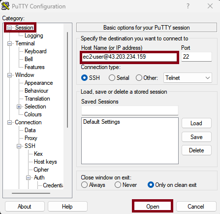
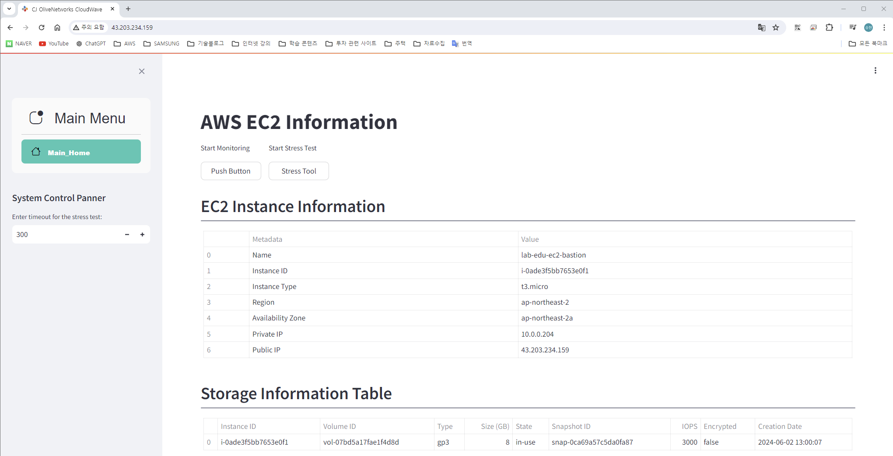

# Creating Bastion Server

### 1. EC2 메인 콘솔 화면으로 이동
- **인스턴스 리소스 탭 → '인스턴스 시작' 버튼 클릭**

    

### 2. EC2 인스턴스 설정 정보 입력 및 생성
- 아래 인스턴스 자원 명세서를 참고하여 정보 입력
    - **이름:** *lab-edu-ec2-bastion*
    - **AMI:** *Amazon Linux 2023*
    - **인스턴스 유형:** *t3.micro*
    - **키 페어:** '새 키 페어 생성' 버튼 클릭 → 키 페어 이름: *lab-edu-key-ec2* → '키 페어 생성' 버튼 클릭

    

    - **네트워크 설정:**
        - '편집' 버튼 클릭
        - 네트워크: *lab-edu-vpc-ap-01*
        - 서브넷: *lab-edu-sub-pub-01*
        - 퍼블릭 IP 자동 할당: 활성화
        - 방화벽(보안 그룹): '보안 그룹 생성'
        - 보안 그룹 이름: *lab-edu-sg-bastion*
        - 보안 그룹 규칙1
            - 유형: ssh
            - 소스 유형: 내 IP
        - '보안 그룹 규칙 추가' 버튼 클릭
        - 보안 그룹 규칙2
            - 유형: http
            - 소스 유형: 내 IP

    

- '인스턴스 시작' 버튼 클릭

### 3. Putty 다운로드
- **다운로드 URL:** https://www.chiark.greenend.org.uk/~sgtatham/putty/latest.html
- MSI (Windows Installer) 64-bit x86 다운로

    
- MSI 파일 실행 → 'next' 버튼 클릭 → 'next' 버튼 클릭 → 'Install' 버튼 클릭 → 'Finish' 버튼 클릭

### 4. Bastion 서버 접속
- 키 페어 확장자 변경 (pem → ppk)
    - PuTTYgen 실행 

        

    - 'Load' 버튼 클릭 → pem 키 파일 다운로드 받을 폴더로 이동 → 확장자 명을 'All Files (*.*)로 변경 → pem 키 파일 선택

        

    - 'save private key' 버튼 클릭 → '예' 버튼 클릭 → 파일 이름 'lab-edu-key-ec2' 입력 → '저장' 버튼 클릭
    
        
    
        

- EC2 접속 정보 확인: 인스턴스 메인 콘솔 화면 이동 → '인스턴스' 탭으로 이동 → 'lab-edu-ec2-bastion' 선택 → 퍼블릭 IPv4 주소 복사
    

- PuTTY 실행 및 접속
    - Putty 실행 → SSH 클릭 → Auth 클릭 → Credentilas 클릭 → Browser 클릭 → 'lab-edu-key-ec2.ppk' 선택

        

    - Session 클릭 → Host Name: 'ec2-user@*{BASTION_SERVER_PUBLIC_IP}* 입력 → 'Open' 버튼 클릭

        

### 5. Web Service 구성
- "Hands_on_Lab_02. Computing Resource/install_python.sh" 파일 내용 복사

    

- Bastion 서버 접속 → VIM Editor 이용 내용 입력

    

- 스크립트 실행 
    ```bash
    chmod +x install_python.sh
    ./install_python.sh
    ```

- 웹 서비스 접속 테스트 (Bastion 서버 Public IP로 브라우저에서 접속)

    

# Creating Web Server
### 1. EC2 메인 콘솔 화면으로 이동
- **인스턴스 리소스 탭 → '인스턴스 시작' 버튼 클릭**

### 2. EC2 인스턴스 설정 정보 입력 및 생성
- 아래 인스턴스 자원 명세서를 참고하여 정보 입력
    - **이름:** *lab-edu-ec2-web*
    - **AMI:** *Amazon Linux 2023*
    - **인스턴스 유형:** *t3.micro*
    - **키 페어:** *lab-edu-key-ec2*
    - **네트워크 설정:**
        - '편집' 버튼 클릭
        - 네트워크: *lab-edu-vpc-ap-01*
        - 서브넷: *lab-edu-sub-pri-01*
        - 퍼블릭 IP 자동 할당: 비활성화
        - 방화벽(보안 그룹): '보안 그룹 생성'
        - 보안 그룹 이름: *lab-edu-sg-web*
        - 보안 그룹 규칙1
            - 유형: ssh
            - 소스 유형: 10.0.0.0/16
        - '보안 그룹 규칙 추가' 버튼 클릭
        - 보안 그룹 규칙2
            - 유형: http
            - 소스 유형: 10.0.0.0/16

### 3. Web 서버 접속
- Bastion 서버 접속
    - Putty 실행 → SSH 클릭 → Auth 클릭 → Credentilas 클릭 → Browser 클릭 → 'lab-edu-key-ec2.ppk' 선택 
    - Session 클릭 → Host Name: 'ec2-user@*{BASTION_SERVER_PUBLIC_IP}* 입력 → 'Open' 버튼 클릭

-   pem 키 페어 Bastion 서버에 저장
    - pem 파일 notepad로 실행 → 전체 복사

        

    - Bastion 서버에서 VIM Editor 이용 파일로 내용 저장 (파일명: *lab-edu-key-ec2.pem*)

        

    - pem 키 파일 권한 설정
        ```bash
        chmod 600 lab-edu-key-ec2.pem
        ```

- EC2 접속 정보 확인: 인스턴스 메인 콘솔 화면 이동 → '인스턴스' 탭으로 이동 → 'lab-edu-ec2-web' 선택 → 프라이빗 IPv4 주소 복사

- Web 서버 접속
    - Bastion 서버를 접속 한 PuTTY 콘솔 화면에서 다음 명령어 실행
        ```bash
        ssh -i lab-edu-key-ec2.pem ec2-user@*{WEB_SERVER_PRIVATE_IP}*
        ```
        

# Creating Cloud9 Server
