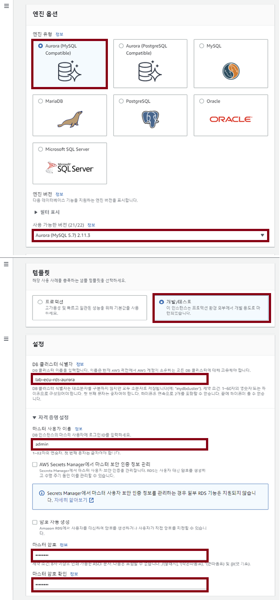
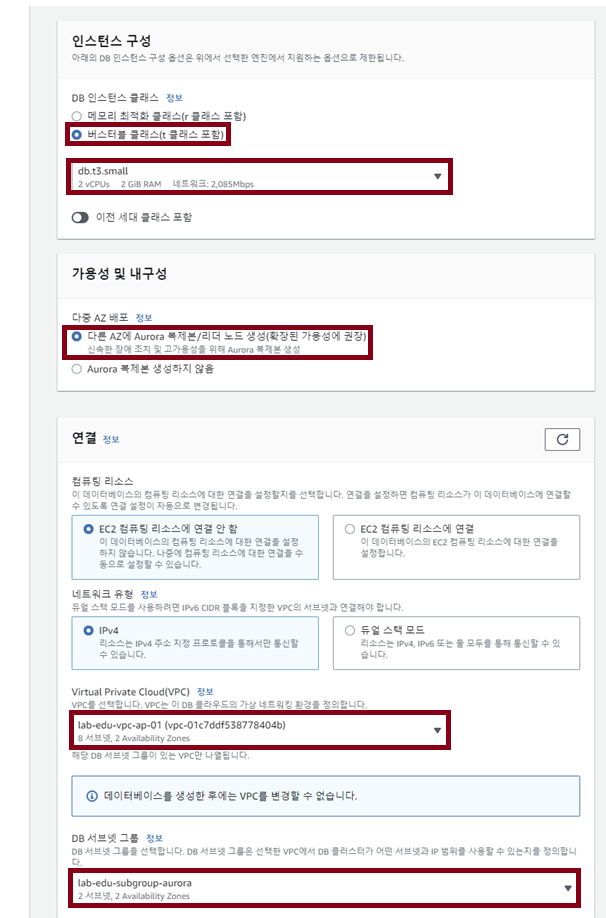
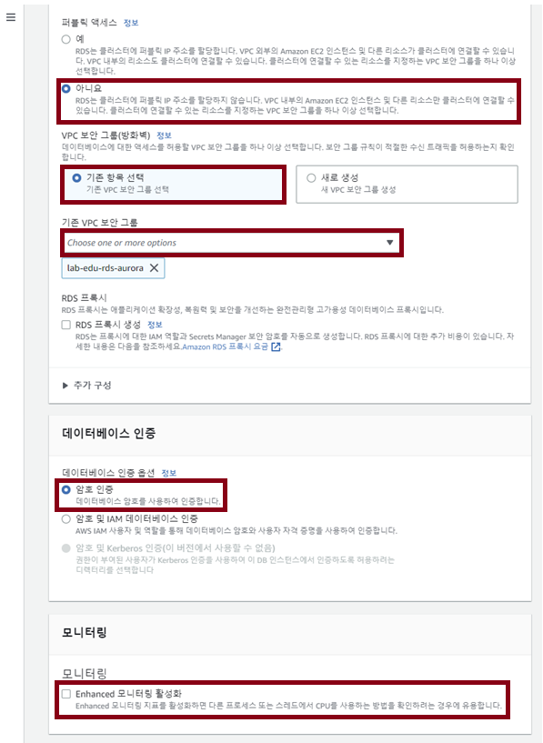

# Database 생성

### 1. Database Subnet 생성

- **VPC 메인 콘솔 화면 → Subnet 리소스 탭 → "Subnet 생성" 버튼 클릭**

- 아래 서브넷 자원 명세서를 참고하여 정보 입력

- 화면 하단의 '서브넷 추가' 버튼 이용 여러 개의 서브넷 정보 동시 입력 가능 

    |                   |Database Subnet 01|Database Subnet 02|
    |:---:|:---:|:---:|
    |VPC_ID             |leb-edu-vpc-ap-01|leb-edu-vpc-ap-01|
    |Subnet_Name        |lab-edu-sub-db-01|lab-edu-sub-db-02|
    |Availability_Zone  |ap-northeast-2a|ap-northeast-2c|
    |IPv4 CIDR          |10.0.80.0/24|10.0.81.0/24|

### 2. Security Group 생성

- **EC2 메인 콘솔 화면 → 보안 그룹 탭 → '보안그룹 생성' 버튼 클릭**

- 아래 **보안그룹 자원 명세서** 정보 참고하여 설정

    |Region         |VPC_Name           |Name               |Rule       |port   |Protocol   |Source|
    |:---:|:---:|:---:|:---:|:---:|:---:|:---:|
    |ap-northeast-2 |lab-edu-vpc-ap-01  |lab-edu-sg-aurora  |In-bound   |5432   |Postgres   |10.0.0.0/16|

### 3. Subnet Group 생성

- **RDS 메인 콘솔 화면 → 서브넷 그룹 탭 → 'DB 서브넷 그룹 생성' 버튼 클릭**

    

- 아래 정보 참고하여 설정

    - 이름: lab-edu-subgroup-aurora

    - VPC: lab-edu-vpc-ap-01

    - 가용영역: ap-northeast-2a, ap-northeast-2c

    - 서브넷: lab-edu-sub-db-01, lab-edu-sub-db-02

        

### 4. RDS 생성

- **RDS 메인 콘솔 화면 → 데이터베이스 탭 → '데이터베이스 생성' 버튼 클릭**

- 아래 **데이터베이스 자원 명세서** 정보 참고하여 설정

    - 엔진유형: Aurora (PostgreSQL Compatible)

    - 사용 가능한 버전: Aurora PostgreSQL 15.3

    - 템플릿: 개발/테스트

    - DB 클러스터 식별자: lab-edu-rds-aurora

    - 자격증명 관리: 자체 관리

    - Master User Name: postgres

    - Master User Password: qwer1234

        
        
    - 인스턴스 구성: 버스터블 클래스(t클래스 포함) - db.t3.medium

    - 다중 AZ 배포: 다른 AZ에 Aurora 복제본/리더 노드 생성 (확장된 가용성에 권장)

    - VPC: lab-edu-vpc-ap-01

    - DB 서브넷 그룹: lab-edu-subgroup-aurora

        
        
    - 퍼블릭 액세스: 아니오

    - VPC 보안 그룹: lab-edu-sg-aurora

    - 데이터베이스 인증: 암호 인증

    - 모니터링 Enhanced 모니터링 활성화 체크박스 해제

    - 나머지 항목은 Default 값으로 설정하고 '생성' 버튼 클릭

        

### 5. PostgreSQL 접속 테스트

- Cloud9 IDE 서버 접속

    - Putty 실행 → SSH 클릭 → Auth 클릭 → Credentials 클릭 → Browser 클릭 → 'lab-edu-key-ec2.ppk' 선택 

    - Session 클릭 → Host Name: 'ec2-user@*{BASTION_SERVER_PUBLIC_IP}* 입력 → 'Open' 버튼 클릭

- RDS Aurora 접속 정보 확인

    - **RDS 메인 콘솔 화면 → 데이터베이스 탭 → 'lab-edu-rds-aurora' 데이터 베이스 클릭**

    - 엔드포인트 탭의 엔드포인트 이름 복사 (별도 메모장에 저장)

        

- PostgreSQL 접속 Tool 다운로드 및 설정

    ```bash
    # Amazon Linux 2023 - PostgreSQL v.15 install 
    # PostgreSQL Install
    sudo dnf update -y
    sudo dnf install postgresql15  -y
    sudo dnf install postgresql15-server -y
    sudo dnf install postgresql-devel -y

    # PostgreSQL Dev Tool Install
    # psycopg2-binary 설치 여부 확인
    pip show psycopg2-binary
    # 설치된 정보가 보이지 않을 경우 아래 명령어 추가 실행
    pip install psycopg2-binary

    # user switching
    # postgres 유저 내 생성되는 Data Directory 접근은 가능하지만 다른 유저에서는 생성하지 못한다.
    su - postgres

    # Connect aurora
    psql -U postgres -h {RDS_AURORA_ENDPOINT}   #앞에서 메모장에 저장한 RDS Aurora 엔드포인 정보 입력
    Password for user postgres: {RDS_AURORA_PASSWORD}   #생성과정에 입력했던 패스워드 입력

    psql (15.6, server 15.4)
    SSL connection (protocol: TLSv1.3, cipher: TLS_AES_256_GCM_SHA384, compression: off)
    Type "help" for help.

    postgres=>
    ```