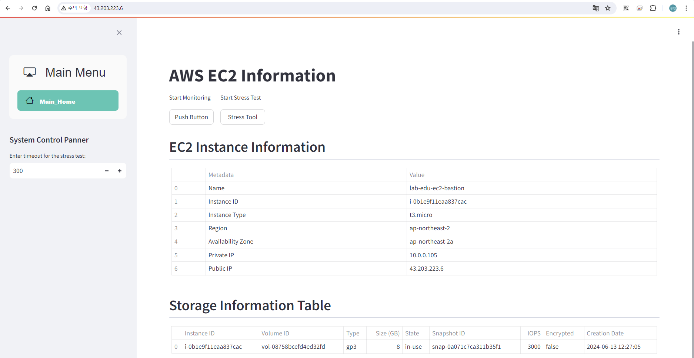

# Creating IAM User

### 1. IAM User 생성

- **IAM 메인 콘솔 화면 → 사용자 리소스 탭 → "사용자 생성" 버튼 클릭**

- 아래 정보 참고하여 설정

    - 이름: lab-edu-iam-user-01

    - 'AWS Management Console에 대한 사용자 액세스 권한 제공' 체크박스 활성화

    - 'IAM 사용자를 생성하고 싶음' 라디오 박스 활성화

    - '사용자 지정 암호' 라디오 박스 활성화 → 패스워드 지정

    - '사용자는 다음 로그인 시 새 암호를 생성해야 합니다 - 권장' 체크박스 해제
    
    - '다음' 버튼 클릭

        

    - '직접 정책 연결' 라디오 박스 활성화

    - 검색 창에 "AdministratorAccess" 입력 → "AdministratorAccess" 체크박스 활성

    - '다음' 버튼 클릭 → '사용자 생성' 버튼 클릭

        

### 2. AWS Account ID 정보 확인

- **콘솔 화면 우측 상단 계정이름 클릭 → 계정 ID 복사 버튼 클릭**

    

### 3. IAM User 이용 AWS Management Console 접속 테스트

- 브라우저에서 " ***Ctrl + Shift + n*** " 버튼 입력 (웹 브라우저 시크릿 모드 실행)

    

- **AWS 웹 사이트 → 로그인 화면 이동** ***(※ AWS Web URL: https://aws.amazon.com/ko)***

    

- 아래 정보 참고하여 입력

    - 계정 ID: 97********00 (자신의 계정 Account ID 값 입력)

    - 사용자 이름: lab-edu-iam-user-01

    - 암호: ***PASSWORD*** (자신이 설정한 패스워드 입력)

    - '로그인' 버튼 클릭

        

### 4. IAM User 권할 설정 테스트

- **IAM 메인 콘솔 화면 → 사용자 리소스 탭 → ***"lab-edu-iam-user-01"*** 클릭**

    

- **'AdministratorAccess' 체크박스 활성화 → '제거' 버튼 클릭 → "정책 제거" 버튼 클릭**

    

- EC2 메인 콘솔 화면으로 이동하여 리소스 정보 확인 ***(※ 권한이 없기 때문에 API 오류 발생)***

    

- 웹 브라우저 '시크릿 모드' 창을 닫고 원래 브라우저 창에서 다음 작업 이어서 진행

<br><br>

# Creating Access key & Secret key

### 1. IAM User AdministratorAccess 권한 할당

- **IAM 메인 콘솔 화면 → 사용자 리소스 탭 → ***"lab-edu-iam-user-01"*** 클릭**

    

- '직접 정책 연결' 라디오 박스 활성화

- 검색 창에 "AdministratorAccess" 입력 → "AdministratorAccess" 체크박스 활성

- '다음' 버튼 클릭 → '권한 추가' 버튼 클릭

### 2. Access key & Secret key 생성

- **'보안 자격 증명' 탭으로 이동 → '액세스 키 만들기' 버튼 클릭**

    

- 'Command Line Interface (CLI)' 라디오 박스 선택 → '위의 권장 사항을 이해했으며 액세스 키 생성을 계속하려고 합니다' 체크박스 활성화

- '다음' 버튼 클릭 → '액세스 키 만들기' 클릭 

    

- '표시' 버튼 클릭 → Access key & Secret key 메모장에 저장 ***(※ 해당 페이지 이탈 후 다시 확인이 불가능하기 때문에 별도 저장 필요)***

    

### 3. Access key & Secret key 활용

- Bastion 서버 접속

    - Putty 실행 → SSH 클릭 → Auth 클릭 → Credentilas 클릭 → Browser 클릭 → 'lab-edu-key-ec2.ppk' 선택 

    - Session 클릭 → Host Name: 'ec2-user@*{BASTION_SERVER_PUBLIC_IP}* 입력 → 'Open' 버튼 클릭

- EC2 Bastion 서버에 Access & Secret key 설정

    ```bash
    $ aws configure
    AWS Access Key ID [None]: AKI**************GQD
    AWS Secret Access Key [None]: cLu************************************vlo
    Default region name [None]: ap-northeast-2
    Default output format [None]: json
    ```

- Access & Secret Key 적용 여부 확인

    ```bash
    $ aws sts get-caller-identity
    {
        "UserId": "AIDA6GBMEOUMBPJ5ZUVFO",
        "Account": "97********00",
        "Arn": "arn:aws:iam::97********00:user/lab-edu-iam-user-01"
    }
    ```

- Access & Secret Key에 할당된 권한 테스트

    - streamlit 서비스 실행

        ```bash
        sudo su -
        cd streamlit-project/
        streamlit run main.py --server.port 80
        ```

    - 브라우저에서 웹 서비스 접속 후 EC2 정보가 화면에 표시 되는지 확인

        
        ***※ streamlit 처음 설치 후 확인 한 서비스 화면에서 Error가 발생 한 이유는 서버 정보에 접근 할 권한이 없었기 때문이다.***