# Creating CodeCommit

### 1. CodeCommit Repository 생성

- **CodeCommit 메인 콘솔 화면 → 리포지토리 리소스 탭 → "리포지토리 생성" 버튼 클릭**

    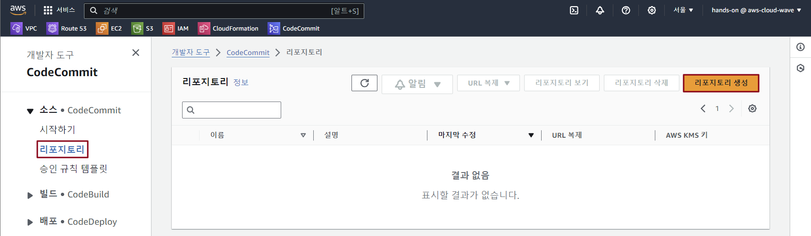

- 아래 정보 참고하여 설정

    - 리포지토리 이름: lab-edu-code-streamlit

    - '생성' 버튼 클릭

        


### 2. Local Workspace 구성

- **Git 다운로드 URL:** https://git-scm.com/downloads

- **VS Code 다운로드 URL:** https://code.visualstudio.com/download

- **Extensions 설치:** python, AWS CLI Configure

    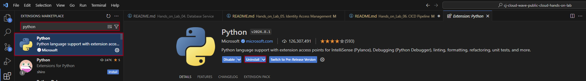

- **실습 Code 다운로드 URL:** https://github.com/sh1517/streamlit-project/tree/main

- "Code" 버튼 클릭 → "Download ZIP" 버튼 클릭 → 다운로드 받은 파일 바탕화면으로 이동 → 압축 풀기

    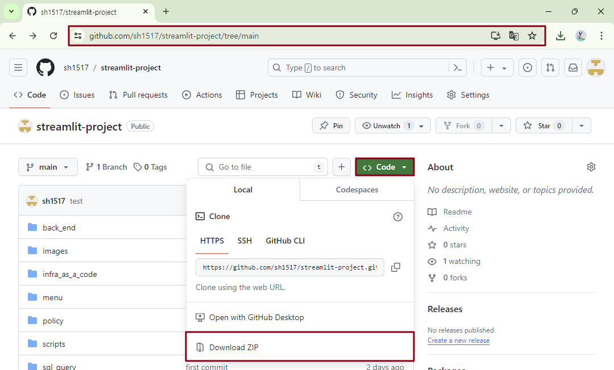


### 3. IAM User Access & Secret key Setting (VS Code)

- **IAM 메인 콘솔 화면 → 사용자 리소스 탭 → "lab-edu-iam-user-01" 클릭**

- "권한 추가" 버튼 클릭 → "권한 추가" 버튼 클릭

- "직접 정책 연결" 라디오 버튼 선택 → "AWSCodeCommitPowerUser" 검색 → "AWSCodeCommitPowerUser" 권한 선택

    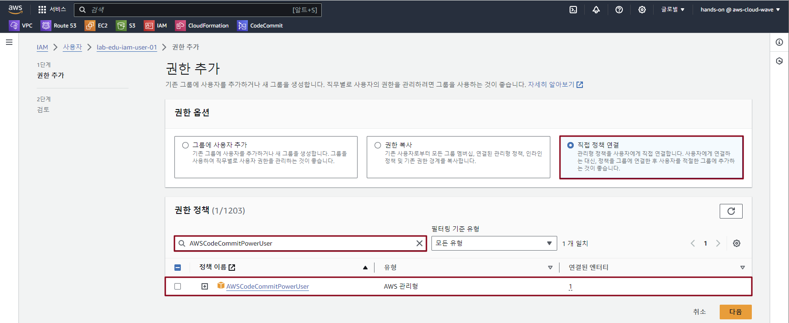

- VS Code Terminal CMD 화면으로 이동

    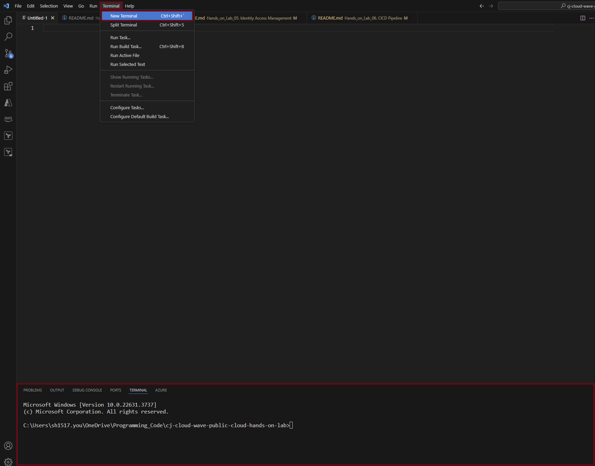

- VS Code Terminal에서 Access & Secret key 설정

    ```bash
    > aws configure
    AWS Access Key ID [None]: AKI**************GQD
    AWS Secret Access Key [None]: cLu************************************vlo
    Default region name [None]: ap-northeast-2
    Default output format [None]: json
    ```
    *<span style="color:yellowgreen">※ Hands on Lab 05. IAM 실습 과정에 생성한 'lab-edu-iam-user-01' access & secret key 입력</span>*

### 4. VS Code → CodeCommit SSH Push 테스트

- VS Code에서 소스 코드 파일 오픈

    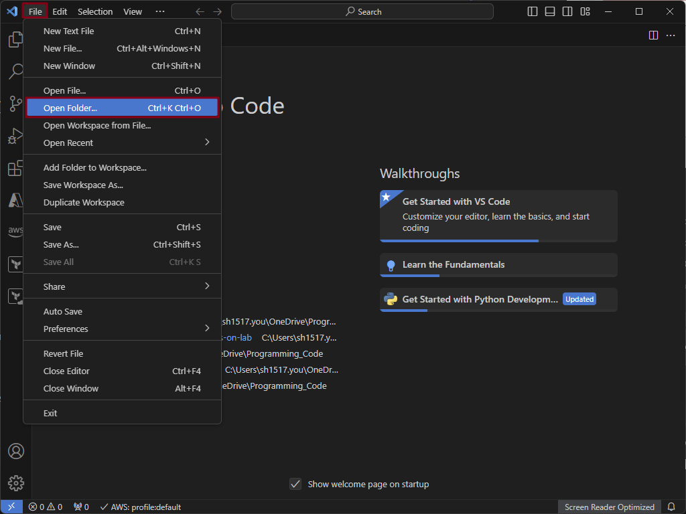

- 탐색기: 바탕화면 → "streamlit-project-main" 폴더 접속 → "streamlit-project-main" 폴더 클릭(두 번째 폴더) → "폴더 선택" 버튼 클릭

    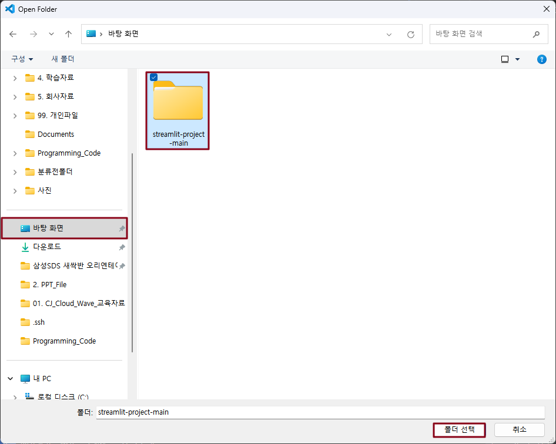

- VS Code Terminal CMD 화면으로 이동

- SSH RSA Key 생성

    ```bash
    > ssh-keygen
    Generating public/private rsa key pair.
    Enter file in which to save the key (C:\Users\sh****.you/.ssh/id_rsa): #Enter
    Enter passphrase (empty for no passphrase): #Enter
    Enter same passphrase again: #Enter
    ```
- 홈 디렉터리의 ".ssh" 폴더로 이동 (C:\Users\sh****.you/.ssh/) → "id_rsa.pub" 파일 메모장으로 실행

    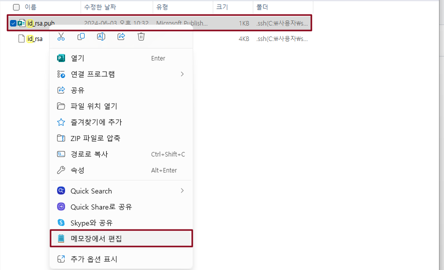

- 전체 내용 복사 *(예시)*

    ```bash
    ssh-rsa EXAMPLE-AfICCQD6m7oRw0uXOjANBgkqhkiG9w0BAQUFADCBiDELMAkGA1UEBhMCVVMxCzAJB
    gNVBAgTAldBMRAwDgYDVQQHEwdTZWF0dGxlMQ8wDQYDVQQKEwZBbWF6b24xFDASBgNVBAsTC0lBTSBDb2
    5zb2xlMRIwEAYDVQQDEwlUZXN0Q2lsYWMxHzAdBgkqhkiG9w0BCQEWEG5vb25lQGFtYXpvbi5jb20wHhc
    NMTEwNDI1MjA0NTIxWhcNMTIwNDI0MjA0NTIxWjCBiDELMAkGA1UEBhMCVVMxCzAJBgNVBAgTAldBMRAw
    DgYDVQQHEwdTZWF0dGxlMQ8wDQYDVQQKEwZBbWF6b24xFDAS=EXAMPLE user-name@computer-name
    ```

- **IAM 메인 콘솔 화면 → 사용자 리소스 탭 → "lab-edu-iam-user-01" 클릭 → 보안자격증명 탭**

    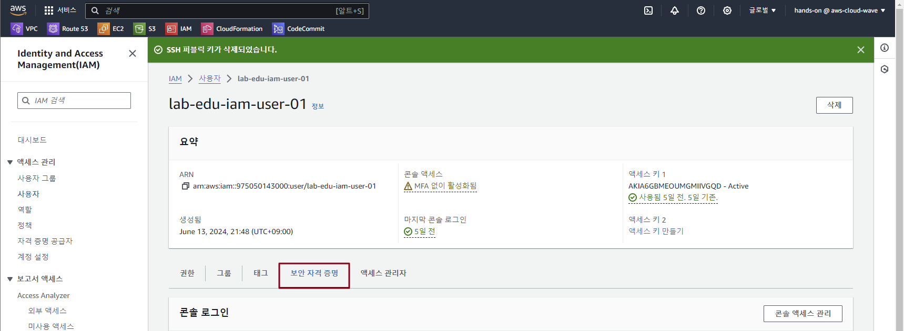

- "SSH 퍼블릭 키 업로드" 버튼 클릭

    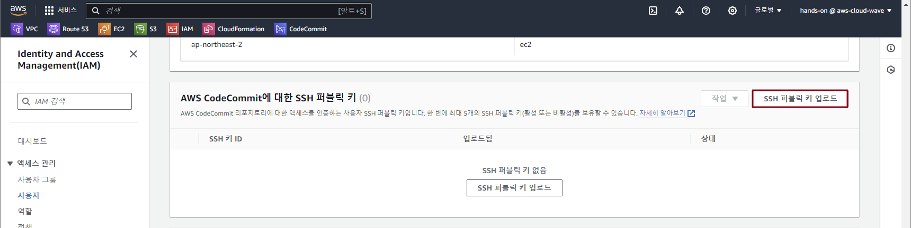

- "SSH 키 ID" 복사

    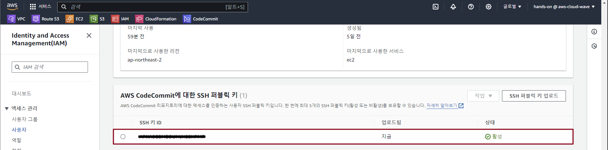

- 홈 디렉터리의 ".ssh" 폴더로 이동 (C:\Users\sh****.you/.ssh/) → "config" 생성 후 메모장으로 실행

    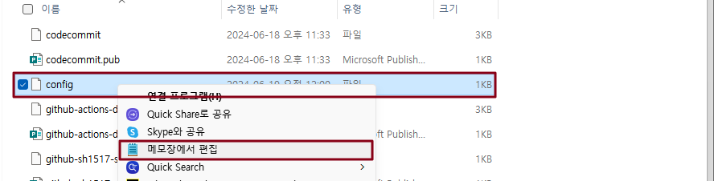

- 아래 코드 입력 후 개인 SSH 키 ID 값으로 치환

    ```bash
    Host git-codecommit.*.amazonaws.com
    User A******************Y   # 개인별로 생성된 SSH 키 ID 값으로 치환
    IdentityFile ~/.ssh/codecommit
    ```

- VS Code Terminal CMD 화면으로 이동 → SSH 설정 테스트

    ```cmd
    ssh git-codecommit.us-east-2.amazonaws.com
    ```

- Local Git Repository 초기화

    ```cmd
    git init
    ```

- Local Branch name setting (main)

    ```cmd
    git branch -M main
    ```

- **CodeCommit 메인 콘솔 화면 → 리포지토리 리소스 탭 → "lab-edu-code-streamlit" 클릭 → "URL 복제" 버튼 클릭 → "SSH 복제" 버튼 클릭**

    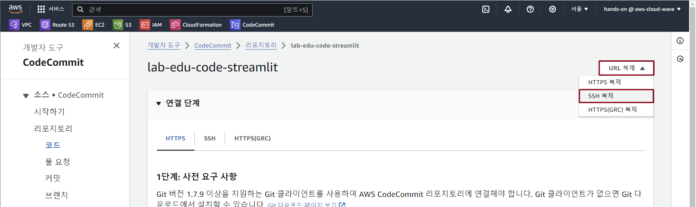

- Remote Repository 등록

    ```cmd
    git remote add [CODE_COMMIT_SSH_URL_INFO]
    ```

- 소스코드 Commit 후 Push 테스트

    ```cmd
    git add .
    git commit -m "first commit"
    git push origin main
    ```

- AWS CodeCommit 레포지토리 콘솔 확인

    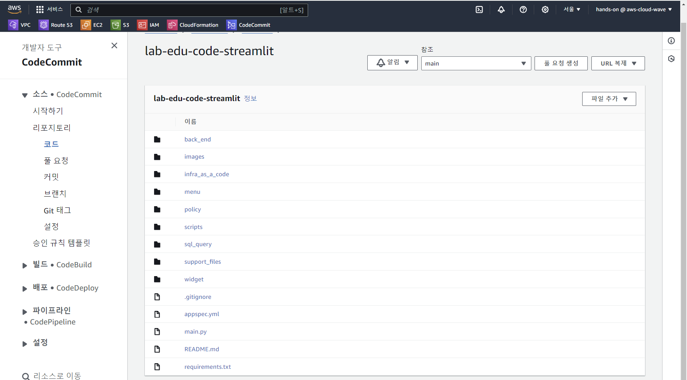

<br>


# Creating CodeDeploy

### 1. CodeDeploy Agent 설치

- Bastion 서버 접속 

    - Putty 실행 → SSH 클릭 → Auth 클릭 → Credentials 클릭 → Browser 클릭 → 'lab-edu-key-ec2.ppk' 선택 

    - Session 클릭 → Host Name: 'ec2-user@*{BASTION_SERVER_PUBLIC_IP}* 입력 → 'Open' 버튼 클릭

- Web 서버 접속

    - Bastion 서버를 접속 한 PuTTY 콘솔 화면에서 다음 명령어 실행

        ```bash
        ssh -i lab-edu-key-ec2.pem ec2-user@*{WEB_SERVER_PRIVATE_IP}*
        ```

- 관련 패키지 다운로드

    ```bash
    sudo yum update -y && sudo yum install ruby -y && sudo yum install wget -y
    ```

- CodeDeploy Agent 설치 프로그램 다운로드

    ```bash
    wget https://aws-codedeploy-ap-northeast-2.s3.ap-northeast-2.amazonaws.com/latest/install
    ```

- 설치 파일 실행 권한 할당

    ```bash
    chmod +x ./install
    ```

- 설치 파일 이용 최신 버전 설치 

    ```bash
    sudo ./install auto
    ```

- CodeDeploy Agent 서비스 실행 및 상태 확인 명령

    ```bash
    systemctl status codedeploy-agent   # sudo service codedeploy-agent status
    systemctl start codedeploy-agent    # sudo service codedeploy-agent start
    ```

### 2. CodeDeploy IAM Role 생성

- **IAM 메인 콘솔 화면 → 역할 리소스 탭 → "역할 생성" 버튼 클릭**

- 아래 정보 참고하여 설정

    - 신뢰할 수 있는 엔터티 유형: 'AWS 서비스' 라디오 박스 선택 

    - 사용 사례: CodeDeploy → '다음' 버튼 클릭

    - 권한 추가 창에 "CodeDeployRole" 정책 반영 여부 확인 → '다음' 버튼 클릭

    - 역할 이름: lab-edu-role-codedeploy

    - '역할 생성' 버튼 클릭

### 3. CodeDeploy Application & Deploy 생성

- **CodeDeploy 메인 콘솔 화면 → 애플리케이션 리소스 탭 → "애플리케이션 생성" 버튼 클릭**

- 아래 정보 참고하여 설정

    - 이름: lab-edu-deploy-ec2

    - 컴퓨팅 플랫폼: EC2/On-premises

    - '애플리케이션 생성' 버튼 클릭

        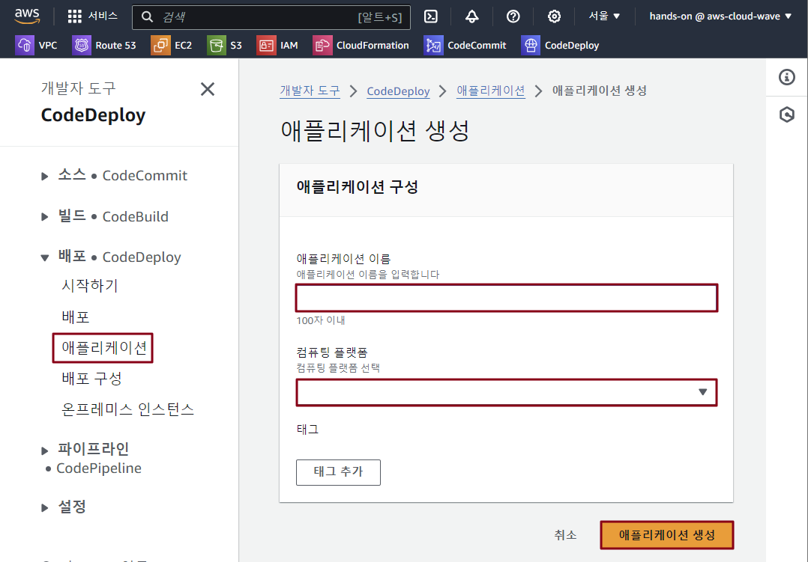

- 애플리케이션 생성 결과 화면 하단의 '배포 그룹' 탭으로 이동 → "배포 그룹 생성" 버튼 클릭**

    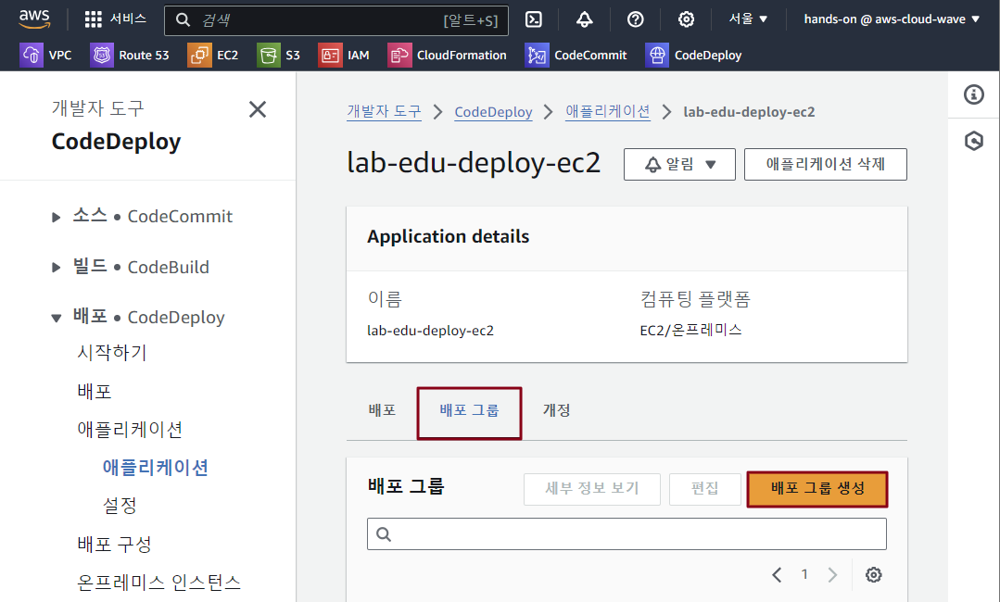

- 아래 정보 참고하여 설정

    - 이름: lab-edu-deploygroup-ec2

    - 서비스 역할: lab-edu-role-codedeploy

    - 애플리케이션 배포 방법: 현재 위치 (In-place)

        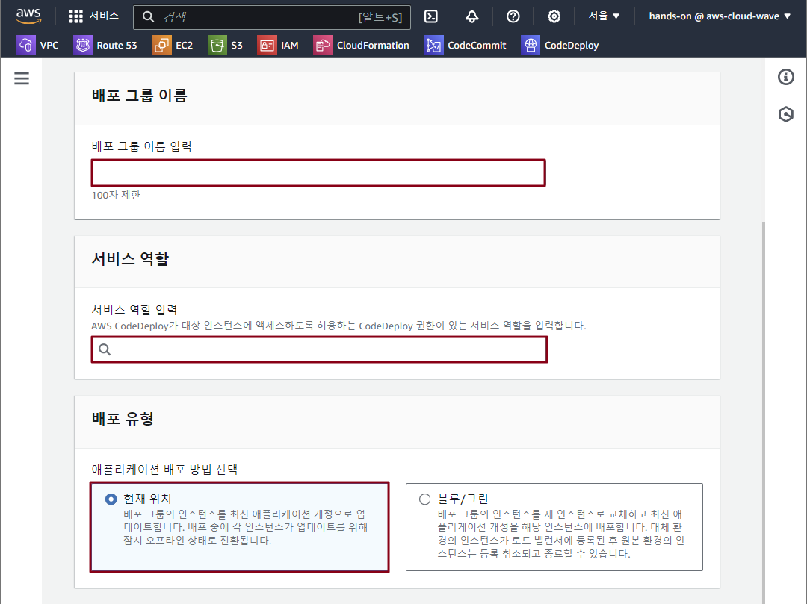

    - "Amazon EC2 Instances" 체크박스 활성화

    - 키: Name

    - 값: lab-edu-ec2-web

        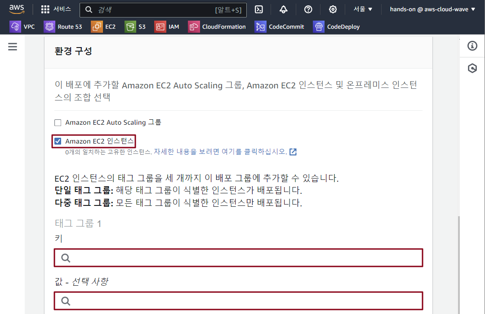

    - AWS CodeDeploy 에이전트 설치: "지금 업데이트 및 업데이트 일정 예약" 라디오 버튼 선택 → 1일

        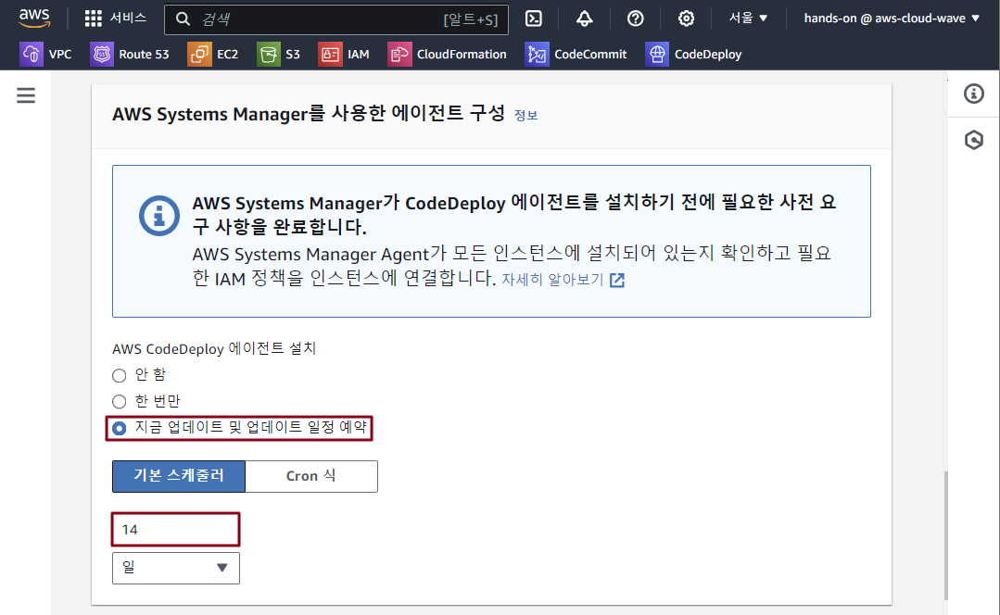

    - 배포 구성: CodeDeployDefault.OneAtaTime

    - 로드 밸런싱 활성화: 체크 해제 → '배포 그룹 생성' 버튼 클릭

        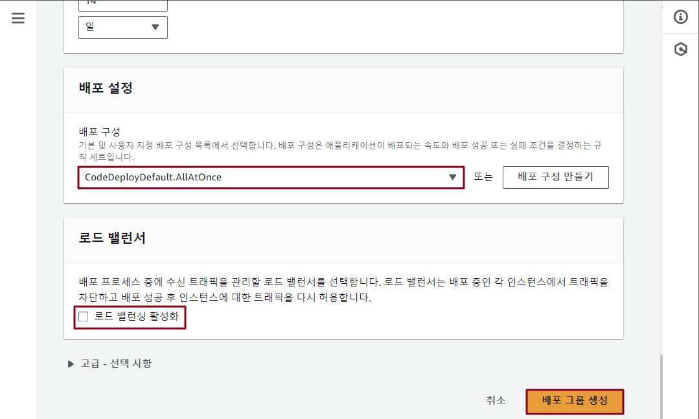

# Creating CodePipeline

- **CodePipeline 메인 콘솔 화면 → 파이프라인 리소스 탭 → "파이프라인 생성" 버튼 클릭**

- 아래 정보 참고하여 설정

    - 이름: lab-edu-pipeline-ec2

    - 파이프라인 유형: V1

    - 실행 모드: 대체

    - 서비스 역할: "새 서비스 역할" 라디오 버튼 선택 → 이름: lab-edu-role-pipeline → '다음' 버튼 클릭

        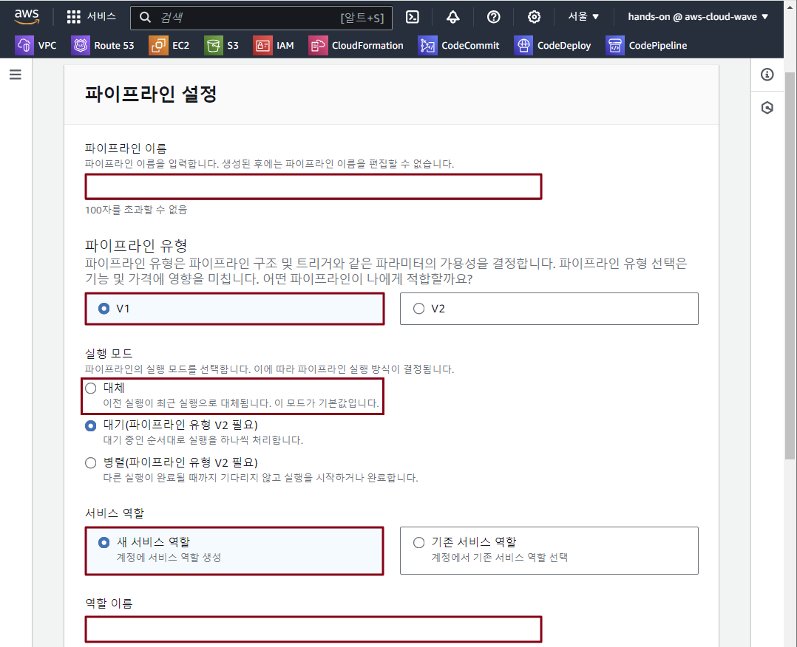

    - 소스 공급자: CodeCommit → '다음' 버튼 클릭 

    - 리포지토리 이름: lab-edu-code-streamlit

    - 브랜치 이름: main

        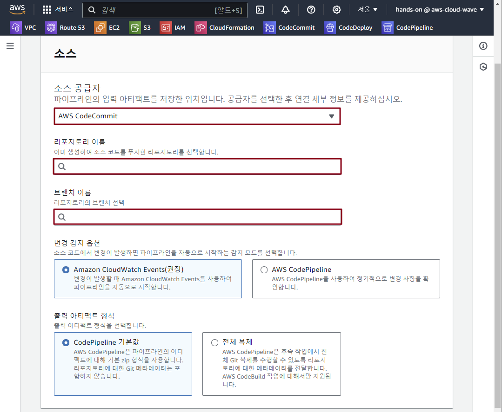

    - '다음' 버튼 클릭 → '빌드 스테이지 건너뛰기' 버튼 클릭 → '건너뛰기' 버튼 클릭 

    - 배포 공급자: AWS CodeDeploy

    - 리전: 아시아 태평양(서울)

    - 애플리케이션 이름: lab-edu-deploy-ec2

    - 배포 그룹: lab-edu-deploygroup-ec2

        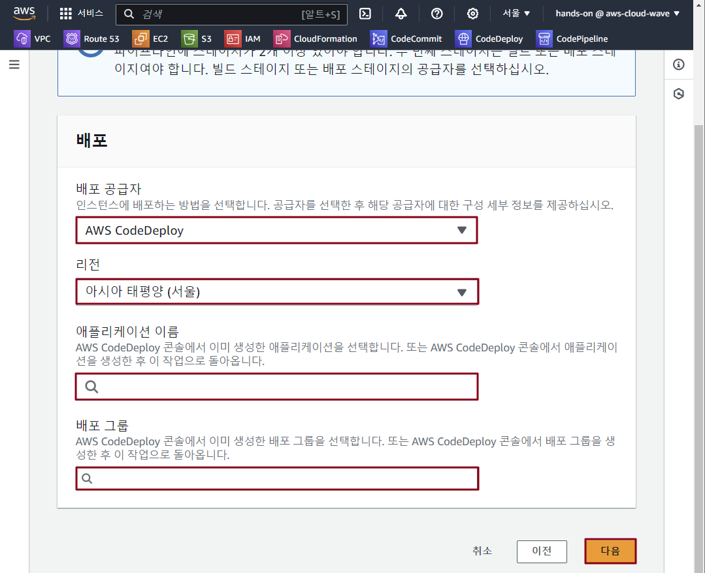

    - '다음' 버튼 클릭 → '파이프라인 생성' 버튼 클릭 

    - 배포 성공 결과 화면 확인

        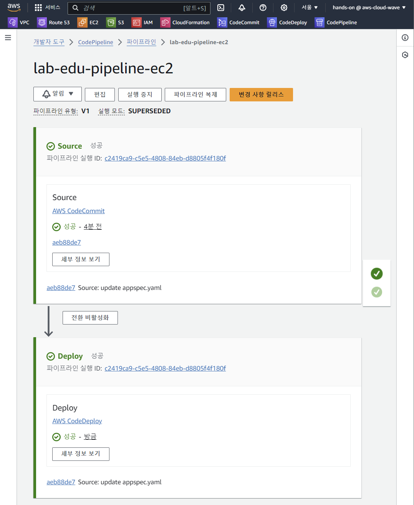

# Code Deploy TEST

- 웹 서비스 접속(로드밸런서 DNS 정보로 브라우저에서 접속) → 'Start Stress Test' 버튼 클릭

    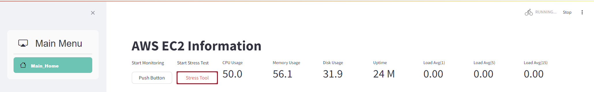

- VS Code 실행 → 'widget/side_bar.py' 파일 오픈 → 설정 값 수정

    ```python
    def start_process(timeout=300):
        stop_process()
        # command = f"stress --cpu 1 --timeout {timeout}"   #AS-IS
        command = f"stress --cpu 2 --timeout {timeout}"     #TO-BE
        subprocess.Popen(command, start_new_session=True, shell=True)
    ```

- 소스코드 Commit 후 Push

    ```cmd
    git add .
    git commit -m "update stress value"
    git push origin main
    ```

- AWS CodePipeline 콘솔 확인

    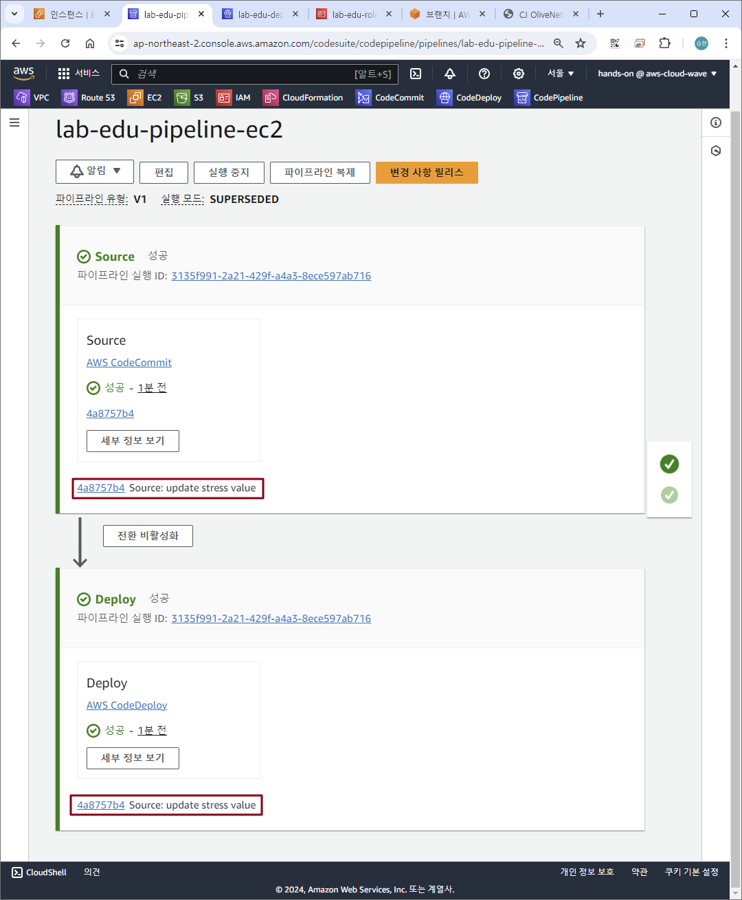

- 웹 서비스 접속(로드밸런서 DNS 정보로 브라우저에서 접속) → 'Start Stress Test' 버튼 클릭 → 결과 차이 확인

    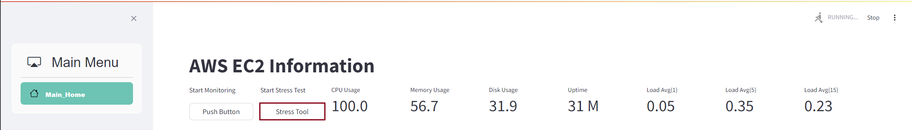

# Reference Documents

- AWS CodeDeploy: https://docs.aws.amazon.com/codedeploy/latest/userguide/deployment-configurations-create.html

- https://medium.com/@youngkeun.kim/aws-ci-cd-%EB%B0%B0%ED%8F%AC-%ED%99%98%EA%B2%BD-%EA%B5%AC%EC%B6%95-7fa70ba8bf78

- https://memory-hub.tistory.com/17

- https://dev.classmethod.jp/articles/create-aws-code-pipeline-ci-cd-environment-kr/

- https://www.youtube.com/watch?v=_o0GYyKnaI0

- https://github.com/wjdrbs96/Today-I-Learn

- 전체 실습 내용: https://docs.aws.amazon.com/ko_kr/codepipeline/latest/userguide/tutorials-simple-codecommit.html