# Network Baseline 추가 (ap-northeast-2)

### 1. IAM User 리소스에 "S3 Full Access" 권한 할당

- **IAM 메인 콘솔 화면 → 사용자 리소스 탭 → "lab-edu-iam-user-01" 클릭**

- "권한 추가" 버튼 클릭 → "권한 추가" 버튼 클릭

- "직접 정책 연결" 라디오 버튼 선택 → "AmazonS3FullAccess" 검색 → "AmazonS3FullAccess" 권한 선택


### 2. CloudFormation YAML 파일 S3 업로드

- VS Code Terminal CMD 화면으로 이동

- Account ID 값 확인 및 환경변수 설정

    ```cmd
    aws sts get-caller-identity --query Account --output text
    ```

    ```cmd
    set ACCOUNT_ID=**********00
    ```

    ```cmd
    echo %ACCOUNT_ID%
    ```

- S3 bucket 생성

    ```cmd
    set BUCKET_NAME=lab-edu-bucket-cf-repository-%ACCOUNT_ID%
    ```

    ```cmd
    echo %BUCKET_NAME%
    ```

    ```cmd
    aws s3 mb s3://%BUCKET_NAME%
    ```

- Data Upload to S3

    ```cmd
    set FILE_PATH=support_files\infra_as_a_code\ap-northeast-2
    ```

    ```cmd
    set FILE_NAME=01. vpc_resource.yaml
    ```

    ```cmd
    set OBJ_NAME=network-baseline.yaml
    ```

    ```cmd
    aws s3 cp "%FILE_PATH%\%FILE_NAME%" s3://%BUCKET_NAME%/%OBJ_NAME%
    ```


### 3. YAML Template 이용 VPC 생성

- YAML Template 파일 구성 확인

    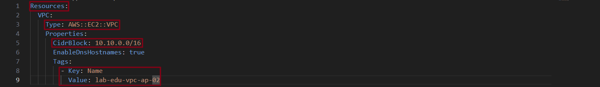

- 객체 URL 정보 확인 → URL 정보 복사
  
    ```cmd
    set OBJ_URL=https://%BUCKET_NAME%.s3.amazonaws.com/%OBJ_NAME%
    ```

    ```cmd
    echo %OBJ_URL%
    ```

- **CloudFormation 메인 콘솔 화면 → 스택 리소스 탭 → "스택 생성" 버튼 클릭**

    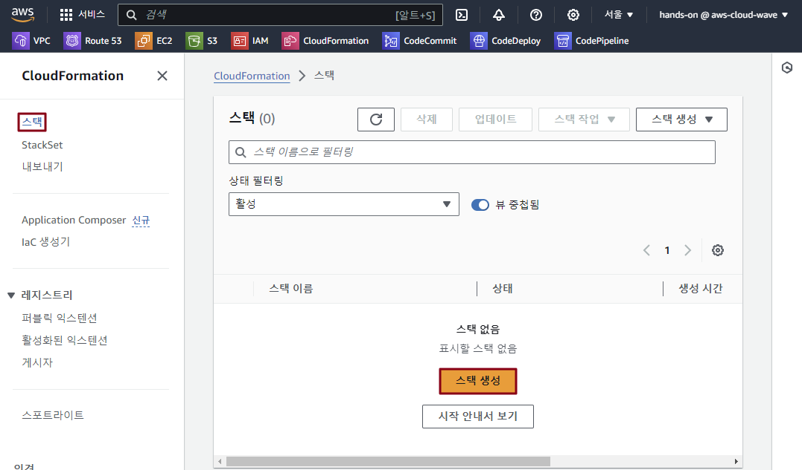

- 객체 URL 정보 입력 → '다음' 버튼 클릭

    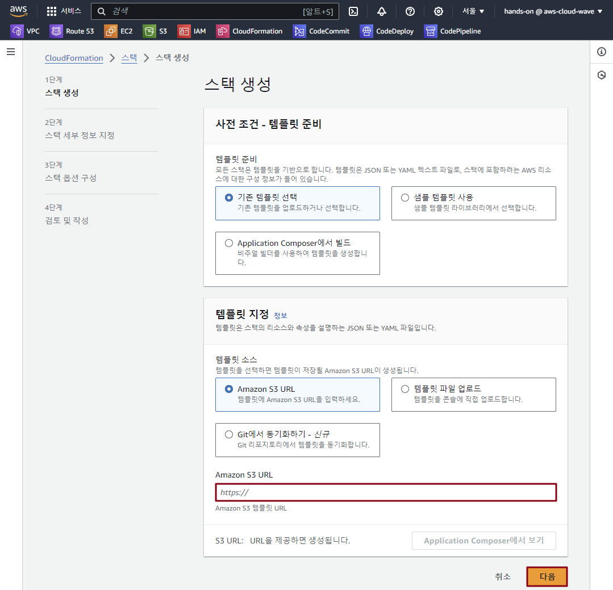

- 스택 이름: lab-edu-cf-network-baseline-ap

- '다음' 버튼 클릭 → '다음' 버튼 클릭 → '전송' 버튼 클릭

    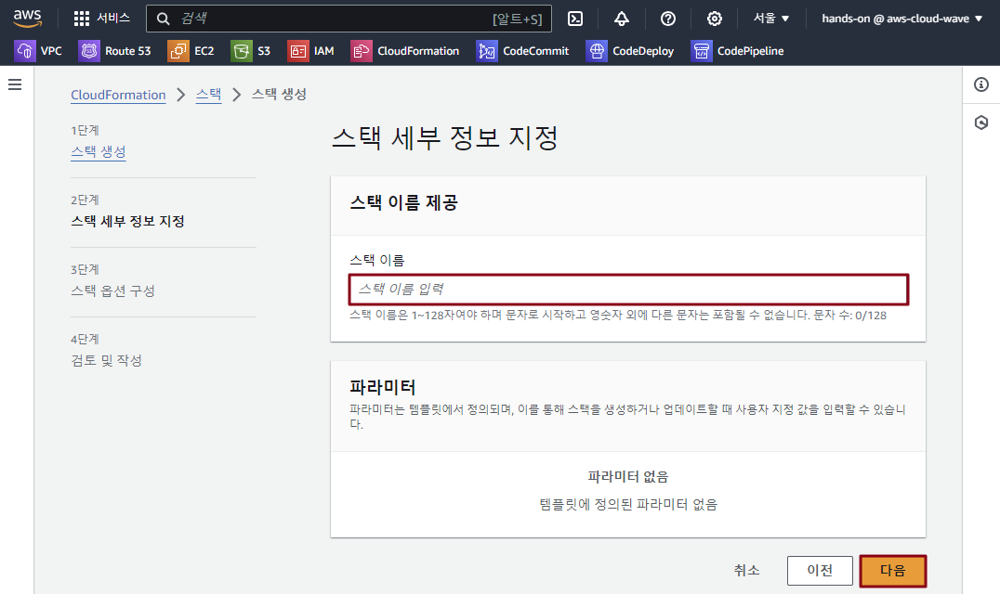


### 4. Parameter Section 활용 Public Subnet 생성

- YAML Template 파일 구성 확인

    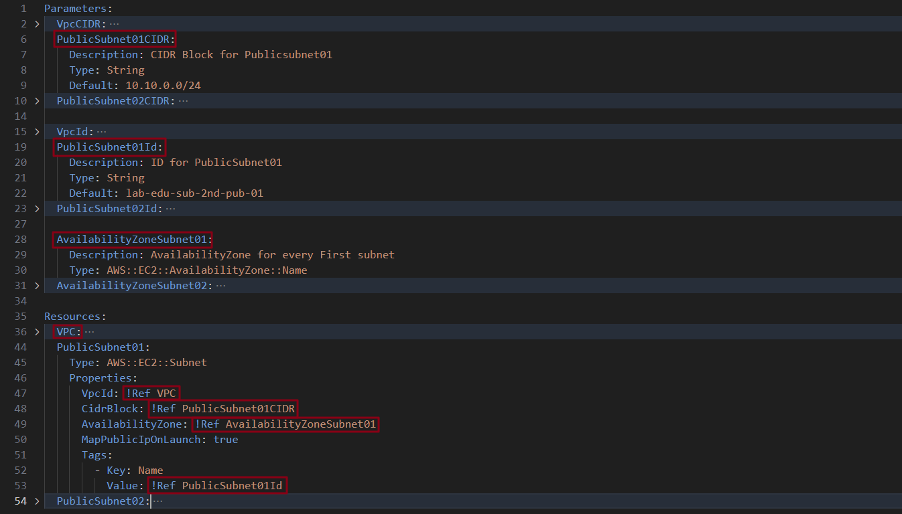

- Data Upload to S3

    ```cmd
    set FILE_NAME=02. subnet_resource.yaml
    ```

    ```cmd
    aws s3 cp "%FILE_PATH%\%FILE_NAME%" s3://%BUCKET_NAME%/%OBJ_NAME%
    ```

- 객체 URL 정보 확인 → URL 정보 복사

    ```cmd
    echo %OBJ_URL%
    ```

- **CloudFormation 메인 콘솔 화면 → 스택 리소스 탭 → "lab-edu-cf-network-baseline-ap" 스택 클릭**

    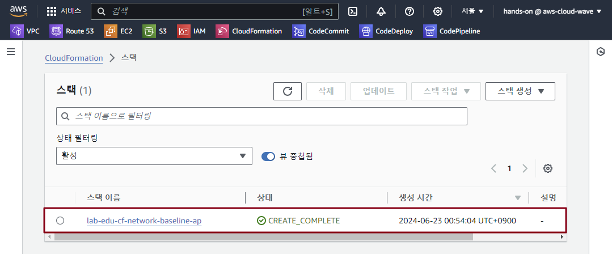

- **"업데이트" 버튼 클릭**

    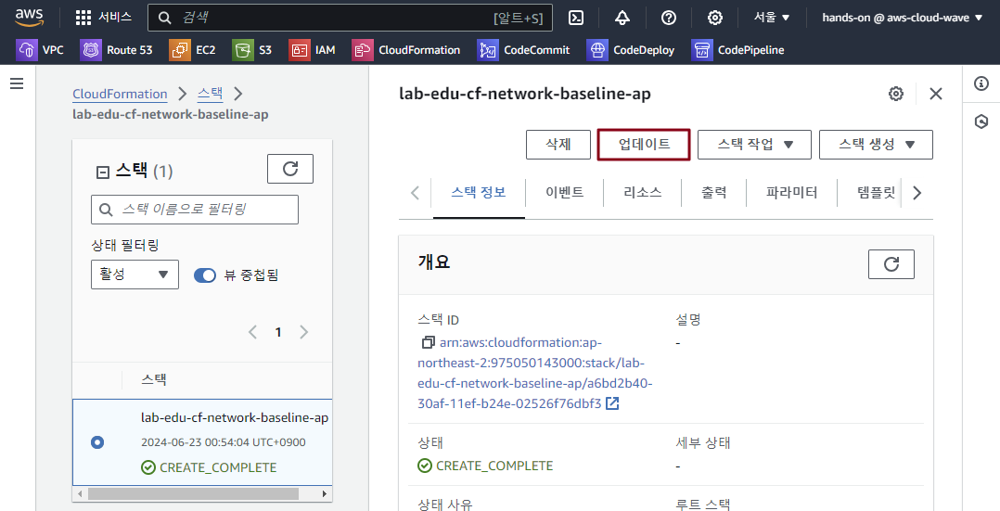

- **"기존 템플릿 교체" 라디오 버튼 클릭 → 객체 URL 정보 입력 → '다음' 버튼 클릭**

    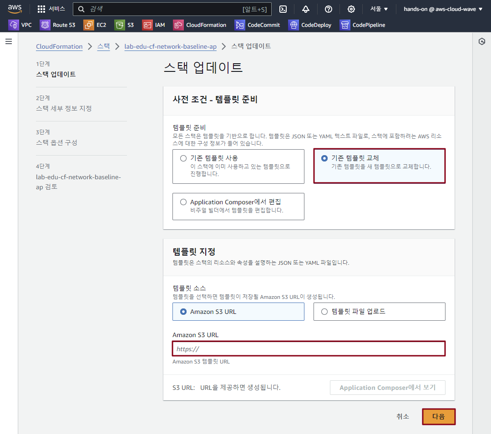

- **AvailabilityZoneSubnet01:** *ap-northeast-2a* / **AvailabilityZoneSubnet02:** *ap-northeast-2c* 선택 → '다음' 버튼 클릭

    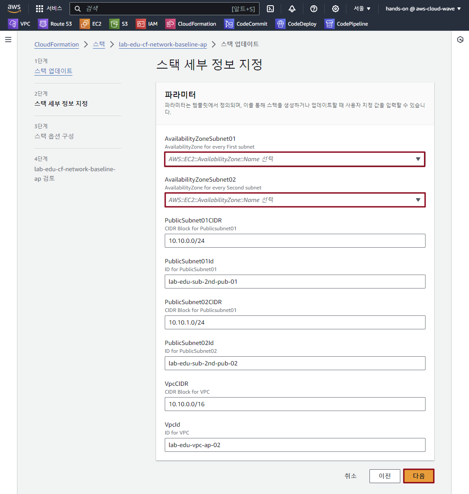

- '다음' 버튼 클릭 → '전송' 버튼 클릭


### 5. Output Section 활용 

- YAML Template 파일 구성 확인

    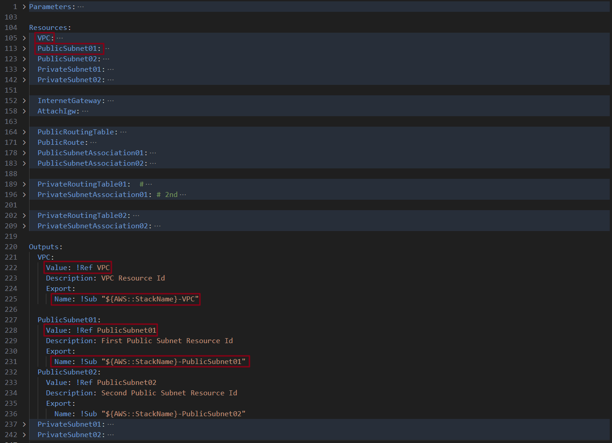

- Data Upload to S3

    ```cmd
    set FILE_NAME=03. resource_output.yaml
    ```

    ```cmd
    aws s3 cp "%FILE_PATH%\%FILE_NAME%" s3://%BUCKET_NAME%/%OBJ_NAME%
    ```

- 객체 URL 정보 확인 → URL 정보 복사

    ```cmd
    echo %OBJ_URL%
    ```

- **CloudFormation 메인 콘솔 화면 → 스택 리소스 탭 → "lab-edu-cf-network-baseline-ap" 스택 클릭**

- **"업데이트" 버튼 클릭 → "기존 템플릿 교체" 라디오 버튼 클릭 → 객체 URL 정보 입력 → '다음' 버튼 클릭**

- '다음' 버튼 클릭 → '다음' 버튼 클릭 → '전송' 버튼 클릭


### 6. Metadatea Section의 ParameterGroups 활용 

- YAML Template 파일 구성 확인

    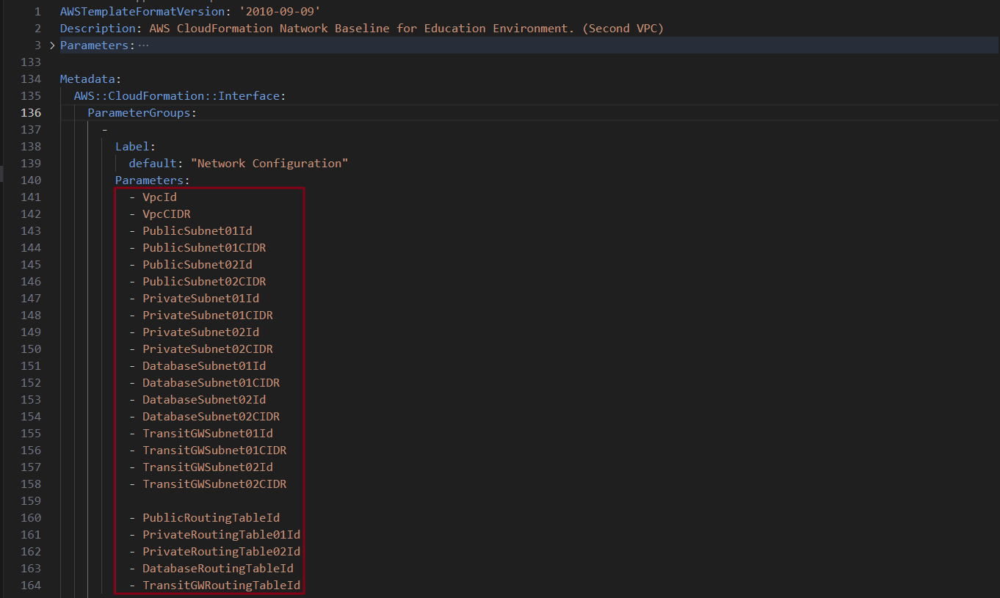

- Data Upload to S3

    ```cmd
    set FILE_NAME=04. metadata_parameter_groups.yaml
    ```

    ```cmd
    aws s3 cp "%FILE_PATH%\%FILE_NAME%" s3://%BUCKET_NAME%/%OBJ_NAME%
    ```

- 객체 URL 정보 확인 → URL 정보 복사

    ```cmd
    echo %OBJ_URL%
    ```

- **CloudFormation 메인 콘솔 화면 → 스택 리소스 탭 → "lab-edu-cf-network-baseline-ap" 스택 클릭**

- **"업데이트" 버튼 클릭 → "기존 템플릿 교체" 라디오 버튼 클릭 → 객체 URL 정보 입력 → '다음' 버튼 클릭**

- '다음' 버튼 클릭 → '다음' 버튼 클릭

- 'AWS CloudFormation에서 사용자 지정 이름으로 IAM 리소스를 생성할 수 있음을 승인합니다.' 체크박스 클릭 → '전송' 버튼 클릭

    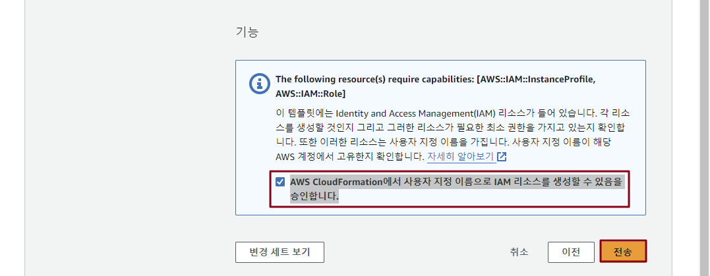

### 7. 일부 리소스 삭제 

- YAML Template 파일 구성 확인

    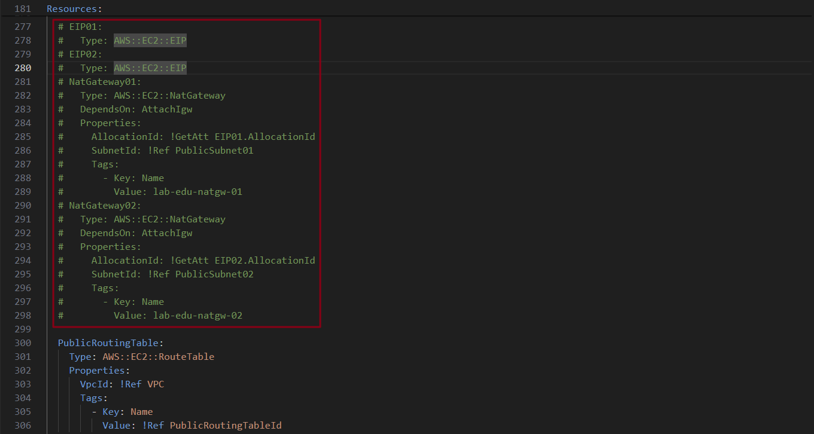

- Data Upload to S3

    ```cmd
    set FILE_NAME=network_baseline.yaml
    ```

    ```cmd
    aws s3 cp "%FILE_PATH%\%FILE_NAME%" s3://%BUCKET_NAME%/%OBJ_NAME%
    ```

- 객체 URL 정보 확인 → URL 정보 복사

    ```cmd
    echo %OBJ_URL%
    ```
<br><br>


# Network Baseline 추가 (us-east-1)

### 1. IAM User 리소스에 "Administrator Access" 권한 할당

- **IAM 메인 콘솔 화면 → 사용자 리소스 탭 → "lab-edu-iam-user-01" 클릭**

- "권한 추가" 버튼 클릭 → "권한 추가" 버튼 클릭

- "직접 정책 연결" 라디오 버튼 선택 → "AdministratorAccess" 검색 → "AdministratorAccess" 권한 선택

### 2. network_baseline.yaml 파일 수정

- VS Code 코드 편집기 화면으로 이동

- support_files > infra_as_a_code > us-east-1 폴더의 network_baseline.yaml 파일 열기

    ```cmd
    streamlit-project/
    ├─back_end
    ├─images
    │  └─animal_picture
    ├─menu
    ├─
    ├─scripts
    ├─support_files
    │  ├─infra_as_a_code
    │  │  ├─ap-northeast-2
    │  │  │      01. vpc_resource.yaml
    │  │  │      02. subnet_resource.yaml
    │  │  │      03. resource_output.yaml
    │  │  │      04. metadata_parameter_groups.yaml
    │  │  │      network_baseline.yaml
    │  │  ├─eu-central-1
    │  │  │      network_baseline.yaml
    │  │  └─us-east-1
    │  │          network_baseline.yaml
    │  ├─policy
    │  └─sql_query
    └─widget
    ```

- ***<Ctrl + F>*** 명령어 입력 → Find: "10.10." 입력 → ">"*(Angle brackets)* 버튼 클릭 → Replace: "10.20." 입력 → ***<Ctrl + Alt + Enter>*** 입력

    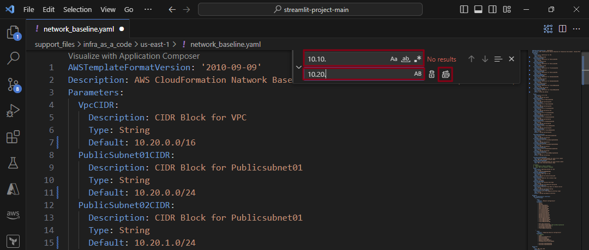

- Find: "lab-edu-vpc-ap-02" 입력 → Replace: "lab-edu-vpc-us" 입력 → ***<Ctrl + Alt + Enter>*** 입력

- Find: "2nd-ap" 입력 → Replace: "us" 입력 → ***<Ctrl + Alt + Enter>*** 입력

- Find: "ami-0ff1cd0b5d98708d1" 입력 → Replace: "ami-01b799c439fd5516a" 입력 → ***<Ctrl + Alt + Enter>*** 입력

- ***<Ctrl + S>*** 명령어 입력 → VS Code 터미널 창으로 이동 → AWS CLI 이용 CloudFormation Stack 생성

    ```cmd
    set FILE_PATH=support_files/infra_as_a_code/us-east-1
    ```

    ```cmd
    set FILE_NAME=network_baseline.yaml
    ```

    ```cmd
    set STACK_NAME=lab-edu-cf-network-baseline-us
    ```

    ```cmd
    set REGION=us-east-1
    ```

    ```cmd
    aws cloudformation create-stack --stack-name %STACK_NAME% ^
    --template-body file://%FILE_PATH%/%FILE_NAME% ^
    --capabilities CAPABILITY_NAMED_IAM ^
    --region %REGION% ^
    --parameters ^
    ParameterKey=AvailabilityZoneSubnet01,ParameterValue=%REGION%a ^
    ParameterKey=AvailabilityZoneSubnet02,ParameterValue=%REGION%c
    ```
<br><br>


# Network Baseline 추가 (eu-central-1)

### 1. network_baseline.yaml 파일 수정

- VS Code 코드 편집기 화면으로 이동

- support_files > infra_as_a_code > ue-central-1 폴더의 network_baseline.yaml 파일 열기

    ```cmd
    streamlit-project/
    ├─back_end
    ├─images
    │  └─animal_picture
    ├─menu
    ├─
    ├─scripts
    ├─support_files
    │  ├─infra_as_a_code
    │  │  ├─ap-northeast-2
    │  │  │      01. vpc_resource.yaml
    │  │  │      02. subnet_resource.yaml
    │  │  │      03. resource_output.yaml
    │  │  │      04. metadata_parameter_groups.yaml
    │  │  │      network_baseline.yaml
    │  │  ├─eu-central-1
    │  │  │      network_baseline.yaml
    │  │  └─us-east-1
    │  │          network_baseline.yaml
    │  ├─policy
    │  └─sql_query
    └─widget
    ```

- ***<Ctrl + F>*** 명령어 입력 → Find: "10.10." 입력 → ">"*(Angle brackets)* 버튼 클릭 → Replace: "10.30." 입력 → ***<Ctrl + Alt + Enter>*** 입력

- Find: "lab-edu-vpc-ap-02" 입력 → Replace: "lab-edu-vpc-eu" 입력 → ***<Ctrl + Alt + Enter>*** 입력

- Find: "2nd-ap" 입력 → Replace: "eu" 입력 → ***<Ctrl + Alt + Enter>*** 입력

- Find: "ami-0ff1cd0b5d98708d1" 입력 → Replace: "ami-04f1b917806393faa" 입력 → ***<Ctrl + Alt + Enter>*** 입력

- ***<Ctrl + S>*** 명령어 입력 → VS Code 터미널 창으로 이동 → AWS CLI 이용 CloudFormation Stack 생성

    ```cmd
    set FILE_PATH=support_files/infra_as_a_code/eu-central-1
    ```

    ```cmd
    set REGION=eu-central-1
    ```

    ```cmd
    set STACK_NAME=lab-edu-cf-network-baseline-eu
    ```

    ```cmd
    aws cloudformation create-stack --stack-name %STACK_NAME% ^
    --template-body file://%FILE_PATH%/%OBJ_NAME% ^
    --capabilities CAPABILITY_NAMED_IAM ^
    --region %REGION% ^
    --parameters ^
    ParameterKey=AvailabilityZoneSubnet01,ParameterValue=%REGION%a ^
    ParameterKey=AvailabilityZoneSubnet02,ParameterValue=%REGION%c
    ```