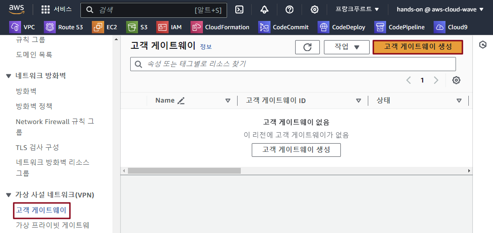
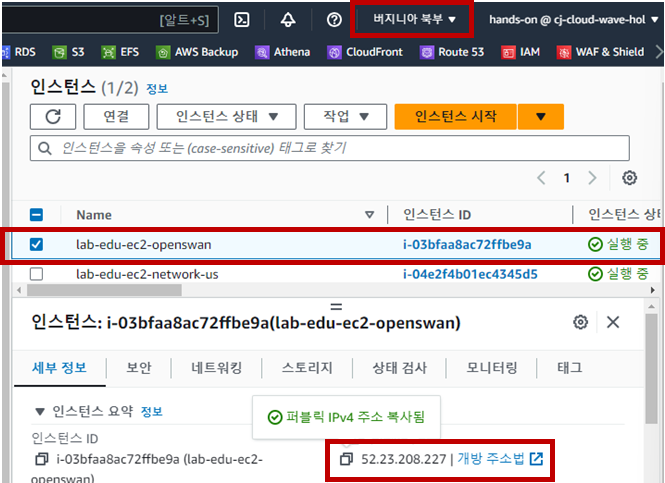
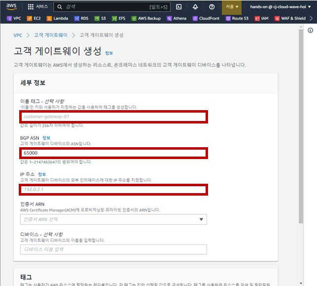
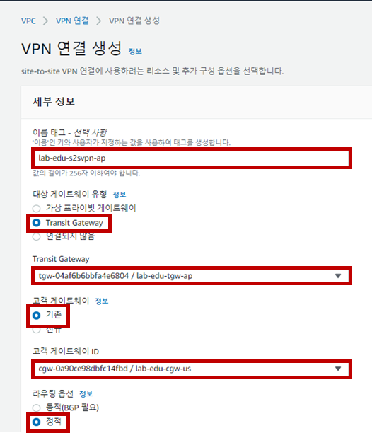
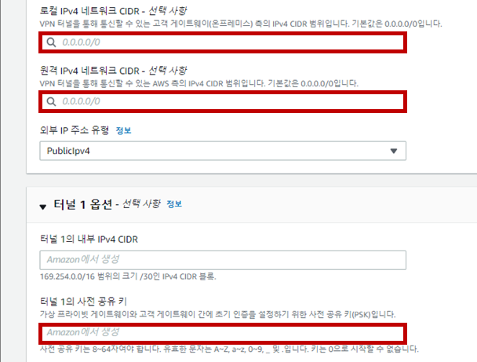
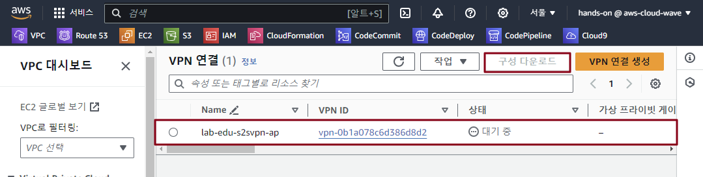
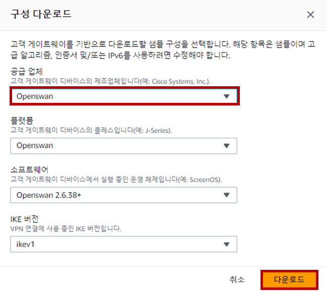
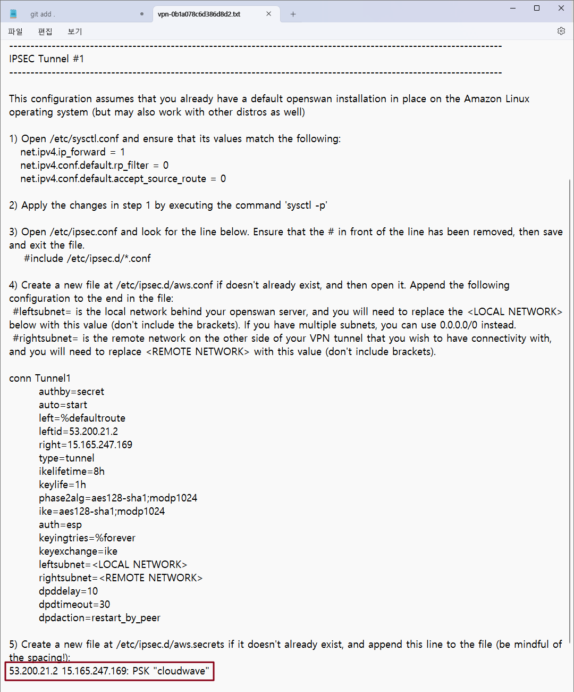
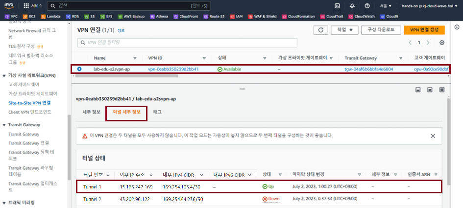

# Lab Environment Configuration

### 1. VPC Peering Resource 삭제

- **VPC 콘솔 메인 화면 → 피어링 연결 리소스 탭 → "lab-edu-peering-ap01-ap02" 선택**

- **'작업' 버튼 클릭 → '피어링 연결 삭제' 버튼 클릭 → '삭제' 입력 → '삭제' 버튼 클릭**

- **VPC 콘솔 메인 화면 → 피어링 연결 리소스 탭 → "lab-edu-peering-ap01-eu01" 선택**

- **'작업' 버튼 클릭 → '피어링 연결 삭제' 버튼 클릭 → '삭제' 입력 → '삭제' 버튼 클릭**
<br><br>


# 서울 리전 ↔ 서울 리전 Transit Gateway 생성

### 1. Transit Gateway 생성

- **VPC 콘솔 메인 화면 → Transit Gateway 리소스 탭 → "Transit Gateway 생성" 버튼 클릭**

- Transit Gateway 생성 정보 입력

    - 이름: lab-edu-tgw-ap

    - Amazon ASN: 64512

    'Transit Gateway 생성' 버튼 클릭
        

### 2. Transit Gateway Attach 생성 (1/2)

- **VPC 콘솔 메인 화면 → Transit Gateway Attach 리소스 탭 → "Transit Gateway Attach 생성" 버튼 클릭**

- Transit Gateway Attach 생성 정보 입력

    - 이름: lab-edu-tgw-att-ap01

    - Transit Gateway ID: lab-edu-tgw-ap

    - 연결 유형: VPC

    - VPC ID: lab-edu-vpc-ap-01

    - Subnet ID: 

        - ap-northeast-2a: lab-edu-sub-tgw-01

        - ap-northeast-2c: lab-edu-sub-tgw-02

    - 'Transit Gateway Attach 생성' 버튼 클릭

        
            
### 3. Transit Gateway Attach 생성 (2/2)

- **VPC 콘솔 메인 화면 → Transit Gateway Attach 리소스 탭 → "Transit Gateway Attach 생성" 버튼 클릭**

- Transit Gateway Attach 생성 정보 입력
    - 이름: lab-edu-tgw-att-ap02

    - Transit Gateway ID: lab-edu-tgw-ap

    - 연결 유형: VPC

    - VPC ID: lab-edu-vpc-ap-02

    - Subnet ID: 

        - ap-northeast-2a: lab-edu-sub-tgw-01

        - ap-northeast-2c: lab-edu-sub-tgw-02

    - 'Transit Gateway Attach 생성' 버튼 클릭

### 4. Transit Gateway Routing Table 설정

- **VPC 콘솔 메인 화면 → Transit Gateway 라우팅 테이블 리소스 탭 → "Routing Table" 선택**

- '경로' 탭 → '정적 경로 생성' 버튼 클릭

    

- 정적 경로 생성 정보 입력 → '정적 경로 생성' 버튼 클릭

    - CIDR: 10.10.0.0/16

    - 연결 선택: lab-edu-tgw-att-ap02

### 5. VPC Routing Table 수정

- **VPC 콘솔 메인 화면 → 라우팅 테이블 탭 → "lab-edu-rtb-pri-01" 선택 → '라우팅' 탭 → '라우팅 편집' 버튼 클릭**

- 라우팅 테이블 경로 생성 정보 입력

    - '라우팅 추가' 버튼 클릭

    - 대상: 10.10.0.0/16

    - 대상: Trangit Gateway (lab-edu-tgw-att-ap01)

    - '변경 사항 저장' 버튼 클릭

- **VPC 콘솔 메인 화면 → 라우팅 테이블 탭 → "lab-edu-rtb-2nd-pri-01" 선택 → '라우팅' 탭 → '라우팅 편집' 버튼 클릭**

- 라우팅 테이블 경로 생성 정보 입력

    - '라우팅 추가' 버튼 클릭

    - 대상: 10.0.0.0/16

    - 대상: Trangit Gateway (lab-edu-tgw-att-ap02)

    - '변경 사항 저장' 버튼 클릭

### 6. Network 통신 테스트

- **EC2 메인 콘솔 화면으로 이동 → 인스턴스 리소스 탭 → 'lab-edu-ec2-network-2nd-ap' 선택 → Private IP 주소 복사**

- Cloud9 IDE Terminal 화면으로 이동 → ssh 명령어 실행

    ```bash
    ssh web-server
    ```

- ICMP 통신 테스트 진행

    ```bash
    ping {2ND_VPC_NETWORK_SERVER_PRIVATE_IP}
    PING 10.10.40.140 (10.10.40.140) 56(84) bytes of data.
    64 bytes from 10.10.40.140: icmp_seq=1 ttl=254 time=0.990 ms
    64 bytes from 10.10.40.140: icmp_seq=2 ttl=254 time=0.926 ms
    64 bytes from 10.10.40.140: icmp_seq=3 ttl=254 time=0.907 ms
    64 bytes from 10.10.40.140: icmp_seq=4 ttl=254 time=0.946 ms
    ```
<br><br>


# 서울 리전 ↔ 프랑크푸르 리전 Transit Gateway 생성

### 1. 프랑크푸르트 리전에 Transit Gateway 생성

- **프랑크푸르트 리전으로 이동 → VPC 콘솔 메인 화면 → Transit Gateway 리소스 탭 → "Transit Gateway 생성" 버튼 클릭**

- Transit Gateway 생성 정보 입력

    - 이름: lab-edu-tgw-eu

    - Amazon ASN: 64513

    - 'Transit Gateway 생성' 버튼 클릭

- Transit Gateway ID 정보 메모장에 저장

    

### 2. 프랑크푸르트 리전 Transit Gateway Attach 생성 (1/2)

- **프랑크푸르트 리전으로 이동 → VPC 콘솔 메인 화면 → Transit Gateway Attach 리소스 탭 → "Transit Gateway Attach 생성" 버튼 클릭**

- Transit Gateway Attach 생성 정보 입력

    - 이름: lab-edu-tgw-att-eu

    - Transit Gateway ID: lab-edu-tgw-eu

    - 연결 유형: VPC

    - VPC ID: lab-edu-vpc-eu-01

    - Subnet ID: 

        - ap-northeast-2a: lab-edu-sub-eu-tgw-01

        - ap-northeast-2c: lab-edu-sub-eu-tgw-02

    'Transit Gateway Attach 생성' 버튼 클릭

### 3. 서울 리전 Transit Gateway Attach 생성 (2/2)

- **서울 리전으로 이동 → VPC 콘솔 메인 화면 → Transit Gateway Attach 리소스 탭 → "Transit Gateway Attach 생성" 버튼 클릭**

- Transit Gateway Attach 생성 정보 입력
    - 이름: lab-edu-tgw-att-peering-eu

    - Transit Gateway ID: lab-edu-tgw-ap

    - 연결 유형: Peering Connection

    - 리전: eu-central-1

    - Transit Gateway(수락자): {FRANKFURT_REGION_TRANGIT_GATEWAY_ID}

    - 'Transit Gateway Attach 생성' 버튼 클릭

        

### 4. 프랑크푸르트 리전 Transit Gateway Peering 수락

- **프랑크푸르트 리전으로 이동 → VPC 콘솔 메인 화면 → Transit Gateway Attach 리소스 탭**

- 'Peering Acceptance' 상태의 Attachment 선택 → 작업 → Transit Gateway Attachment 수락 → 수

    

### 5. Transit Gateway Routing Table 설정

- **서울 리전으로 이동 → VPC 콘솔 메인 화면 → Transit Gateway 라우팅 테이블 리소스 탭 → "Routing Table" 선택**

- '경로' 탭 → '정적 경로 생성' 버튼 클릭

- 정적 경로 생성 정보 입력 → '정적 경로 생성' 버튼 클릭

    - CIDR: 10.30.0.0/16

    - 연결 선택: lab-edu-tgw-att-peering-eu

- **프랑크푸르트 리전으로 이동 → VPC 콘솔 메인 화면 → Transit Gateway 라우팅 테이블 리소스 탭 → "Routing Table" 선택**

- '경로' 탭 → '정적 경로 생성' 버튼 클릭

- 정적 경로 생성 정보 입력 → '정적 경로 생성' 버튼 클릭

    - CIDR: 10.0.0.0/16

    - 연결 선택: lab-edu-tgw-att-peering-eu


### 6. VPC Routing Table 수정

- **서울 리전으로 이동 → VPC 콘솔 메인 화면 → 라우팅 테이블 탭 → "lab-edu-rtb-pri-01" 선택 → '라우팅' 탭 → '라우팅 편집' 버튼 클릭**

- 라우팅 테이블 경로 생성 정보 입력

    - '라우팅 추가' 버튼 클릭

    - 대상: 10.30.0.0/16

    - 대상: Trangit Gateway (lab-edu-tgw-att-ap01)

    - '변경 사항 저장' 버튼 클릭

- **프랑크푸르트 리전으로 이동 → VPC 콘솔 메인 화면 → 라우팅 테이블 탭 → "lab-edu-rtb-eu-pri" 선택 → '라우팅' 탭 → '라우팅 편집' 버튼 클릭**

- 라우팅 테이블 경로 생성 정보 입력

    - '라우팅 추가' 버튼 클릭

    - 대상: 10.0.0.0/16

    - 대상: Trangit Gateway (lab-edu-tgw-att-eu)

    - '변경 사항 저장' 버튼 클릭

### 7. Network 통신 테스트

- **프랑크푸르트 리전으로 이동 → EC2 메인 콘솔 화면 → 인스턴스 리소스 탭 → 'lab-edu-ec2-network-eu' 선택 → Private IP 주소 복사**

- Cloud9 IDE Terminal 화면으로 이동 → ssh 명령어 실행

    ```bash
    ssh web-server
    ```

- ICMP 통신 테스트 진행

    ```bash
    ping {FRANKFURT_REGION_NETWORK_SERVER_PRIVATE_IP}
    PING 10.30.40.56 (10.30.40.56) 56(84) bytes of data.
    64 bytes from 10.30.40.56: icmp_seq=1 ttl=252 time=241 ms
    64 bytes from 10.30.40.56: icmp_seq=2 ttl=252 time=240 ms
    64 bytes from 10.30.40.56: icmp_seq=3 ttl=252 time=239 ms
    64 bytes from 10.30.40.56: icmp_seq=4 ttl=252 time=239 ms
    ```
<br><br>


# 서울 리전 ↔ 버지니아 리전 Transit Gateway & Site to Site VPN 연동

### 1. 서울 리전 Custom Gateway 생성

- **서울 리전으로 이동 → VPC 콘솔 메인 화면 → 고객 게이트웨이 리소스 탭 → "고객 게이트웨이 생성" 버튼 클릭**

    

- 버지니아 리전으로 이동 → 인스턴스 콘솔 메인 화면 → 인스턴스 리소스 탭 → 'lab-edu-ec2-openswan-us' 선택 → Public IP 복사

    

- 고객 게이트웨이 생성 정보 입력

    - 이름: lab-edu-cgw-us

    - BGP ASN: 65100

    - IP Address: {VIRGINIA_REGION_OPENSWAN_SERVER_PUBLIC_IP}

    - '고객 게이트웨이 생성' 버튼 클릭

        

### 2. 서울 리전 Site to Site VPN 리소 생성

- **서울 리전으로 이동 → VPC 콘솔 메인 화면 → 'Site to Site VPC 연결' 리소스 탭 → "VPN 연결 생성" 버튼 클릭**

- 'Site to Site VPC 연결' 생성 정보 입력

    - 이름: lab-edu-s2svpn-ap

    - 대상 게이트웨이 유형: Transit Gateway

    - Transit Gateway: lab-edu-tgw-ap

    - 고객 게이트웨이: 기존

    - 고객 게이트웨이 ID: lab-edu-cgw-us

    - 라우팅 옵션: 정적

        

    - 로컬 IPv4 네트워크 CIDR: 10.30.0.0/16

    - 원격 IPv4 네트워크 CIDR: 10.0.0.0/16

    - 터널 1, 2 옵션의 사전 공유 키: cloudwave

    - 'VPN 연결 생성' 버튼 클릭

        

### 3. 고객 게이트웨이 구성 다운로드

- **서울 리전으로 이동 → VPC 콘솔 메인 화면 → 'Site to Site VPC 연결' 리소스 탭 → "lab-edu-s2svpn-ap" 선택 → '구성 다운로드' 버튼 클릭**

    

- 구성 다운로드 설정 정보 입력

    - 공급 업체: Openswan

    - 플랫폼: Openswan

    - 소프트웨어: Openswan 2.6.38+

    - IKE 버전: ikev1

    - '다운로드' 버튼 클릭

        

### 4. Openswan 서버 설정

- **버지니아 리전으로 이동 → EC2 콘솔 메인 화면 → 인스턴스 리소스 탭 → 'lab-edu-ec2-openswan-us' 선택 → '연결' 버튼 클릭**

- 'Session Manager' 탭으로 이동 → '연결' 버튼 클릭

- sysctl.conf 파일 설정

    ```bash
    sudo su -
    ```

    ```bash
    vim /etc/sysctl.conf
    ```

    ```bash
    net.ipv4.ip_forward = 1  
    net.ipv4.conf.default.rp_filter = 0   
    net.ipv4.conf.default.accept_source_route = 0
    ```

- 구성 다운로드 파일 열기 → 설정 내용 복사

    

- aws.conf 파일 설정 (구성 다운로드 파일 다운로드 내용 붙여넣기 → 수정)

    ```bash
    vim /etc/ipsec.d/aws.conf
    ```

    ```bash
    conn Tunnel1
        authby=secret
        auto=start
        left=%defaultroute
        leftid=52.23.208.227
        right=13.125.161.188
        type=tunnel
        ikelifetime=8h
        keylife=1h
        phase2alg=aes128-sha1;modp1024
        ike=aes128-sha1;modp1024
        auth=esp	                 # 삭제!!
        keyingtries=%forever
        keyexchange=ike
        leftsubnet=<LOCAL NETWORK>	 # <LOCAL NETWORK> 삭제 → 10.30.0.0/16 입력
        rightsubnet=<REMOTE NETWORK> # <REMOTE NETWORK> 삭제 → 10.0.0.0/16 입력
        dpddelay=10
        dpdtimeout=30
        dpdaction=restart_by_peer
    ```

- 구성 다운로드 파일 열기 → 설정 내용 복사

    

- aws.secrets 파일 설정 (구성 다운로드 파일 다운로드 내용 붙여넣기)

    ```bash
    vim /etc/ipsec.d/aws.ecrets
    ```

    ```bash
    53.200.21.2 15.165.247.169: PSK "cloudwave"
    ```

- Openswan 재시작

    ```bash
    systemctl restart network
    ```

    ```bash
    systemctl restart ipsec.service
    ```

    ```bash
    systemctl status ipsec.service
    ```

    

### 5. Transit Gateway Routing Table 설정

- **서울 리전으로 이동 → VPC 콘솔 메인 화면 → Transit Gateway 라우팅 테이블 리소스 탭 → "Routing Table" 선택**

- '경로' 탭 → '정적 경로 생성' 버튼 클릭

- 정적 경로 생성 정보 입력 → '정적 경로 생성' 버튼 클릭

    - CIDR: 10.20.0.0/16

    - 연결 선택: lab-edu-s2svpn-ap

### 6. VPC Routing Table 수정

- **서울 리전으로 이동 → VPC 콘솔 메인 화면 → 라우팅 테이블 탭 → "lab-edu-rtb-pri-01" 선택 → '라우팅' 탭 → '라우팅 편집' 버튼 클릭**

- 라우팅 테이블 경로 생성 정보 입력

    - '라우팅 추가' 버튼 클릭

    - 대상: 10.20.0.0/16

    - 대상: Trangit Gateway (lab-edu-tgw-att-ap01)

    - '변경 사항 저장' 버튼 클릭

- **버지니아 리전으로 이동 → VPC 콘솔 메인 화면 → 라우팅 테이블 탭 → "lab-edu-rtb-us-pri" 선택 → '라우팅' 탭 → '라우팅 편집' 버튼 클릭**

- 라우팅 테이블 경로 생성 정보 입력

    - '라우팅 추가' 버튼 클릭

    - 대상: 10.0.0.0/16

    - 대상: 인스턴스 (lab-edu-ec2-openswan-us)

    - '변경 사항 저장' 버튼 클릭

### 7. Network 통신 테스트

- **버지니아 리전으로 이동 → EC2 메인 콘솔 화면 → 인스턴스 리소스 탭 → 'lab-edu-ec2-network-us' 선택 → Private IP 주소 복사**

- Cloud9 IDE Terminal 화면으로 이동 → ssh 명령어 실행

    ```bash
    ssh web-server
    ```

- ICMP 통신 테스트 진행

    ```bash
    ping {VIRGINIA_REGION_NETWORK_SERVER_PRIVATE_IP}
    PING 10.20.40.196 (10.20.40.196) 56(84) bytes of data.
    64 bytes from 10.20.40.196: icmp_seq=1 ttl=253 time=188 ms
    64 bytes from 10.20.40.196: icmp_seq=2 ttl=253 time=187 ms
    64 bytes from 10.20.40.196: icmp_seq=3 ttl=253 time=187 ms
    64 bytes from 10.20.40.196: icmp_seq=4 ttl=253 time=188 ms