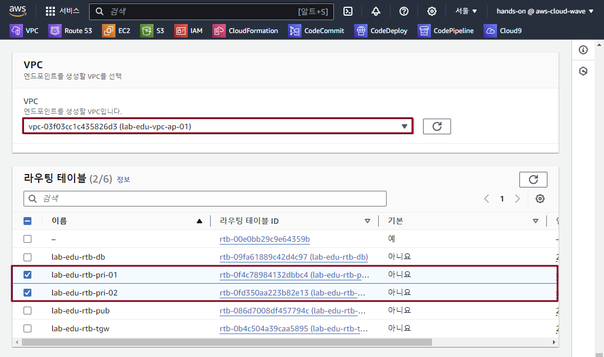

# Lab Environment Configuration

### 1. 이미지 파일 저장용 Amazon S3 Bucket 생성

- Cloud9 IDE Terminal 화면으로 이동 

    ```bash
    cd ~/environment
    sh cloud-wave-workspace/scripts/upload_images_to_s3.sh 
    ```

### 2. Network 테스트용 EC2 서버 2개 추가 생성

- Cloud9 IDE Terminal 화면에서 이어서 작업 진행

    ```bash
    cd ~/environment
    sh cloud-wave-workspace/scripts/create_ec2_instance.sh 
    ```

### 3. Network 테스트용 EC2 서버 접속 및 S3 버킷 조회

- Cloud9 IDE Terminal 화면에서 이어서 작업 진행

- Network-01 EC2 접속 → S3 Bucket Object 조회

    ```bash
    ssh network-01
    ```

    ```bash
    aws s3 ls
    ```

    ```bash
    aws s3 ls s3://lab-edu-bucket-image-9**********0/
    ```

- Cloud9 IDE 새로운 Terminal 화면 열기

- Network-02 EC2 접속 → S3 Bucket Object 조회

    ```bash
    ssh network-02
    ```

    ```bash
    aws s3 ls
    ```

    ```bash
    aws s3 ls s3://lab-edu-bucket-image-9**********0/
    ```
<br><br>

# S3 버킷용 VPC Endpoint 생성 (Gateway Type)

### 1. VPC Endpoint 생성

- **VPC 콘솔 메인 화면 → 엔드포인트 리소스 탭 → "엔드포인트 생성" 버튼 클릭**

- 엔드포인트 생성 정보 입력

    - 이름: lab-edu-endpoint-s3

    - 서비스 이름 / 소유자 / 유형: com.amazonaws.ap-northeast-2.s3 / amazon / Gateway

        

    - VPC: lab-edu-vpc-ap-01

    - 라우팅 테이블: lab-edu-rtb-pri-01, lab-edu-rtb-pri-02

        

    - 정책: 전체 액세

    - '엔드포인트 생성' 버튼 클릭

        

### 2. Network 테스트용 EC2 서버 접속 및 S3 버킷 조회

- Network-02 EC2 접속 → S3 Bucket Object 조회

    ```bash
    ssh network-02
    ```

    ```bash
    aws s3 ls
    ```

    ```bash
    aws s3 ls s3://lab-edu-bucket-image-9**********0/
<br><br>


# SSM VPC Endpoint 생성 (Interface Type)

### 1. SSM 이용 Network Server 접속 테스트

- **EC2 콘솔 메인 화면 → 인스턴스 리소스 탭 → 'lab-edu-ec2-network-ap-01' 선택 → '연결' 버튼 클릭**

- 'Session Manager' 탭으로 이동 → '연결' 버튼 클릭

- **EC2 콘솔 메인 화면 → 인스턴스 리소스 탭 → 'lab-edu-ec2-network-ap-02' 선택 → '연결' 버튼 클릭**

- 'Session Manager' 탭으로 이동 → '연결' 버튼 클릭 → 연결 

### 2. SSM VPC Endpoint용 Security Group 생성

- **EC2 콘솔 메인 화면 → 보안 그룹 리소스 탭 → "보안 그룹 생성" 버튼 클릭**

- 엔드포인트 생성 정보 입력

    - 보안그룹 이름: lab-edu-sg-endpoint-interface

    - VPC: lab-edu-vpc-ap-01

    - 인바운드 규칙:

        - 유형: HTTPS / 포트 범위: 443 / 소스: 10.0.0.0/16

        - 유형: UDP / 포트 범위: 53 / 소스: 10.0.0.0/16

    - '보안 그룹 생성' 버튼 클릭

### 3. VPC Endpoint 생성

- **VPC 콘솔 메인 화면 → 엔드포인트 리소스 탭 → "엔드포인트 생성" 버튼 클릭**

- 엔드포인트 생성 정보 입력 (ssm)

    - 이름: lab-edu-endpoint-ssm

    - 서비스 이름 / 소유자 / 유형: com.amazonaws.ap-northeast-2.ssm / amazon / Interface

    - VPC: lab-edu-vpc-ap-01

    - 서브넷: lab-edu-sub-pri-01, lab-edu-sub-pri-02

    - 보안그룹: lab-edu-sg-endpoint-interface

    - '엔드포인트 생성' 버튼 클릭

- 엔드포인트 생성 정보 입력 (ssmessages)

    - 이름: lab-edu-endpoint-ssmessages

    - 서비스 이름 / 소유자 / 유형: com.amazonaws.ap-northeast-2.ssmessages / amazon / Interface

    - VPC: lab-edu-vpc-ap-01

    - 서브넷: lab-edu-sub-pri-01, lab-edu-sub-pri-02

    - 보안그룹: lab-edu-sg-endpoint-interface

    - '엔드포인트 생성' 버튼 클릭

- 엔드포인트 생성 정보 입력 (ec2messages)

    - 이름: lab-edu-endpoint-ec2messages

    - 서비스 이름 / 소유자 / 유형: com.amazonaws.ap-northeast-2.ec2messages / amazon / Interface

    - VPC: lab-edu-vpc-ap-01

    - 서브넷: lab-edu-sub-pri-01, lab-edu-sub-pri-02

    - 보안그룹: lab-edu-sg-endpoint-interface

    - '엔드포인트 생성' 버튼 클릭

### 4. SSM 이용 Network Server 접속

- **EC2 콘솔 메인 화면 → 인스턴스 리소스 탭 → 'lab-edu-ec2-network-ap-02' 선택 → '연결' 버튼 클릭**

- 'Session Manager' 탭으로 이동 → '연결' 버튼 클릭 → 연결 