# AWS Marketplace 이용 EC2 생성 (OpenVPN)

### 1. OpenVPN 인스턴스 생성

- **EC2 콘솔 메인 화면 → 인스턴스 리소스 탭 → '인스턴스 생성' 버튼 클릭**

- EC2 생성 정보 입력

    - 이름: lab-edu-ec2-openvpn

    - AMI 검색창에 'openvpn' 입력

        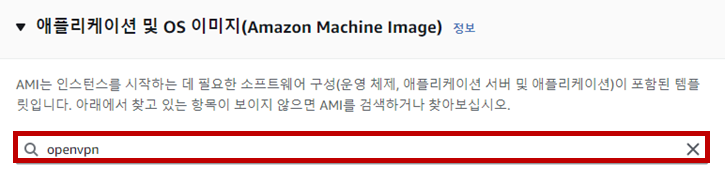

    - AWS Marketplace AMI 탭으로 이동 → 'OpenVPN Access Server' 선택

        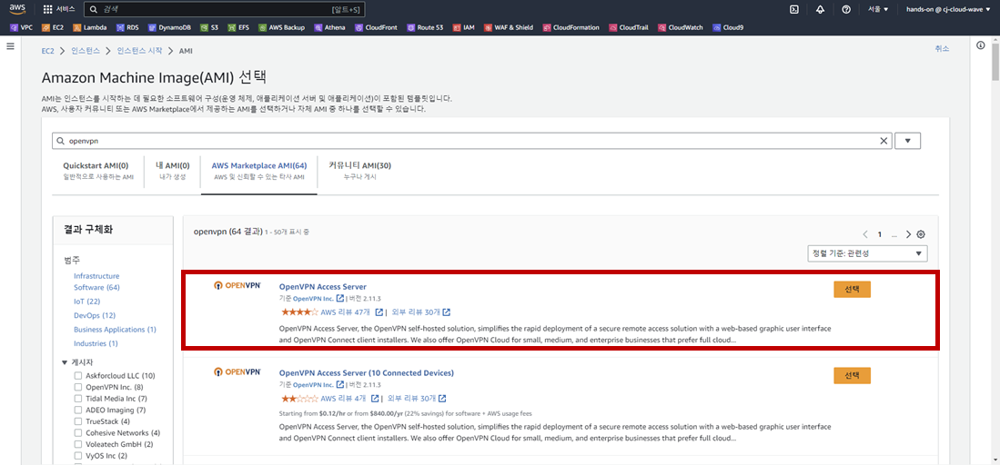

    - '계속' 버튼 클릭

        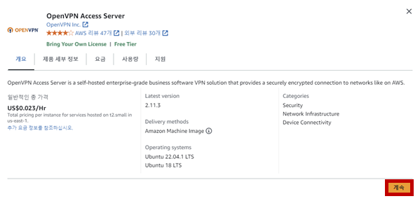

    - 키 페어: lab-edu-key-ec2.pem

    - VPC: lab-edu-vpc-ap-01

    - Subnet: lab-edu-sub-pub-01

    - '생성' 버튼 클릭

### 2. EIP 생성 및 OpenVPN 인스턴스에 할당

- **EC2 콘솔 메인 화면 → 탄력적 IP 리소스 탭 → '탄력적 IP 주소 할당' 버튼 클릭 → '할당' 버튼 클릭**

    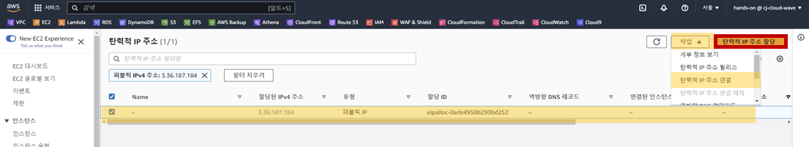

- 새로 생성된 EIP 선택 → '작업' → '탄력적 IP 주소 연결' 선택

    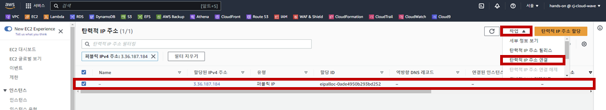

- 인스턴스: 'lab-edu-ec2-openvpn' → '연결' 버튼 클릭

    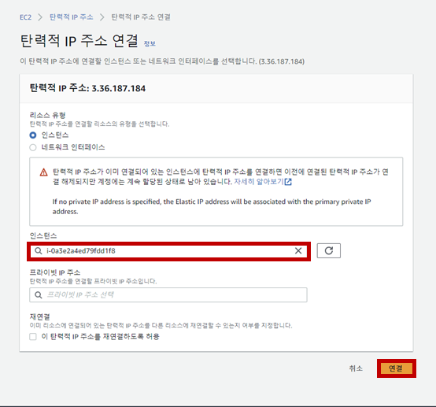

### 3. OpenVPN 설정

- **EC2 콘솔 메인 화면 → 인스턴스 리소스 탭 → 'lab-edu-ec2-openvpn' 선택 → '연결' 버튼 클릭**

- 'Session Manager' 탭으로 이동 → '연결' 버튼 클릭 → 연결 → 'root' 사용자로 전환

    ```bash
    sudo su -
    ```

- 최초 질문에 'yes' 입력 → 모든 설정 값은 Default로 입력 (모두 'Enter' 입력)

- 설정 완료 후 접속 정보 메모장에 저장 (Admin UI, Client UI, Password)
  
    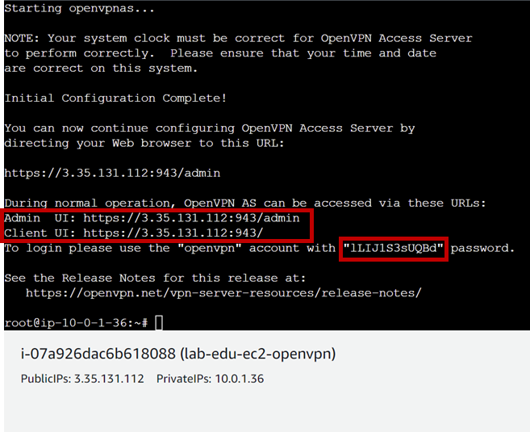

- 웹 브라우저에 Admin UI 접속 정보 입력 → '고급' 선택 → 'IP_ADDRESS (안전하지 않음)으로 이동' 클릭

    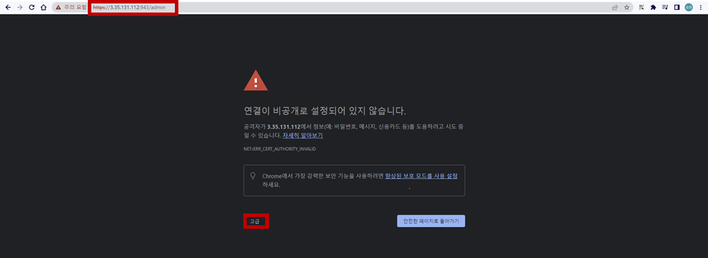

- 로그인 정보 입력 (ID: openvpn / Password: 앞에서 메모장에 저장한 Password 입력)

    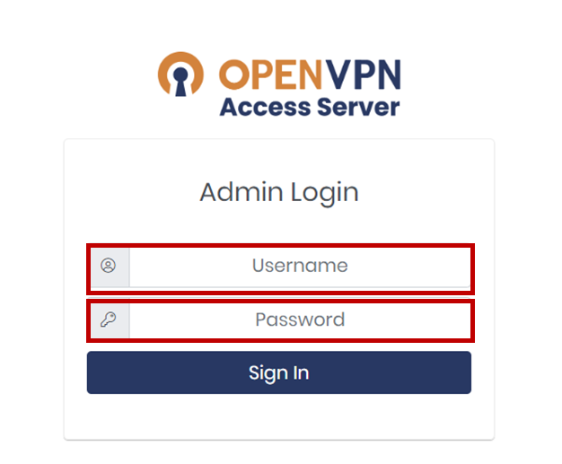

- 'USER MANAGEMENT' 탭으로 이동 → 'User Permissions' 탭 선택 → OpenVPN 계정 생성 정보 입력

    - 이름: admin

    - Allow Auto-login 체크박스 활성화

    - More Settings 버튼 클릭

    - Local Password: PASSWORD 입력 (예시: qwer1234)

    - '생성' 버튼 클릭

        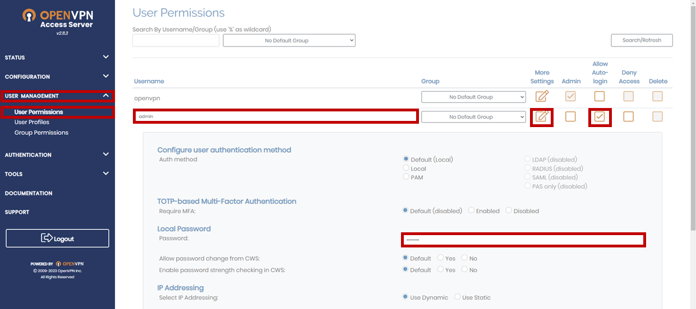

- 웹 브라우저에 Client UI 접속 정보 입력 → 로그인 정보 입력 (ID: admin / Password: PASSWORD 입력 (예시: qwer1234))

    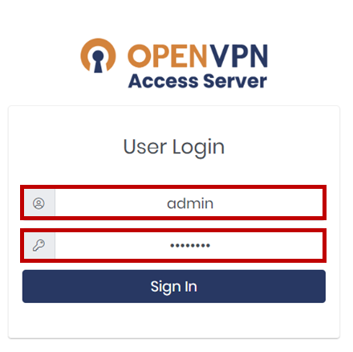

- OS 환경에 맞춰 OpenVPN Connector 다운로드

    

- 바탕화면 우측 하단의 'OpenVPN' 아이콘 클릭 → {IP_ADDRESS} 선택 → 'Connect as admin' 버튼 클

    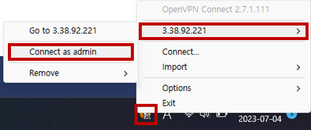

### 4. OpenVPN 테스트

- EC2 접속 정보 확인: 인스턴스 메인 콘솔 화면 이동 → '인스턴스' 탭으로 이동 → 'lab-edu-ec2-web' 선택 → 프라이빗 IPv4 주소 복사

- Putty 실행 → SSH 클릭 → Auth 클릭 → Credentials 클릭 → Browser 클릭 → 'lab-edu-key-ec2.ppk' 선택 

- Session 클릭 → Host Name: 'ec2-user@*{WEB_SERVER_PRIVATE_IP}* 입력 → 'Open' 버튼 클릭

- 웹 브라우저에서 주소창에 *{WEB_SERVER_PRIVATE_IP}* 입력 