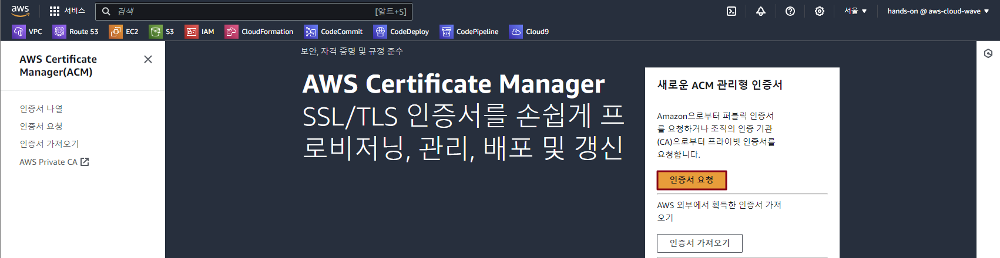
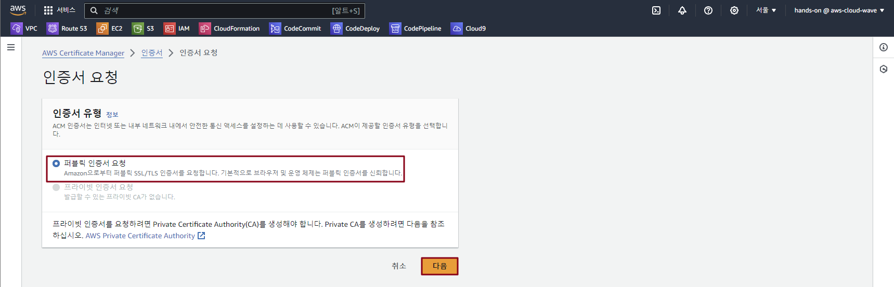
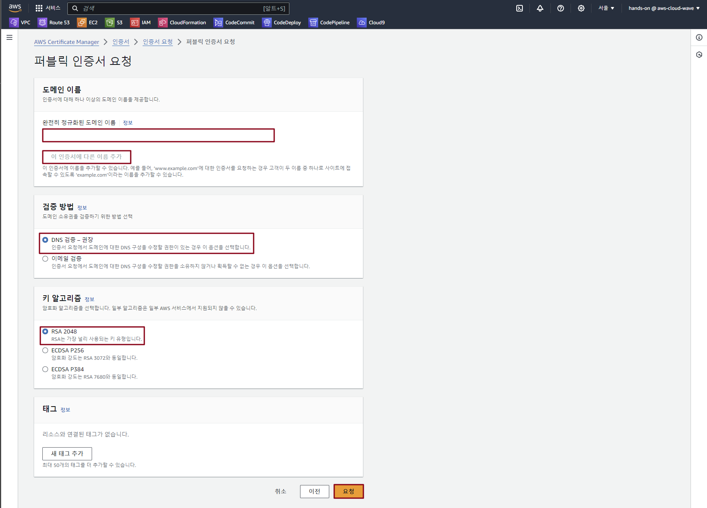
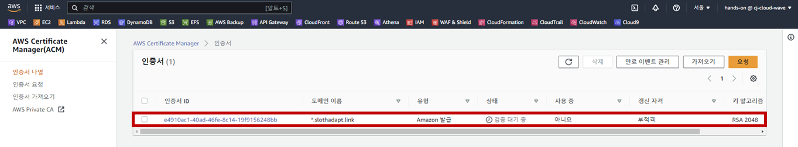
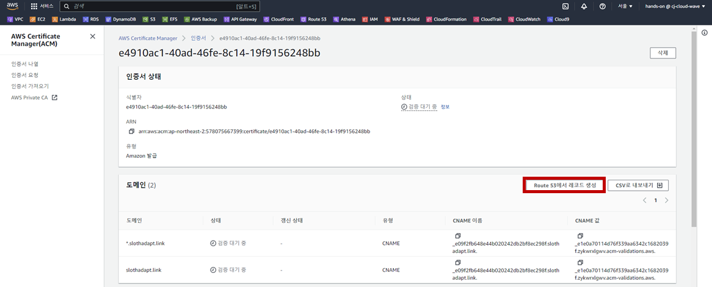
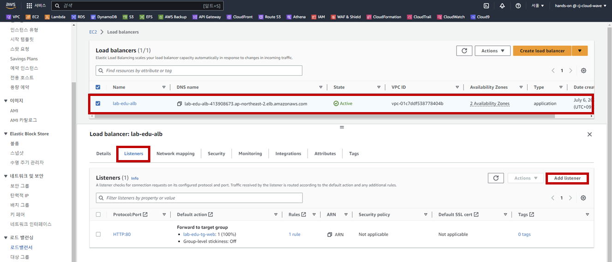
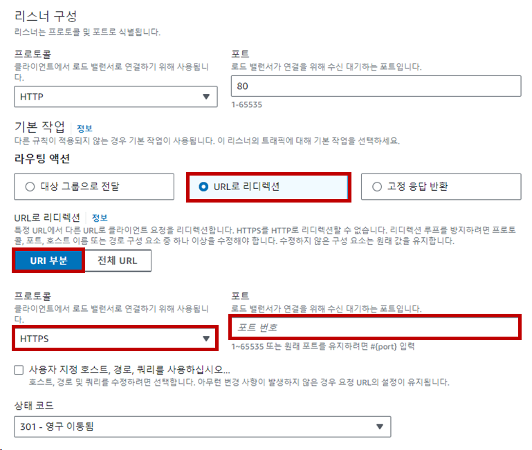
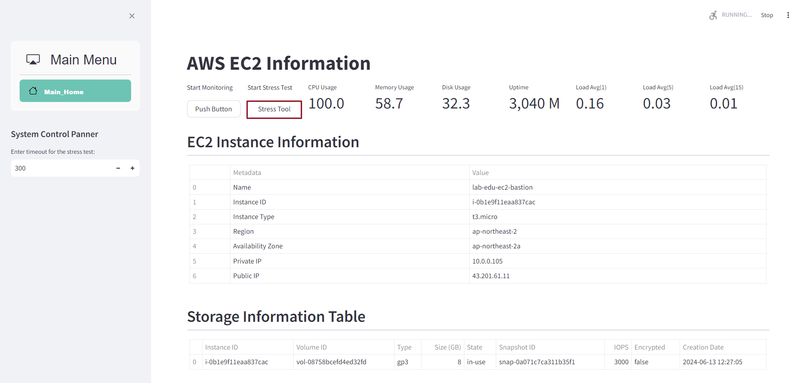

# AWS Certificate Manager 생성 및 HTTPS 프로토콜 활성화

### 1. AWS Certificate Manager 생성

- **Certificate Manager 메인 콘솔 화면 → "인증서 요청" 버튼 클릭**

    

- '퍼블릭 인증서 요청' 선택 → '다음' 버튼 클릭

    

- ACM 생성 정보 입력

    - 완전히 정규화된 도메인 이름: ***\*.stxx.cj-cloud-wave.com***

    - '이 인증서에 다른 이름 추가' 버튼 클릭

    - 두 번째 정규화된 도메인 이름: ***stxx.cj-cloud-wave.com***

    - 검증 방법: DNS 검증

    - 키 알고리즘: RSA 2048

    - '요청' 버튼 클릭

        

- 검증 대기 상태의 도메인 이름 클릭 

    

- 'Route 53에서 레코드 생성' 버튼 클릭

    

### 2. Route 도메인 정보 등록

- **Route 53 메인 콘솔 화면 → 호스팅 영역 리소스 탭 → "stxx.cj-cloud-wave.com" 클릭 → '레코드 생성' 버튼 클릭**

- Routing Policy 생성 정보 입력

    - 레코드 이름: *

    - 레코드 유형: ***A***

    - '별칭' 버튼 클릭

    - 'Application/Classic Load Balancer에 대한 별칭' 선택

    - '아시아 태평양(서울) [ap-northeast-2]' 선택

    - 'dualstack.lab-edu-alb-***[임의숫자]***.ap-northeast-2.elb.amazonaws.com' 선택

    - '레코드 생성' 버튼 클릭

### 3. Load Balancer Listener 등록

- **EC2 메인 콘솔 화면 → 로드밸런서 탭 → *lab-edu-alb-web* 선택 → 'Listeners' 탭 → 'Add listener' 버튼 클릭**

    

- 리스너 생성 정보 입력

    - Protocol: HTTPS

    - Default actions: Forward to

    - Target group: lab-edu-tg-web

    - Default SSL/TLS certificate: ***\*.stxx.cj-cloud-wave.com***

- 웹 서비스 접속 테스트 (*https://www.stxx.cj-cloud-wave.com*)

### 4. HTTP Redirect 설정

- **EC2 메인 콘솔 화면 → 로드밸런서 탭 → *lab-edu-alb-web* 선택**

- **'Listeners' 탭 → 'HTTP:80' 선택 → '리스너 관리' 버튼 클릭 → '리스너 편집' 클릭**

- 리스너 편집 정보 입력

    - 'URL로 리디렉션' 선택

    - 'URI 부분' 선택

    - 프로토콜: HTTPS

    - 포트: 443

        

- 웹 서비스 접속 테스트 (*http://www.stxx.cj-cloud-wave.com*)
  

# Auto Scaling과 ALB 연동

### 1. 시작 템플릿 생성

- **EC2 메인 콘솔 화면 → '시작 템플릿' 리소스 탭 → '시작 템플릿 생성' 버튼 클릭**

- 시작 템플릿 생성 정보 입력

    - **시작 템플릿 이름:** *lab-edu-template-autoscaling-web*

    - 'Auto Scaling 지침 체크 박스 활성화'

    - **Target Group:** *lab-edu-tg-web*

    - **Default SSL/TLS certificate:** ***\*.stxx.cj-cloud-wave.com***

    - 인스턴스 유형: t3.micro

    - 키 페어: lab-edu-key-ec2

    - 서브넷: 시작 템플릿에 포함하지 않음

    - 보안 그룹: lab-edu-sg-web

    - 태그:

        - Key: Name

        - Value: lab-edu-ec2-web

    - '고급 세부 정보' 확장 → IAM 인스턴스 프로파일: lab-edu-role-ec2

    - '생성' 버튼 클릭

### 2. Auto Scaling Group 생성

- **EC2 메인 콘솔 화면 → 'Auto Scaling Group' 리소스 탭 → 'Auto Scaling Group 생성' 버튼 클릭**

- Auto Scaling Group 생성 정보 입력

    - Auto Scaling Group 이름: lab-edu-asg-web

    - 시작 템플릿: *lab-edu-template-autoscaling-web*

    - '다음' 버튼 클릭

        

    - VPC: lab-edu-vpc-ap-01

    - 가용 영역, 서브넷: 
  
        - lab-edu-sub-pri-01

        - lab-edu-sub-pri-02

    - '다음' 버튼 클릭

        

    - '기존 로드 밸런서에 연결' 버튼 클릭

    - 기존 로드 밸런서 대상 그룹: lab-edu-alb-web

    - 'Elastic Load Balancer 상태 확인 켜기' 체크 박스 활성화

    - '다음' 버튼 클릭

        

    - 그룹 크기 설정

        - 원하는 용량: 1

        - 최소 용량: 1

        - 최대 용량: 4

            

    - '대상 추적 크기 조정 정책' 선택

        - 크기 조정 정책 이름: Target Tracking Policy

        - 지표 유형: 평균 CPU 사용률

        - 대상 값: 30

            

    - 태그 값 추가

        - Key: Name

        - Value: lab-edu-asg-web

    - 'Auto Scaling 생성' 버튼 클릭

### 3. 웹 서비스 접속 및 Auto Scaling Out 테스트

- 웹 서비스 접속 (*https://www.stxx.cj-cloud-wave.com*)

- 서버 부하 발생을 위해 'Stress Tool' 클릭

    

- **EC2 메인 콘솔 화면 → 'Auto Scaling Group' 리소스 탭 → 'lab-edu-asg-web' 클릭 → 모니터링 탭으로 이동**

    

- '활동' 탭으로 이동 → 인스턴스 작업 기록 확인

    

- '인스턴스 관리' 탭으로 이동 → 신규 EC2 확인

    