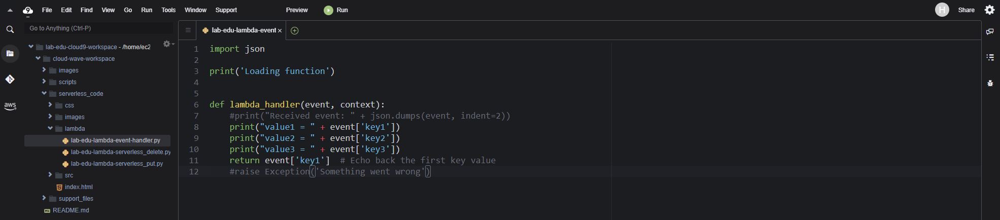

# Lambda 생성 및 기본 사용방법 

### 1. Lambda 함수 생성

- **Lambda 메인 콘솔 화면 → "함수 생성" 버튼 클릭**

- 함수 생성 정보 입력

    - 함수 이름: lab-edu-lambda-event-handler

    - 런타임: python 3.10

    - '함수 생성' 버튼 클릭

        

- Cloud9 IDE Terminal 화면으로 이동 → 폴더 구조 확인

    ```bash
    cloud-wave-workspace/
    ├── images
    ├── scripts
    ├── serverless_code
    │   ├── css
    │   │   └── style.css
    │   ├── images
    │   │   └── cj-olivenetworks.png
    │   ├── index.html
    │   ├── lambda
    │   │   ├── lab-edu-lambda-event-handler.py
    │   │   ├── lab-edu-lambda-serverless_delete.py
    │   │   └── lab-edu-lambda-serverless_put.py
    │   └── src
    │       └── script.js
    └── support_files
    ```

- 'serverless_code/lambda' 폴더의 'lab-edu-lambda-event-handler.py' 파일 열기

    


