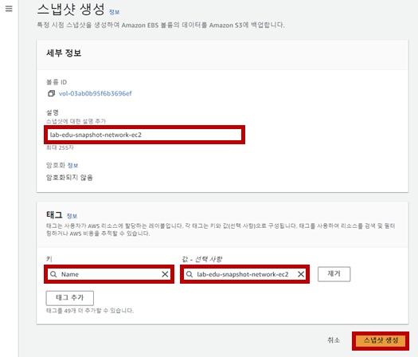
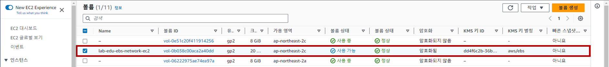

# EBS Size 확장 / 증설 / 스냅샷 / 복제

### 1. EBS Volume Size 확장

- **EC2 메인 콘솔 화면 → 인스턴스 리소스 탭 → 'cloud9-workspace...' 서버 선택 → 스토리지 상세 화면 → 볼륨 ID 클릭**

    

- 볼륨 ID 선택 → '작업' 버튼 클릭 → '볼륨 수정' 버튼 클릭

    

- 크기 정보: '20GiB' 입력 → '수정' 버튼 클릭 → '수정' 버튼 클릭

    

- Cloud9 IDE Terminal 화면으로 이동

- 확장된 볼륨 확인

    - Xen Instance System 기준
  
        ```bash
        $ lsblk
        NAME      MAJ:MIN RM SIZE RO TYPE MOUNTPOINTS
        xvda      202:0    0  20G  0 disk 
        ├─xvda1   202:1    0  10G  0 part /
        ├─xvda127 259:0    0   1M  0 part 
        └─xvda128 259:1    0  10M  0 part /boot/efi
        ```

    - Nitro Instance System 기준
  
        ```bash
        $ sudo lsblk
        NAME          MAJ:MIN RM SIZE RO TYPE MOUNTPOINT
        nvme0n1       259:1    0  20G  0 disk
        └─nvme0n1p1   259:2    0   8G  0 part /
        └─nvme0n1p128 259:3    0   1M  0 part
        ```

- 파티션 사이즈 확장

    - Xen Instance System 기준

        ```bash
        $ sudo growpart /dev/xvda 1
        ```

        ```bash
        $ lsblk
        NAME      MAJ:MIN RM SIZE RO TYPE MOUNTPOINTS
        xvda      202:0    0  20G  0 disk 
        ├─xvda1   202:1    0  20G  0 part /
        ├─xvda127 259:0    0   1M  0 part 
        └─xvda128 259:1    0  10M  0 part /boot/efi
        ```

    - Nitro Instance System 기준
  
        ```bash
        $ sudo growpart /dev/nvme0n1 1
        ```

        ```bash
        $ sudo lsblk
        NAME          MAJ:MIN RM SIZE RO TYPE MOUNTPOINT
        nvme0n1       259:1    0  20G  0 disk
        └─nvme0n1p1   259:2    0  20G  0 part /
        └─nvme0n1p128 259:3    0   1M  0 part
        ```

- 파일 시스템 사이즈 확장

    - XFS 파일 시스템 기준

        ```bash
        $ df -Th
        Filesystem     Type      Size  Used Avail Use% Mounted on
        devtmpfs       devtmpfs  4.0M     0  4.0M   0% /dev
        tmpfs          tmpfs     475M     0  475M   0% /dev/shm
        tmpfs          tmpfs     190M  2.9M  188M   2% /run
        /dev/xvda1     xfs        10G  8.4G  1.7G  84% /
        tmpfs          tmpfs     475M  8.0K  475M   1% /tmp
        /dev/xvda128   vfat       10M  1.3M  8.7M  13% /boot/efi
        tmpfs          tmpfs      95M     0   95M   0% /run/user/1000
        ```

        ```bash
        sudo xfs_growfs -d /
        ```

        ```bash
        $ df -Th
        Filesystem     Type      Size  Used Avail Use% Mounted on
        devtmpfs       devtmpfs  4.0M     0  4.0M   0% /dev
        tmpfs          tmpfs     475M     0  475M   0% /dev/shm
        tmpfs          tmpfs     190M  2.9M  188M   2% /run
        /dev/xvda1     xfs        20G  8.4G   12G  43% /
        tmpfs          tmpfs     475M  8.0K  475M   1% /tmp
        /dev/xvda128   vfat       10M  1.3M  8.7M  13% /boot/efi
        tmpfs          tmpfs      95M     0   95M   0% /run/user/1000
        ```

    - EXT 2~4 파일 시스템 기준

        ```bash
        sudo resize2fs /dev/xvda1
        ```

        ```bash
        sudo resize2fs /dev/nvme0n1p1
        ```
<br><br>


### 2. EBS Volume 연결 해제 및 재연결 (손상된 SSH authorized key 복구 시나리오)

- **Cloud9 IDE Terminal 화면으로 이동 → 'lab-edu-ec2-network-ap-01' 접속**

    ```bash
    ssh network-01
    ```

- '~/.ssh/authorized_keys' 파일 삭제

    ```bash
    rm -rf ~/.ssh/authorized_keys
    ```

- 'lab-edu-ec2-network-ap-01' 서버에서 로그아웃

- 'lab-edu-ec2-network-ap-01' 접속 재시도 (실패)

    ```bash
    $ ssh network-01
    ec2-user@10.0.40.113: Permission denied (publickey,gssapi-keyex,gssapi-with-mic).
    ```

- **EC2 메인 콘솔 화면 → 인스턴스 리소스 탭 → 'lab-edu-ec2-network-ap-01' 서버 선택 → 인스턴스 상태 → 인스턴스 중지**

- **EC2 메인 콘솔 화면 → 인스턴스 리소스 탭 → 'lab-edu-ec2-network-ap-01' 서버 선택 → 스토리지 상세 화면 → 볼륨 ID 클릭**

- 볼륨 ID 선택 → '작업' 버튼 클릭 → '볼륨 분리' 버튼 클릭 → '분리' 버튼 클릭

- 볼륨 ID 선택 → '작업' 버튼 클릭 → '볼륨 연결' 버튼 클릭 

- 볼륨 연결 정보 입력

    - 인스턴스: lab-edu-ec2-web

    - 디바이스 이름: /dev/sdf

    - '볼륨 연결' 버튼 클릭

- **Cloud9 IDE Terminal 화면으로 이동 → 'lab-edu-ec2-web' 접속**

    ```bash
    ssh web-server
    ```

- EBS 디스크 연결 여부 확인

    ```bash
    $ lsblk
    NAME          MAJ:MIN RM SIZE RO TYPE MOUNTPOINTS
    nvme0n1       259:0    0   8G  0 disk 
    ├─nvme0n1p1   259:1    0   8G  0 part /
    ├─nvme0n1p127 259:2    0   1M  0 part 
    └─nvme0n1p128 259:4    0  10M  0 part /boot/efi
    nvme1n1       259:3    0   8G  0 disk 
    ├─nvme1n1p1   259:5    0   8G  0 part 
    ├─nvme1n1p127 259:6    0   1M  0 part 
    └─nvme1n1p128 259:7    0  10M  0 part
    ```

- System Mount 처리

    ```bash
    sudo mkdir /data
    ```

    ```bash
    sudo mount /dev/nvme1n1p1 /data
    ```

    ```bash
    ll /data
    ```

- 손상된 SSH authorized key 복구

    - Cloud9 IDE 새로운 터미널 생성 → 'lab-edu-ec2-network-02' 서버 접속 

    - 'lab-edu-ec2-network-02' 서버 'authorized_keys' 내용 복사

        ```bash
        $ cat ~/.ssh/authorized_keys
        ssh-rsa AAAAB3NzaC1yc2EAAAADAQABAAABAQCwgsCOHtWxkkQ33s71PW3Mm3ajjltclQ7F+zqc3WBNott4OmvcIlBQudtEmB8E0FvU0E9L4ID3BQyGmCAa4f2jFiflh7ofaMa3CSRBo/9sMS8HiCoHsDvxyLIx5h2Og488uVQV7PfqvhwL45KaAXPCjbY9HuiZWMFbOFF5gdRP/TIbcKRTjXYphHSaBL1KN6lr3QNEuMl7WheuunEPJbiVFKLE3zdmHQzzaM6ZlJmthrtXdIGVCznjehooAwJ3+BZOf6AkISdyaXw7/IMdC5PiPFn7xG5fQ9z8Pb3ZE09bVcz6VyFSIzdgDOfJqBUupK1AYxcxdmuBa8JLeeorUl7d lab-edu-key-network
        ```

    - Cloud9 IDE 'lab-edu-ec2-web' 서버 접속 터미널 화면으로 전환

    - 'lab-edu-ec2-network-02' 서버의 'authorized_keys' 내용 붙여 넣기 → 저장 후 종료 (':' 입력 → 'wq!' 입력 → 'Enter') 

        ```bash
        vim /data/home/ec2-user/.ssh/authorized_keys 
        ```

        ```bash
        ssh-rsa AAAAB3NzaC1yc2EAAAADAQABAAABAQCwgsCOHtWxkkQ33s71PW3Mm3ajjltclQ7F+zqc3WBNott4OmvcIlBQudtEmB8E0FvU0E9L4ID3BQyGmCAa4f2jFiflh7ofaMa3CSRBo/9sMS8HiCoHsDvxyLIx5h2Og488uVQV7PfqvhwL45KaAXPCjbY9HuiZWMFbOFF5gdRP/TIbcKRTjXYphHSaBL1KN6lr3QNEuMl7WheuunEPJbiVFKLE3zdmHQzzaM6ZlJmthrtXdIGVCznjehooAwJ3+BZOf6AkISdyaXw7/IMdC5PiPFn7xG5fQ9z8Pb3ZE09bVcz6VyFSIzdgDOfJqBUupK1AYxcxdmuBa8JLeeorUl7d lab-edu-key-network
        ```

        ```bash
        sudo umount /data
        ```

- **EC2 메인 콘솔 화면 → 인스턴스 리소스 탭 → 'lab-edu-ec2-web' 서버 선택 → 스토리지 상세 화면 → '/dev/sdf' 볼륨 ID 클릭**

- 볼륨 ID 선택 → '작업' 버튼 클릭 → '볼륨 분리' 버튼 클릭 → '분리' 버튼 클릭

- 볼륨 ID 선택 → '작업' 버튼 클릭 → '볼륨 연결' 버튼 클릭 

- 볼륨 연결 정보 입력

    - 인스턴스: lab-edu-ec2-network-01

    - 디바이스 이름: /dev/xvda

    - '볼륨 연결' 버튼 클릭

- **EC2 메인 콘솔 화면 → 인스턴스 리소스 탭 → 'lab-edu-ec2-network-ap-01' 서버 선택 → 인스턴스 상태 → 인스턴스 시작**


- **Cloud9 IDE Terminal 화면으로 이동 → 'lab-edu-ec2-network-01' 접속 시도**

    ```bash
    ssh network-01
    ```
<br><br>


### 3. EBS Volume 생성 및 추가 연결

- **EC2 메인 콘솔 화면 → 볼륨 리소스 탭 → '볼륨 생성' 버튼 클릭**

    

- EBS 볼륨 생성 정보 입력

    - 볼륨 유형: 범용 SSD(gp3)

    - 크기: 10GiB

    - 가용 영역: ap-northeast-2a

    - '볼륨 생성' 버튼 클릭

        

- 신규 생성 볼륨 선택 → '작업' → '볼륨 연결' 버튼 클

    

- EBS 연결 정보 입력

    - 인스턴스 항목: lab-edu-ec2-web

    - 디바이스 이름: /dev/sdf

    - '볼륨 연결' 버튼 클릭

- **Cloud9 IDE Terminal 화면으로 이동 → 'lab-edu-ec2-web' 접속**

- 연결된 볼륨 정보 확인

    ```bash
    $ lsblk
    NAME          MAJ:MIN RM SIZE RO TYPE MOUNTPOINTS
    nvme0n1       259:0    0   8G  0 disk 
    ├─nvme0n1p1   259:1    0   8G  0 part /
    ├─nvme0n1p127 259:2    0   1M  0 part 
    └─nvme0n1p128 259:3    0  10M  0 part /boot/efi
    nvme1n1       259:4    0  10G  0 disk 
    ```

- 볼륨 파일 시스템 포맷 → '/data' 폴더에 마운트

    ```bash
    sudo mkfs.xfs /dev/nvme1n1
    ```

    ```bash
    sudo mount /dev/nvme1n1 /data
    ```

- '/etc/fstab' 설정 ('/dev/nvme1n1' 장치 UUID 값 복사 → fstab 파일 반영 → 저장 후 종료 (':' 입력 → 'wq!' 입력 → 'Enter'))

    ```bash
    $ sudo blkid
    /dev/nvme0n1p1: LABEL="/" UUID="f2b2ef41-737e-43c2-8746-a8a3b0a9feb8" BLOCK_SIZE="4096" TYPE="xfs" PARTLABEL="Linux" PARTUUID="78211cfb-c3f9-4d33-8fa9-b74de39853b2"
    /dev/nvme0n1p128: SEC_TYPE="msdos" UUID="D6C4-DA90" BLOCK_SIZE="512" TYPE="vfat" PARTLABEL="EFI System Partition" PARTUUID="11e41d8e-dee8-4c97-a1e4-9dab7d22bf71"
    /dev/nvme0n1p127: PARTLABEL="BIOS Boot Partition" PARTUUID="9c4a6d1a-eaff-4f1c-81e9-c078d27058e9"
    /dev/nvme1n1: UUID="d7f03908-1e26-43d9-bb4d-44eb2fdd09f5" BLOCK_SIZE="512" TYPE="xfs"
    ```

    ```bash
    $ sudo vim /etc/fstab
    ```

    ```bash
    UUID=f2b2ef41-737e-43c2-8746-a8a3b0a9feb8     /           xfs    defaults,noatime  1   1
    UUID=D6C4-DA90        /boot/efi       vfat    defaults,noatime,uid=0,gid=0,umask=0077,shortname=winnt,x-systemd.automount 0 2
    UUID=d7f03908-1e26-43d9-bb4d-44eb2fdd09f5       /data   xfs     defaults,noatime        1 1     #내용추가
    ```

- 마운트 해제 후 마운트 재시도

    ```bash
    sudo umount /data
    ```

    ```bash
    sudo mount -a
    ```

### 4. EBS Snapshot 생성 

- **EC2 메인 콘솔 화면 → 인스턴스 리소스 탭 → 'lab-edu-ec2-network-ap-01' 서버 선택 → 스토리지 상세 화면 → 볼륨 ID 클릭**

- 볼륨 ID 선택 → '작업' 버튼 클릭 → '스냅샷 생성' 버튼 클릭

- 스냅샷 생성 정보 입력

    - 설명: lab-edu-snapshot-network-ec2

    - '태그 추가' 버튼 클릭

    - 키/값: Name / lab-edu-snapshot-network-ec2

    - '스냅샷 생성' 버튼 클릭

        

- **EC2 메인 콘솔 화면 → 스냅샷 리소스 탭 → 'lab-edu-snapshot-network-ec2' 스냅샷 선택 → '작업' → '스냅샷에서 볼륨 생성'**

- 볼륨 생성 정보 입력

    - 가용 영역:

    - '암호화' 체크박스 활성화

    - '태그 추가' 버튼 클릭

    - 키/값: Name / lab-edu-ebs-network-ec2

    - '볼륨 생성' 버튼 클

- 생성된 볼륨 확인 (암호화 항목에 설정이 반영되었는지 체크)

    


### 5. EBS Snapshot 해외 리전으로 복제

- **EC2 메인 콘솔 화면 → 스냅샷 리소스 탭 → 'lab-edu-snapshot-network-ec2' 스냅샷 선택 → '작업' → '스냅샷 복사'**

- 스냅샷 복제 정보 입력

    - 대상 리전: us-east-1

    - '이 스냅샷 암호화' 체크박스 활성화

    - '볼륨 복제' 버튼 클릭

- **버지니아 리전으로 이동 → EC2 메인 콘솔 화면 → 스냅샷 리소스 탭 → 복제된 스냅샷 정보 확**

    
