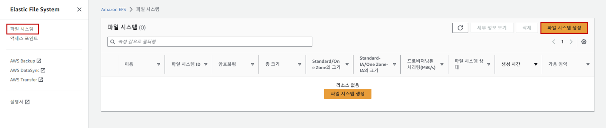
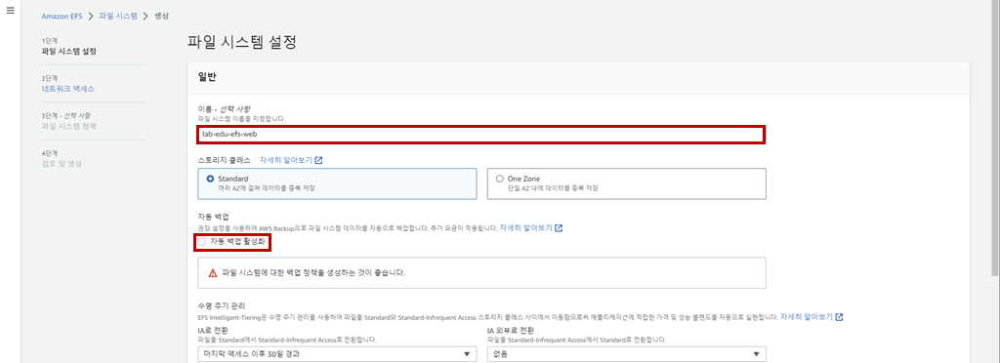
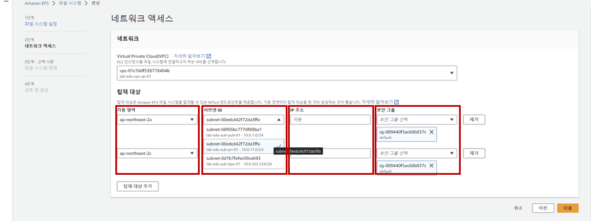
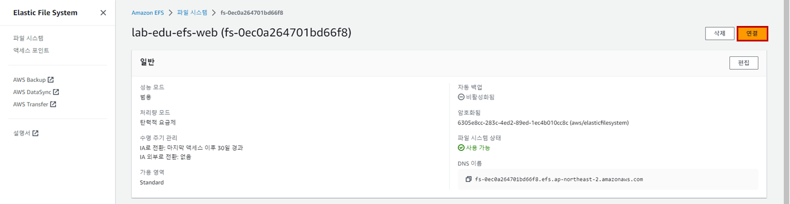
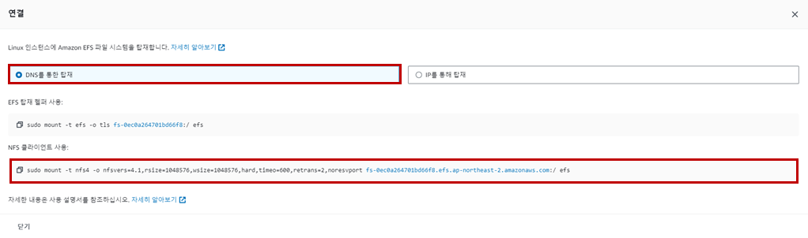

# EFS 생성 및 연동

### 1. Security Group 생성 (EFS 리소스용)

- **EC2 메인 콘솔 화면 → 보안그룹 리소스 탭 → '보안그룹 생성' 버튼 클릭**

- 보안 그룹 생성 정보 입력

    - 보안그룹 이름: lab-edu-sg-efs

    - VPC: lab-edu-vpc-ap-01

    - 인바운드 규칙:

        - 유형: TCP / 포트 범위: 2049 / 소스: 10.0.0.0/16

    - '보안 그룹 생성' 버튼 클릭

### 2. EFS 생성

- **EFS 메인 콘솔 화면 → 파일 시스템 리소스 탭 → '파일 시스템 생성' 버튼 클릭**

    

- '사용자 지정' 버튼 클릭

    

- EFS 생성 정보 입력

    - 이름: lab-edu-efs-web

    - '자동 백업' 체크 박스 선택

    - '다음' 버튼 클릭

        

    - 탑재 대상 설정:

        - 가용 영역: ap-northeast-2a / 서브넷: lab-edu-sub-pri-01 / IP주소: 자동 / 보안그룹: lab-edu-sg-efs

        - 가용 영역: ap-northeast-2c / 서브넷: lab-edu-sub-pri-02 / IP주소: 자동 / 보안그룹: lab-edu-sg-efs

    - '다음' 버튼 클릭 → '다음' 버튼 클릭 → '생성' 버튼 클릭

        

### 3. EFS 시스템 EC2 서버(web) Mount

- **EFS 메인 콘솔 화면 → 파일 시스템 리소스 탭 → 'lab-edu-efs-web' 선택 → '연결' 버튼 클릭**

    

- 'DNS를 통한 탑재' → 'NFS 클라이언 사용' 복사 버튼 클릭

    

- **Cloud9 IDE Terminal 화면으로 이동 → 'lab-edu-ec2-web' 접속**

    ```bash
    ssh web-server
    ```

- EFS 파일 시스템 Mount

    ```bash
    sudo mkdir /efs
    sudo mount -t nfs4 -o nfsvers=4.1,…(생략) fs-0ec0a264701bd66f8.efs.ap-northeast-2.amazonaws.com:/ /efs
    ```

- Mount 정보 확인 → EFS UUID 복사

    ```bash
    $ df -Th
    Filesystem                                              Type      Size  Used Avail Use% Mounted on
    ...(생략)...
    fs-0ec0a264701bd66f8.efs.ap-northeast-2.amazonaws.com:/ nfs4      8.0E     0  8.0E   0% /efs
    ```

- '/etc/fstab' 설정 ('efs' 장치 UUID 값 복사 → fstab 파일 반영 → 저장 후 종료 (':' 입력 → 'wq!' 입력 → 'Enter'))

    ```bash
    sudo vim /etc/fstab
    ```

    ```bash
    fs-0ec0a264701bd66f8.efs.ap-northeast-2.amazonaws.com:/ /efs nfs4 nfsvers=4.1,rsize=1048576,wsize=1048576,hard,timeo=600,retrans=2,noresvport,_netdev 0 0
    ```

- 두 번째 Web 서버 접속 정보 확인: 인스턴스 메인 콘솔 화면 → '인스턴스' 리소스 탭 → 'lab-edu-ec2-web(Auto-Scaling으로 생성된 서버)' 선택 → 프라이빗 IPv4 주소 복사

- **Cloud9 IDE Terminal 화면으로 이동 → 'lab-edu-ec2-web(Auto-Scaling으로 생성된 서버)' 접속**

    ```bash
    ssh -i ~/.ssh/lab-edu-key-ec2 ec2-user@{2ND_WEB_SERVER_PRIVATE_IP}
    ```

- EFS 파일 시스템 Mount

    ```bash
    sudo mkdir /efs
    sudo mount -t nfs4 -o nfsvers=4.1,…(생략) fs-0ec0a264701bd66f8.efs.ap-northeast-2.amazonaws.com:/ /efs
    ```

- Mount 정보 확인 → EFS UUID 복사

    ```bash
    $ df -Th
    Filesystem                                              Type      Size  Used Avail Use% Mounted on
    ...(생략)...
    fs-0ec0a264701bd66f8.efs.ap-northeast-2.amazonaws.com:/ nfs4      8.0E     0  8.0E   0% /efs
    ```

- '/etc/fstab' 설정 ('efs' 장치 UUID 값 복사 → fstab 파일 반영 → 저장 후 종료 (':' 입력 → 'wq!' 입력 → 'Enter'))

    ```bash
    sudo vim /etc/fstab
    ```

    ```bash
    fs-0ec0a264701bd66f8.efs.ap-northeast-2.amazonaws.com:/ /efs nfs4 nfsvers=4.1,rsize=1048576,wsize=1048576,hard,timeo=600,retrans=2,noresvport,_netdev 0 0
    ```

### 4. EFS 시스템 연동 테스트

- **Cloud9 IDE Terminal 화면으로 이동 → 'lab-edu-ec2-web' 접속 → 테스트 파일 생성**

    ```bash
    cd /efs
    ```

    ```bash
    sudo touch 1 2 3 4 
    ```

- **Cloud9 IDE 새로운 Terminal 화면 열기 → 'lab-edu-ec2-web(Auto-Scaling으로 생성된 서버)' 접속 → 테스트 파일 확인**

    ```bash
    cd /efs
    ```

    ```bash
    ls -al
    ```