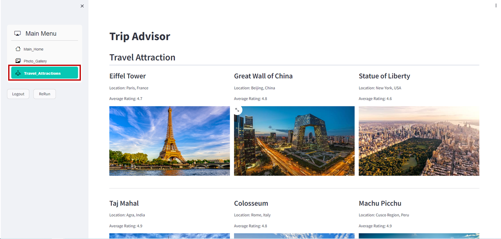

# Streamlit Login 페이지 생성 및 Aurora 연동

### 1. users 테이블 생성 

- Cloud9 IDE 접속 → PostgreSQL 'trip_advisor' 데이터베이스 접속

    ```bash
    psql –U user –d trip_advisor –h {RDS_AURORA_ENDPOINT}   # 앞에서 메모장에 저장한 RDS Aurora 엔드포인 정보 입력
    Password for user user: {RDS_AURORA_PASSWORD}           # 생성과정에 입력했던 패스워드 입력
    ```

- Cloud9 IDE → SQL Query Sample 파일 열기 (support_files/sql_query/create_users_teabl.sql) → 내용 복사 → 붙여넣기

    - 테이블 생성

        ```sql
        CREATE TABLE users (
            id SERIAL PRIMARY KEY,
            username VARCHAR(50) UNIQUE NOT NULL,
            email VARCHAR(255) UNIQUE NOT NULL,
            password VARCHAR(255) NOT NULL
        );
        ```

    - 데이터 입력

        ```sql
        INSERT INTO users (username, email, password) 
        VALUES ('user', 'user@admin.abc', 'qwer1234');
        ```

### 2. Streamlit 서비스 Login 기능 활성화

- VS Code 코드 편집기 실행 → 'main.py' 파일 오픈 → 설정 값 수정

    ```python
    if 'logged_in' not in st.session_state:
    # st.session_state['logged_in'] = True          # 주석처리
    # RDS Database Login Session / Login Function
    st.session_state['logged_in'] = False           # 주석제거
    ```

    ```python
    def side_bar():

        ...

        col1, col2, col3 = st.columns(3)                        #주석해제
        with col1:                                              #주석해제
            # RDS Database Login Session / Logout Function      #주석해제     
            if st.button('Logout', use_container_width=True):   #주석해제
                st.session_state['logged_in'] = False           #주석해제
                st.rerun()                                      #주석해제
        with col2:                                              #주석해제
            if st.button('ReRun', use_container_width=True):    #주석해제
                st.rerun()                                      #주석해제
    ```

### 3. Backend service 설정 및 실행

- VS Code 코드 편집기 → 'back_end/db_connection.py' 파일 오픈 → 설정 값 수정

    ```python
    def get_db_connection():
    conn = psycopg2.connect(
        host='localhost',           # localhost → {RDS_AURORA_ENDPOINT} 정보로 변경
        database='trip_advisor',
        user='user',
        password='qwer1234'
    )
    return conn
    ```

- VS Code 코드 편집기 → 'appspec.py' 파일 오픈 → 설정 값 수정

    ```yaml
    version: 0.0
    os: linux
    files:
    - source: /
        destination: /root/streamlit-project
        runas: root
    file_exists_behavior: OVERWRITE
    hooks:
    ApplicationStop:
        # - location: scripts/stop_streamlit.sh     #주석처리
        - location: scripts/stop_applications.sh    #주석해제
    ApplicationStart:
        # - location: scripts/start_streamlit.sh     #주석처리
        - location: scripts/start_applications.sh    #주석해제
    ```

### 4. 서비스 코드 배포 

- VS Code Termainal → 소스코드 Commit → Push

    ```cmd
    git add .
    git commit -m "update login function"
    git push origin main
    ```

### 5. 웹 서비스 접속 테스트

- 웹 서비스 접속 (*https://www.stxx.cj-cloud-wave.com*)

    
<br><br>


# Travel Attraction Page 생성 및 Aurora 연동

### 1. attraction 테이블 생성 

- Cloud9 IDE 접속 → PostgreSQL 'trip_advisor' 데이터베이스 접속

    ```bash
    psql –U user –d trip_advisor –h {RDS_AURORA_ENDPOINT}   # 앞에서 메모장에 저장한 RDS Aurora 엔드포인 정보 입력
    Password for user user: {RDS_AURORA_PASSWORD}           # 생성과정에 입력했던 패스워드 입력
    ```

- Cloud9 IDE → SQL Query Sample 파일 열기 (support_files/sql_query/create_destination_teable.sql) → 내용 복사 → 붙여넣기

    - 테이블 생성

        ```sql
        CREATE TABLE attractions (
            id SERIAL PRIMARY KEY,
            name VARCHAR(255) NOT NULL,
            location VARCHAR(255) NOT NULL,
            average_rating VARCHAR(10),
            photo_url VARCHAR(255)
        );
        ```

    - 데이터 입력

        ```sql
        INSERT INTO attractions (name, location, average_rating, photo_url) VALUES 
        ('Eiffel Tower', 'Paris, France', 4.7, 'https://lh5.googleusercontent.com/p/AF1QipOnJHzIOu1VUvkTX0GKjmqK-NdgXWJEUa8m2YPd=w540-h312-n-k-no'),
        ('Great Wall of China', 'Beijing, China', 4.8, 'https://encrypted-tbn1.gstatic.com/licensed-image?q=tbn:ANd9GcSNsVSfi_LRcKaaxzjCs-Aq1_9YS7WAN7d4rrC_Oecn5n0D3Jkm8klHCLU6Eo9cZNRctYeEuTL_3jL_xUATWJOuSJm62z54'),
        ('Statue of Liberty', 'New York, USA', 4.6, 'https://encrypted-tbn2.gstatic.com/licensed-image?q=tbn:ANd9GcQeve9KWo7zk7gXpRgaBDhfeCklifCZqaLWPXXJgKJJCFpYSp7kauVOlyt1nmNLi9UqT9P4SiUFBLihf5omTv-bdR8LLTWv'),
        ('Taj Mahal', 'Agra, India', 4.9, 'https://lh3.googleusercontent.com/p/AF1QipOIwFX7pMJXtOZ5zEkes4rLws69dgeTYas5C1p4=s680-w680-h510'),
        ('Colosseum', 'Rome, Italy', 4.8, 'https://lh3.googleusercontent.com/p/AF1QipNtY2FidGEO7yj8kqm-h-ixL3H27DmKOD8dAwvK=s1360-w1360-h1020'),
        ('Machu Picchu', 'Cusco Region, Peru', 4.9, 'https://lh3.googleusercontent.com/p/AF1QipOHVkYSLcE9rOozPl9UPtEz4ga0IkMVD5_4J-NM=s1360-w1360-h1020'),
        ('Gyeongbokgung Palace', 'Seoul, South Korea', 4.7, 'https://lh3.googleusercontent.com/p/AF1QipPe2q2PPeip1zVjV6UI4FHCkdFxIglodID7c0a3=s1360-w1360-h1020'),
        ('Sydney Opera House', 'Sydney, Australia', 4.7, 'https://lh3.googleusercontent.com/p/AF1QipMHftgSCBlvyjxYphi4gLqDC_62WWvZvyy1EBuh=s1360-w1360-h1020'),
        ('Waikiki Beach', 'Honolulu, Hawaii', 4.5, 'https://www.vmcdn.ca/f/files/glaciermedia/import/lmp-all/1621129-hawaiian-islands-jpg-w-960.jpg');
        ```

### 2. Streamlit 서비스 attraction 페이지 활성화

- VS Code 코드 편집기 실행 → 'main.py' 파일 오픈 → 설정 값 수정

    ```python
    def side_bar():
    with st.sidebar.container():
        selected_page = option_menu(
            menu_title="Main Menu", 
            # options=["Main_Home"],                   
            # options=["Main_Home", "Photo_Gallery"],                       # 주석처리
            options=["Main_Home", "Photo_Gallery", "Travel_Attractions"],   # 주석제거
            icons=['bi bi-house', 'bi bi-images', 'bi bi-airplane-engines'],
            ...
        )
    ```

### 3. 서비스 코드 배포 

- VS Code Termainal → 소스코드 Commit → Push

    ```cmd
    git add .
    git commit -m "update login function"
    git push origin main
    ```

### 4. 웹 서비스 접속 테스트

- 웹 서비스 접속 (*https://www.stxx.cj-cloud-wave.com*) → 로그인 → "Travel_Attractions" 페이지 이동

    


