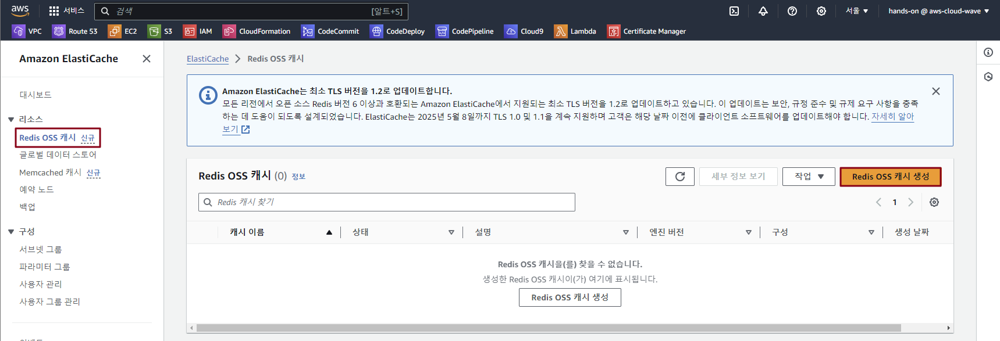
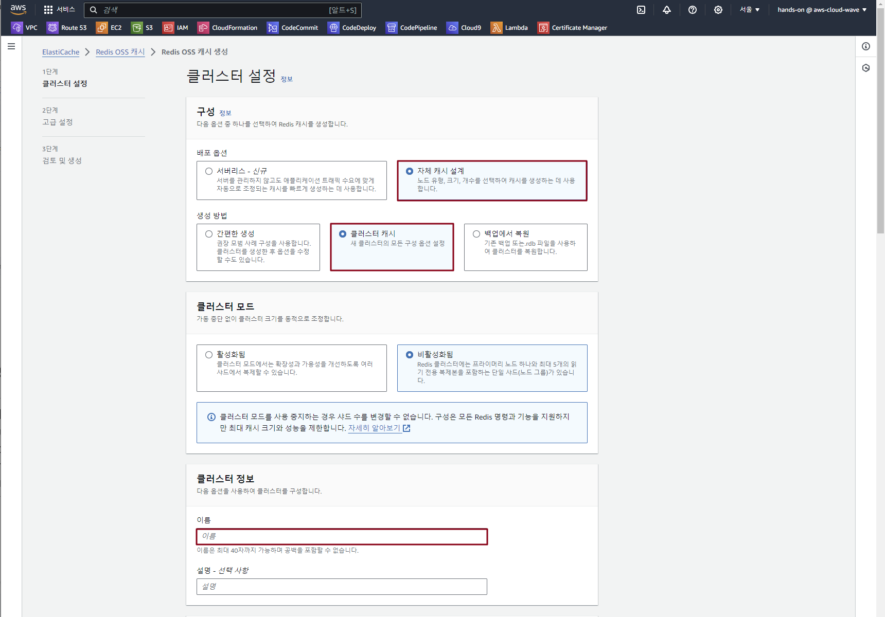
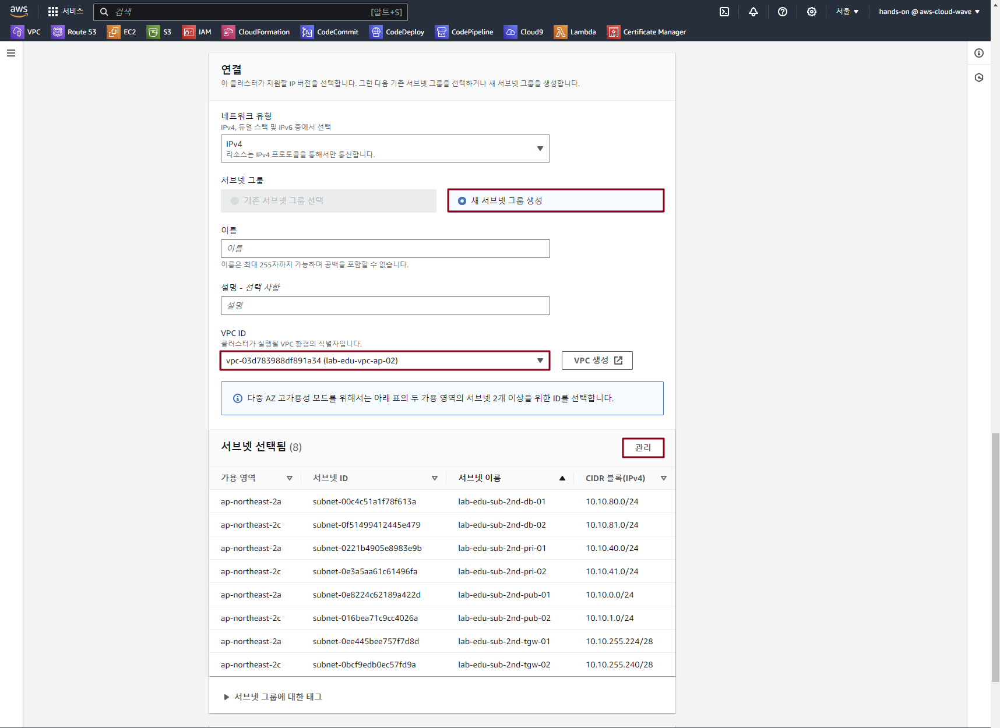
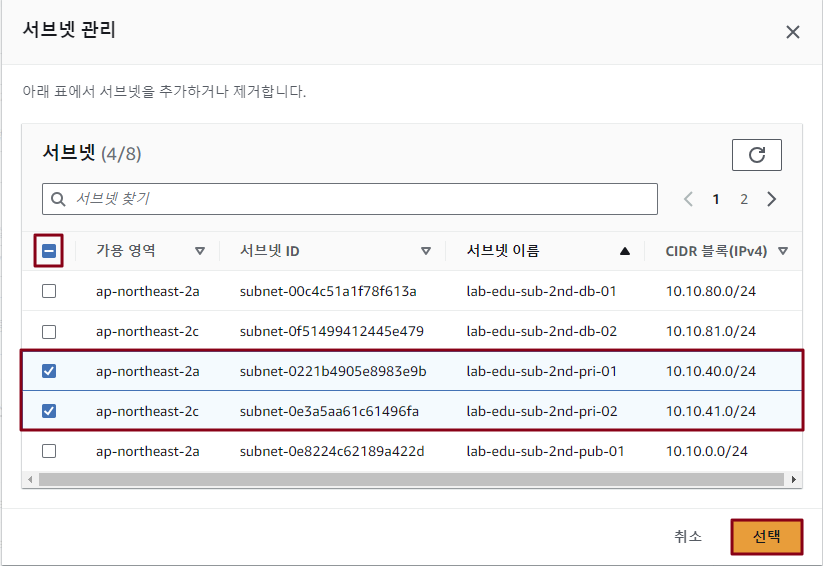
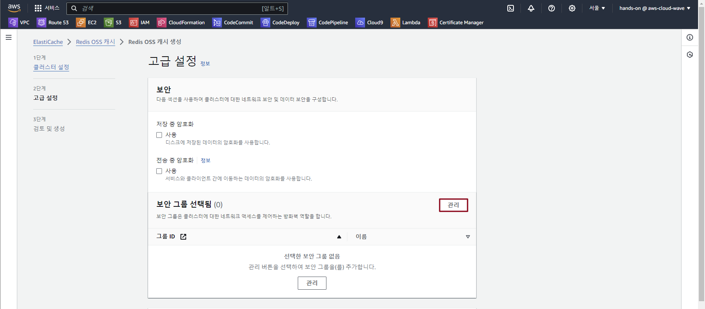
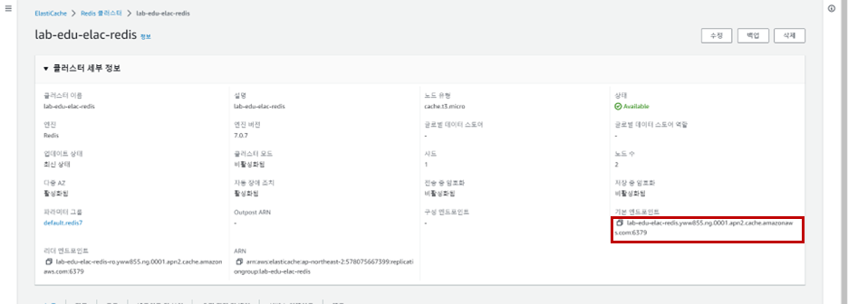
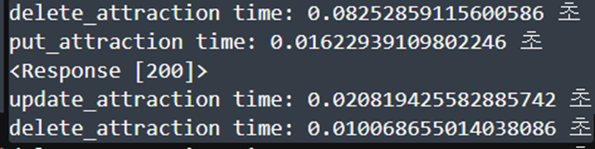
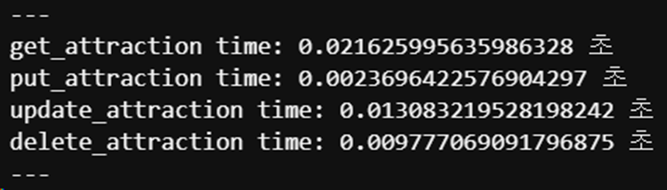

# ElastiCache 생성 및 application 연동

### 1. Security Group 생성 (ElastiCache 리소스용)

- **EC2 메인 콘솔 화면 → 보안그룹 리소스 탭 → '보안그룹 생성' 버튼 클릭**

- 보안 그룹 생성 정보 입력

    - 보안그룹 이름: lab-edu-sg-redis

    - VPC: lab-edu-vpc-ap-01

    - 인바운드 규칙:

        - 유형: TCP / 포트 범위: 6379 / 소스: 10.0.0.0/16

    - '보안 그룹 생성' 버튼 클릭

### 2. ElastiCache 생성

- **ElastiCache 메인 콘솔 화면 → 'Redis OSS 캐시' 리소스 탭 → 'Redis OSS 캐시 생성' 버튼 클릭**

    

- ElastiCache 생성 정보 입력

    - '자체 캐시 설계' 선택

    - '클러스터 캐시' 선택

    - 이름: lab-edu-elasticache-redis

        

    - '새 서브넷 그룹 생성' 선택

    - VPC ID: lab-edu-vpc-ap-01

    - '관리' 버튼 클릭

        

    - 전체 선택 해제 → lab-edu-sub-pri-01, lab-edu-sub-pri-02 선택 → '선택' 버튼 클릭

        

    - '다음' 버튼 클릭

    - '관리' 버튼 클릭 → 'lab-edu-sg-redis' 보안 그룹 선택 → '선택' 버튼 클릭

        

    - '자동 백업 사용' 체크 박스 해제
    
    - '마이너 버전 자동 업그레이드' 체크 박스 해제
    
    - '다음' 버튼 클릭

    - '생성' 버튼 클릭

### 3. application 연동 

- VS Code 코드 편집기 → 'menu/travel_attraction.py' 파일 오픈 → 설정 값 수정

    ```python
    import time
    import requests
    import streamlit as st

    BACKEND_URL = "http://localhost:5000"
    #TABLE = "attractions"            # 주석처리
    TABLE = "attractions_redis"       # 주석해제
    ```

- VS Code 코드 편집기 → 'back_end/app.py' 파일 오픈 → 설정 값 수정

    ```python
    import redis            # 주석해제
    from flask import *

    from login_connection import login_blueprint
    from get_destination import get_destinations_blueprint
    from get_destination_redis import get_destinations_redis_blueprint  # 주석해제
    from add_destination import add_destination_blueprint
    from delete_destination import delete_destination_blueprint
    from update_destination import update_destination_blueprint


    app = Flask(__name__)                       # 주석해제
    app.secret_key = 'cloudwave'                # 주석해제

    app.config['REDIS'] = redis.StrictRedis(    # 주석해제
        host='localhost',                       # 주석해제
        port=6379,                              # 주석해제
        db=0,                                   # 주석해제
        password='qwer1234',                    # 주석해제
        decode_responses=True)                  # 주석해제

    app.register_blueprint(login_blueprint)
    app.register_blueprint(get_destinations_blueprint)
    app.register_blueprint(get_destinations_redis_blueprint)  # 주석해제
    app.register_blueprint(add_destination_blueprint)
    app.register_blueprint(delete_destination_blueprint)
    app.register_blueprint(update_destination_blueprint)

    if __name__ == '__main__':
        app.run(debug=True)
    ```

- **ElastiCache 메인 콘솔 화면 → 'Redis OSS 캐시' 리소스 탭 → 'lab-edu-elasticache-redis' 선택**

- ElastiCache 엔드포인트 정보 복사

    

- VS Code 코드 편집기 → 'back_end/app.py' 파일 오픈 → 설정 값 수정

    ```python
    import redis            # 주석해제
    from flask import *

    from login_connection import login_blueprint
    from get_destination import get_destinations_blueprint
    from get_destination_redis import get_destinations_redis_blueprin
    from add_destination import add_destination_blueprint
    from delete_destination import delete_destination_blueprint
    from update_destination import update_destination_blueprint


    app = Flask(__name__)                
    app.secret_key = 'cloudwave'          

    app.config['REDIS'] = redis.StrictRedis(    
        host='localhost',       # localhost → 'Redis Endpoint'로 수정                  
        port=6379,                            
        db=0,                                
        password='qwer1234',              
        decode_responses=True)     

    app.register_blueprint(login_blueprint)
    app.register_blueprint(get_destinations_blueprint)
    app.register_blueprint(get_destinations_redis_blueprint)
    app.register_blueprint(add_destination_blueprint)
    app.register_blueprint(delete_destination_blueprint)
    app.register_blueprint(update_destination_blueprint)

    if __name__ == '__main__':
        app.run(debug=True)
    ```

### 4. 접속 테스트

- 웹 서비스 접속 (*https://www.stxx.cj-cloud-wave.com*) → 로그인 → "Travel_Attractions" 페이지 이동

- "Main" 페이지 이동 → "Travel_Attractions" 페이지 이동

- 웹 서버 backend 서버 log 확인

    - 최초 접속 시도 

        

    - 두 번째 접속 시도

        