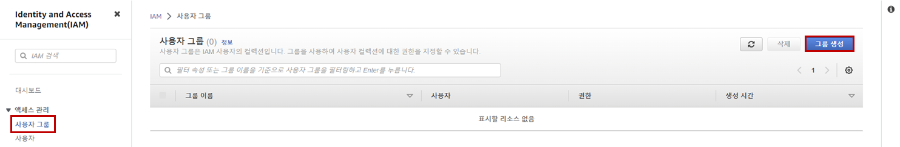
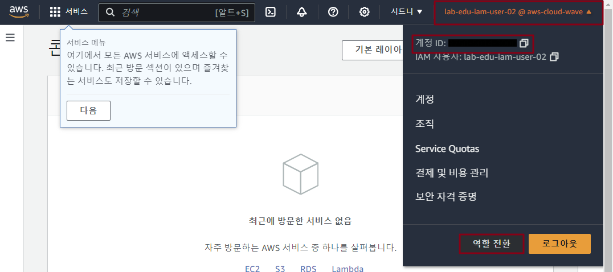
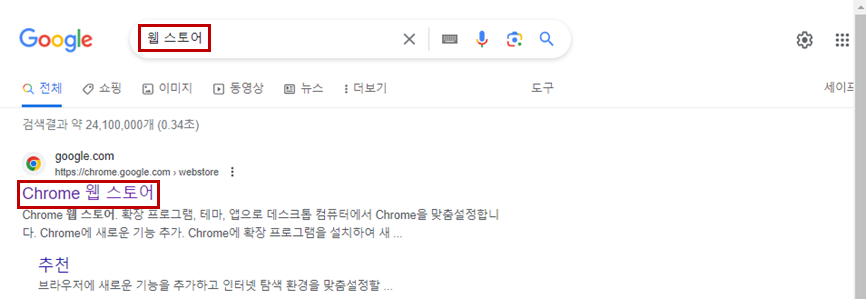
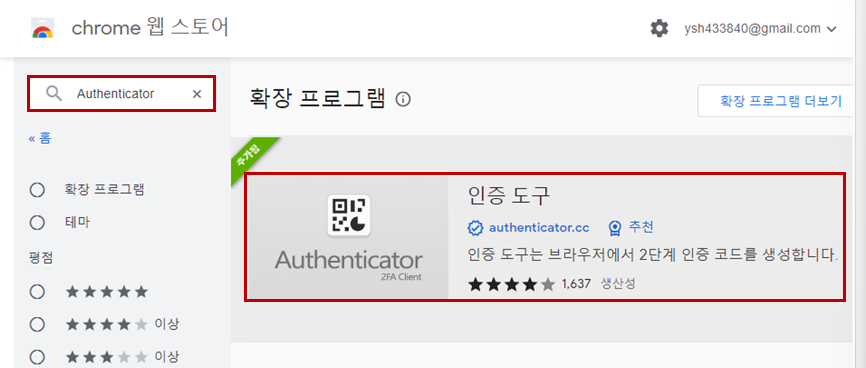
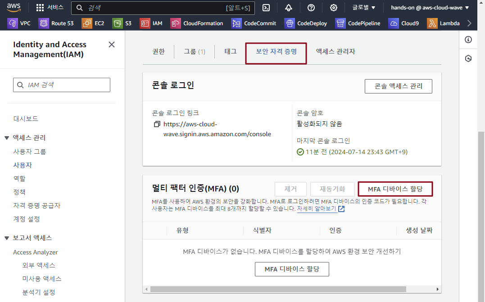
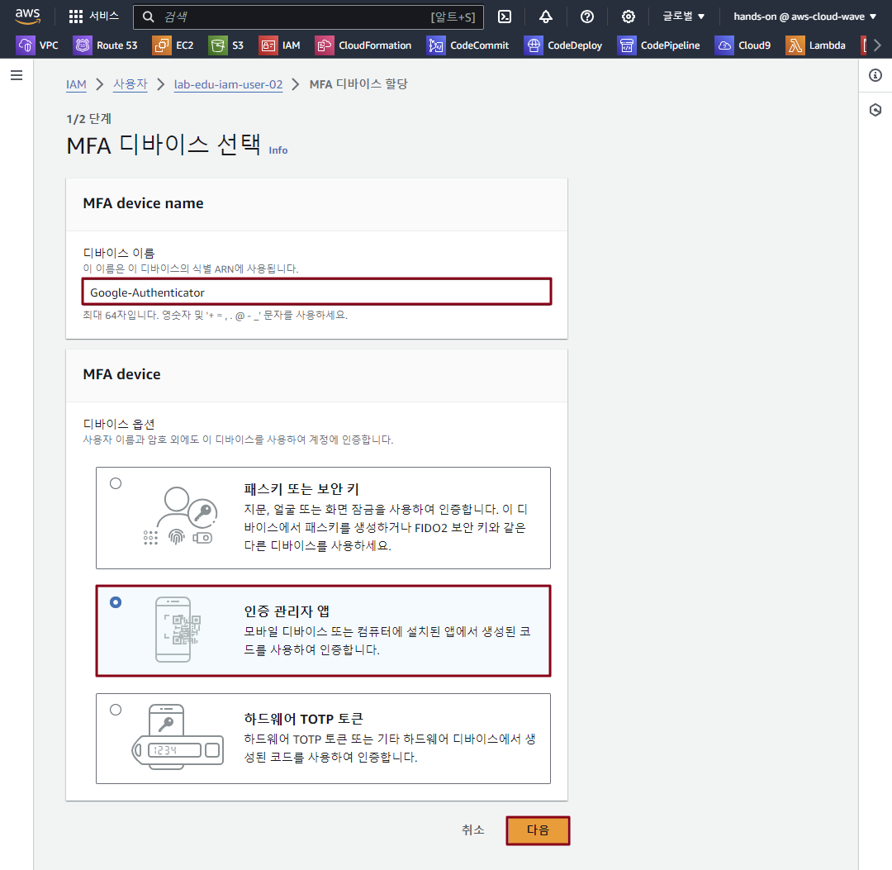
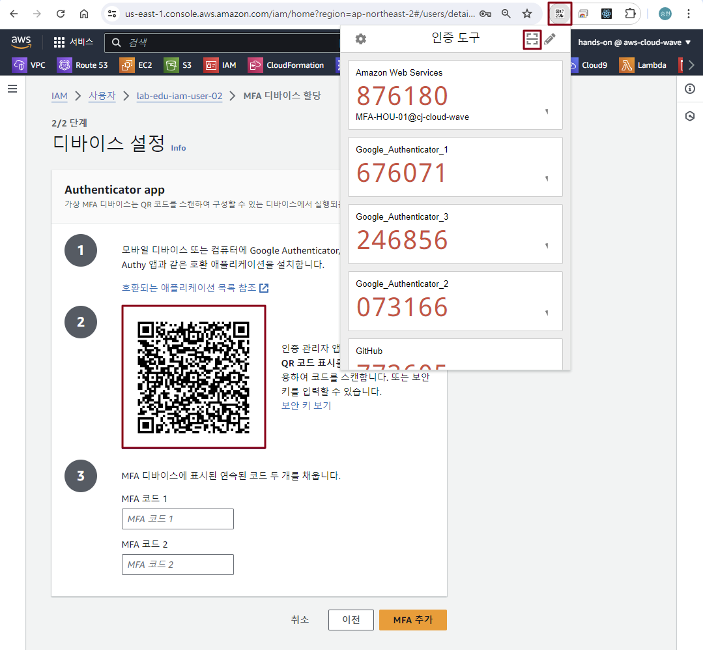
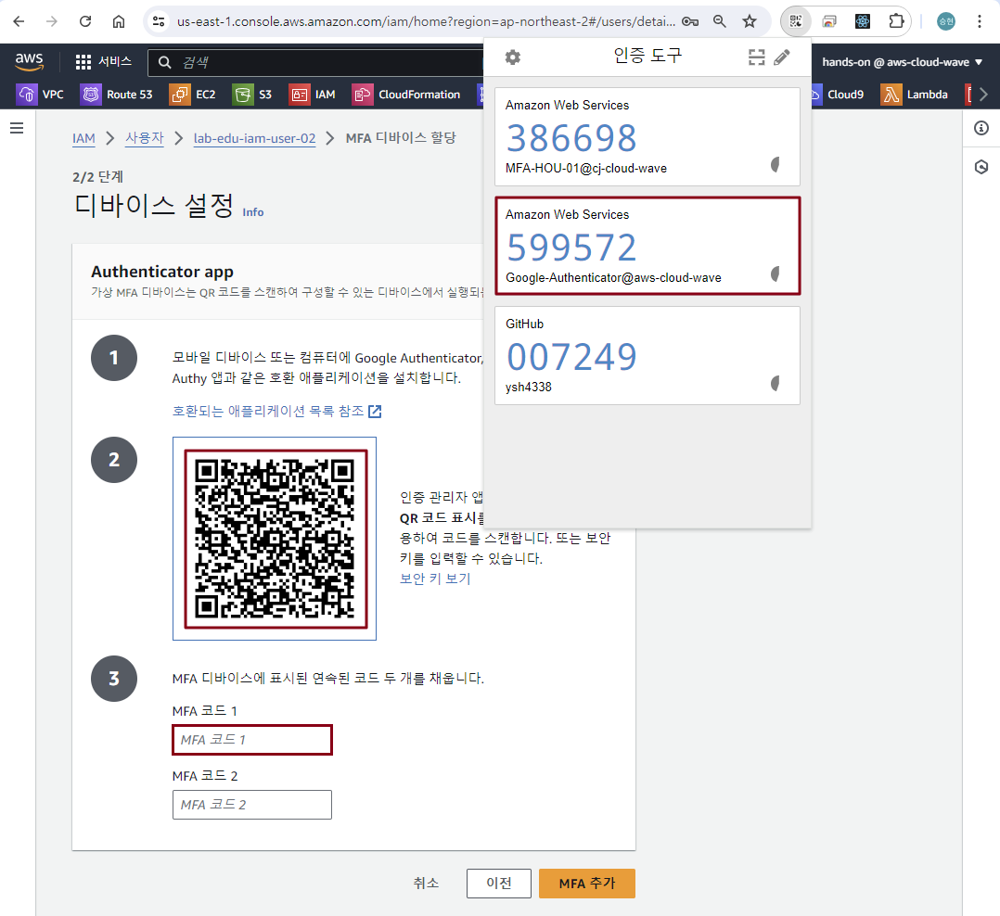
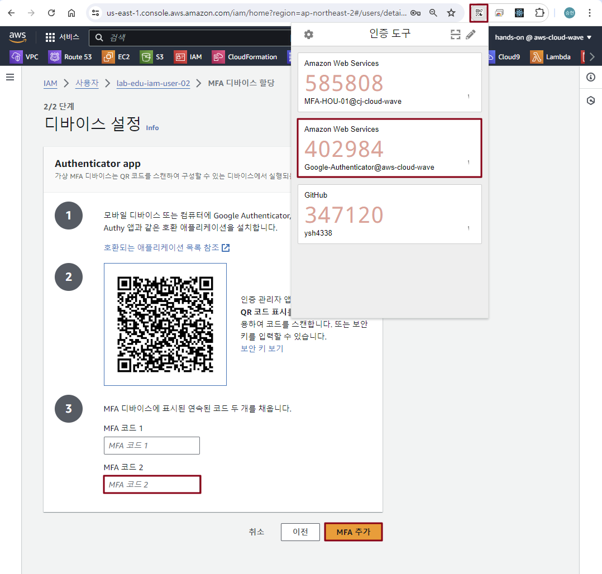
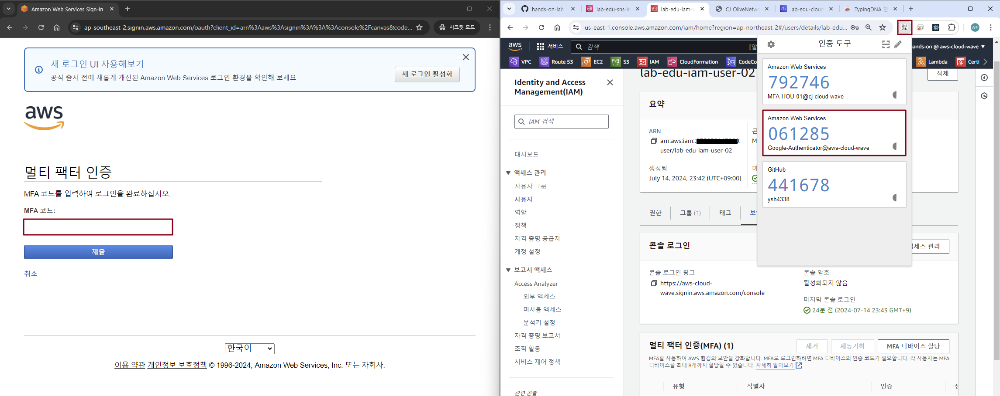

# IAM Group & User 설정

### 1. IAM Group 생성

- **IAM 메인 콘솔 화면 → '사용자 그룹' 리소스 탭 → "그룹 생성" 버튼 클릭**

    

- IAM Group 생성 정보 입력

    - 사용자 그룹 이름: lab-edu-group-auditor

    - 권한 정책 연결: "ReadOnlyAccess" 검색 → 필터링 기준: "AWS 관리형 - 직무" 선택 → "ReadOnlyAccess" 권한 선택

    - '그룹 생성' 버튼 클릭

### 2. IAM User 생성

- **IAM 메인 콘솔 화면 → 사용자 리소스 탭 → "사용자 생성" 버튼 클릭**

- IAM User 생성 정보 입력

    - 이름: lab-edu-iam-user-02

    - 'AWS Management Console에 대한 사용자 액세스 권한 제공' 체크박스 활성화

    - 'IAM 사용자를 생성하고 싶음' 라디오 박스 활성화

    - '사용자 지정 암호' 라디오 박스 활성화 → 패스워드 지정

    - '사용자는 다음 로그인 시 새 암호를 생성해야 합니다 - 권장' 체크박스 해제
    
    - '다음' 버튼 클릭

    - '그룹에 사용자 추가' 선택

    - 'lab-edu-group-auditor' 체크 박스 선택
     
    - '다음' 버튼 클릭 → '사용자 생성' 버튼 클릭

### 3. IAM User 이용 AWS Management Console 접속 테스트

- 브라우저에서 " ***Ctrl + Shift + n*** " 버튼 입력 (웹 브라우저 시크릿 모드 실행)

- **AWS 웹 사이트 → 로그인 화면 이동** ***(※ AWS Web URL: https://aws.amazon.com/ko)***

- 아래 정보 참고하여 입력

    - 계정 ID: 97********00 (자신의 계정 Account ID 값 입력)

    - 사용자 이름: lab-edu-iam-user-02

    - 암호: ***PASSWORD*** (자신이 설정한 패스워드 입력)

    - '로그인' 버튼 클릭

### 4. IAM User 권한 테스트

- **S3 메인 콘솔 화면 → *"lab-edu-bucket-image-$ACCOUNT_ID"* 버킷 선택 → '업로드' 버튼 클릭 → 임의 파일 업로드 테스트**
<br><br>


# IAM Assume Role 테스트

### 1. IAM role 생성

- 기존 웹 브라우저 화면으로 복귀

- **IAM 메인 콘솔 화면 → '역할' 리소스 탭 → "역할 생성" 버튼 클릭**

- IAM Role 생성 정보 입력

    - 신뢰할 수 있는 엔터티 유형: 'AWS 계정' 라디오 박스 선택 

    - '이 계정(ACCOUNT_ID)' 체크박스 활성화

    - '다음' 버튼 클릭 

    - 검색 창에 "AdministratorAccess" 입력 → "AdministratorAccess" 체크박스 활성 → '다음' 버튼 클릭

    - 역할 이름: lab-edu-role-assume

    - '역할 생성' 버튼 클릭

- IAM 신뢰 관계 정책 수정

    - VS Code 편집기 → 'support_files/policy/iam_assume_role.json' 파일 열기 → 코드 수정 → 코드 복사

        ```json
        {
            "Version": "2012-10-17",
            "Statement": [ 
            {
                    "Effect": "Allow",
                    "Principal": {
                        "AWS": [
                            "arn:aws:iam::{ACCOUNT_ID}:root",                       // Account ID 변경
                            "arn:aws:iam::{ACCOUNT_ID}:user/lab-edu-iam-user-02"    // Account ID 변경
                        ]
                    },
                    "Action": "sts:AssumeRole",
                    "Condition": {}
                }
            ]
        }
        ```

    - IAM 메인 콘솔 화면 → 'lab-edu-role-assume' 역할 클릭 → '신뢰 관계' 탭으로 이동 → '신뢰 관계 편집' 버튼 클릭

    - 복사한 'iam_assume_role.json' 파일 내용 붙여넣기

### 2. Assume Role 테스트

- 앞에서 생성한 웹 브라우저 시크릿 모드 화면으로 이동 (lab-edu-iam-user-02 로그인 화면)

- 콘솔 우측 상단 '계정 ID' 클릭 → '계정 ID' 복사 → '역할 전환' 버튼 클릭

    

- 역할 전환 정보 입력

    - 계정: '계정 ID' 입력

    - 역할: lab-edu-role-assume

    - '역할 전환' 버튼 클릭

### 3. IAM Role 권한 테스트

- **S3 메인 콘솔 화면 → *"lab-edu-bucket-image-$ACCOUNT_ID"* 버킷 선택 → '업로드' 버튼 클릭 → 임의 파일 업로드 테스트**
<br><br>

# IAM MFA 설정

### 1. IAM role 생성

- 기존 웹 브라우저 화면으로 복귀

- 구글 검색창에 '웹 스토어' 검색 → 'Chrome 웹 스토어' 클릭
    
    

- 'Authenticator' 입력 → '인증 도구' 클릭 → 'Chrome에 추가' 버튼 클릭

    

- **IAM 메인 콘솔 화면 → 사용자 리소스 탭 → "lab-edu-iam-user-" 선택**

- '보안 자격 증명' 탭 → '멀티 팩터 인증(MFA)' 항목 → 'MFA 디바이스 할당' 버튼 클릭

    

- MFA 설정 정보 입력

    - 디바이스 이름: Google-Authenticator

    - MFA devicd: 인증 관리자 앱

    - '다음' 버튼 클릭

        

    - 'QR 코드 표시' 클릭

    - 'Authenticator' 버튼 클릭

    - 'QR 코드 리더기' 버튼 클릭

        

    - 화면의 'QR 코드' 지정 → 'QR 코드 리더기' 버튼 클릭

    - 'Google-Authenticator' 클릭(복사) → 'MFA 코드 1' 입력

        

    - 화면의 'QR 코드' 지정 → 'QR 코드 리더기' 버튼 클릭

    - 'Google-Authenticator' 클릭(복사) → 'MFA 코드 2' 입력 → 'MFA' 추가 버튼 클릭

        

### 3.MFA 설정 테스트

- 앞에서 생성한 웹 브라우저 시크릿 모드 창 종료

- 새로운 웹 브라우저 시크릿 모드 실행 " ***Ctrl + Shift + n*** " 버튼 입력

- **AWS 웹 사이트 → 로그인 화면 이동** ***(※ AWS Web URL: https://aws.amazon.com/ko)***

- 로그인 정보 입력

    - 계정 ID: 97********00 (자신의 계정 Account ID 값 입력)

    - 사용자 이름: lab-edu-iam-user-01

    - 암호: ***PASSWORD*** (자신이 설정한 패스워드 입력)

    - '로그인' 버튼 클릭

- MFA 코드 입력

    - 기존 웹 브라우저 창으로 이동 → 'MFA 코드' 복사

    - 시크릿 모드 창으로 이동 → 'MFA 코드' 붙여넣기

        


