# CloudTrail 로그 생성 및 Athena 이용 로깅 데이터 검색

### 1. CloudTrail 활성화

- **CloudTrail 메인 콘솔 화면 → '추적' 리소스 탭 → "추적 생성" 버튼 클릭**

    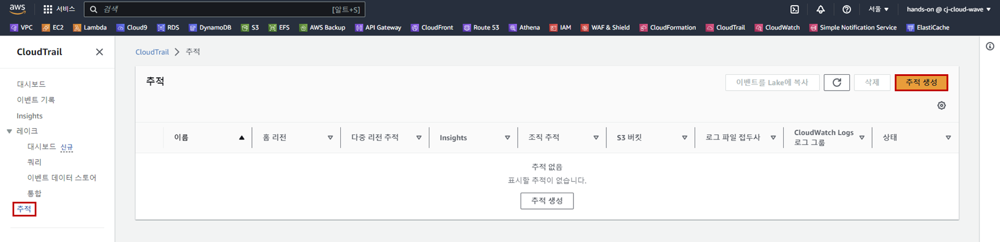

- CloudTrail 생성 정보 입력

    - 추적 이름: lab-edu-cloudtrail

    - 추적 로그 버킷 및 폴더: lab-edu-s3-log-cloudtrail-*{ACCOUNT_ID}*

    - AWS KMS 별칭: lab-edu-kms-cloudtrail

    - '추적 생성' 버튼 클릭

        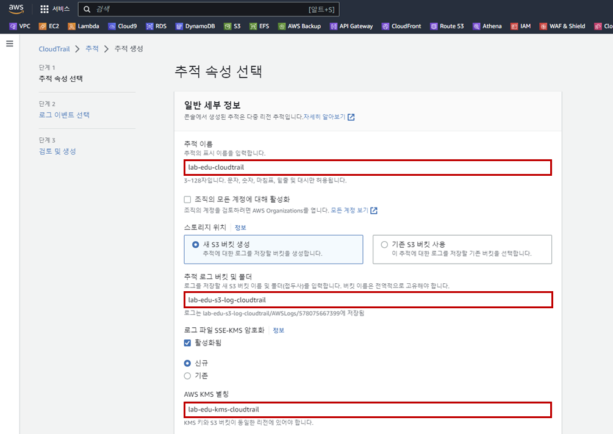

### 2. Athena 테이블 생성

- **CloudTrail 메인 콘솔 화면 → '이벤트 기록' 리소스 탭 → "Athena 테이블 생성" 버튼 클릭**

    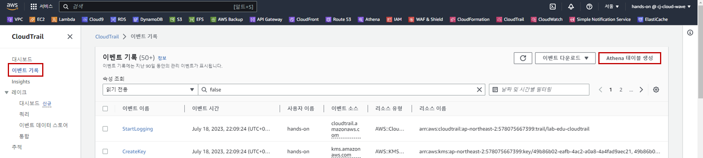

- Athena 테이블 생성 정보 입력

    - 스토리지 위치: lab-edu-s3-log-cloudtrail-*{ACCOUNT_ID}*

    - '테이블 생성' 버튼 클릭

        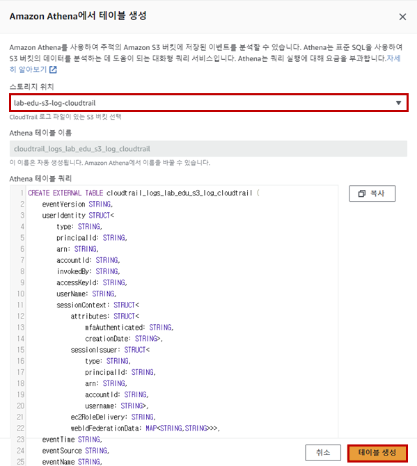

### 3. Athena 이용 로깅 데이터 검색

- **Athena 메인 콘솔 화면 → '쿼리 편집기' 탭 → "설정 편집" 버튼 클릭**

    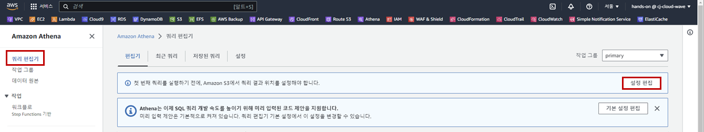

- 설정 정보 입력

    - 'S3 찾아보기' 버튼 클릭

        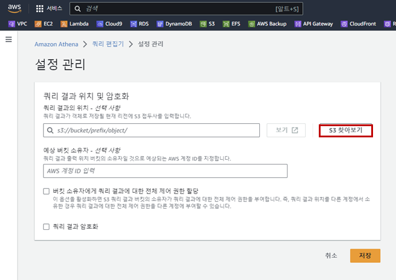

    - S3 데이터 세트 선택: lab-edu-s3-log-cloudtrail-*{ACCOUNT_ID}*

    - '선택' 버튼 클릭

        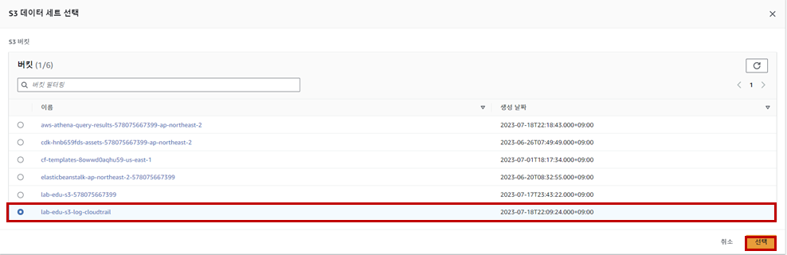

    - '저장' 버튼 클릭

- VS Code 편집기 이동 → 'support_files/athena_query/cloudtrail_query.sql' 파일 열기 → 쿼리 복사

    ```sql
    SELECT
    useridentity.arn,
    eventname,
    sourceipaddress,
    eventtime
    FROM {CLOUDTRAIL_LOGS}
    LIMIT 100;
    ```

- **Athena 메인 콘솔 화면 → '쿼리 편집기' 탭 → "편집기" 탭 → 쿼리 내용 붙여 넣기 → 테이블 항목의 하단 테이블 이름 복사 → 쿼리의 {CLOUDTRAIL_LOGS} 삭제 후 붙여넣기**

    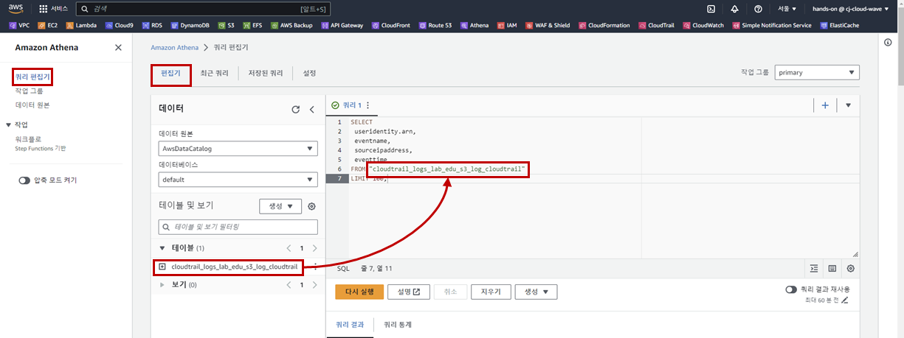

- '실행' 버튼 클릭

    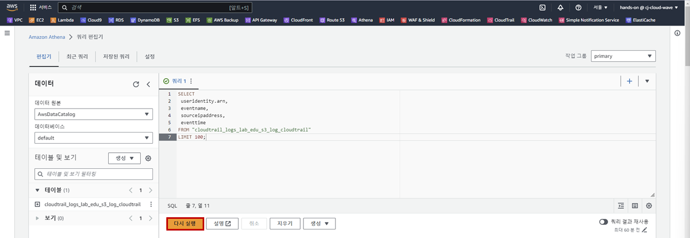
<br><br>


# Elastic Load Balancer 로그 생성 및 Athena 이용 로깅 데이터 검색

### 1. ALB Access Logging 전용 S3 버킷 생성

- **S3 메인 콘솔 화면 → '버킷 만들기' 버튼 클릭**

- S3 버킷 생성 정보 입력

    - 이름: lab-edu-s3-log-alb-access-*{ACCOUNT_ID}*

    - '버킷 생성' 버튼 클릭

### 2. S3 버킷 정책 수정

- VS Code 편집기 이동 → 'support_files/policy/s3_bucket_alb_logging_policy.json' 파일 열기 → 내용 수정 → 내용 복사

    ```json
    {
        "Version": "2012-10-17",
        "Statement": [
            {
            "Effect": "Allow",
            "Principal": {
                "AWS": "arn:aws:iam::{ACCOUNT_ID}:root"     // Account ID 입력
            },
            "Action": "s3:PutObject",
            "Resource": "arn:aws:s3:::{ALB_LOG_BUCKET_NAME}/AWSLogs/{ACCOUNT_ID}/*"     // lab-edu-s3-log-alb-access-{Account ID}, Account ID 입력
            }
        ]
    }
    ```

- **S3 메인 콘솔 화면 → 'lab-edu-s3-log-alb-access-*{ACCOUNT_ID}*' 선택 → '권한' 탭 → '버킷 정책' 영역의 '편집' 버튼 클릭 → JSON 파일 내용 붙여넣기**

### 3. ALB Logging 활성화

- **EC2 메인 콘솔 화면 → '로드 밸런서' 탭으로 이동 → *lab-edu-alb-web* 선택 → Action → 'Edit load balancer attributes' 버튼 클릭**

    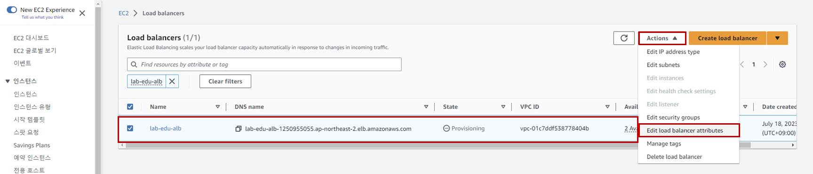

- ALB Access Logging 설정 정보 입력

    - Monitoring 셀의 'Access logs' 버튼 활성화

    - S3 UI: *lab-edu-s3-log-alb-access-{ACCOUNT_ID}*

    - 'Save changes' 버튼 클릭

        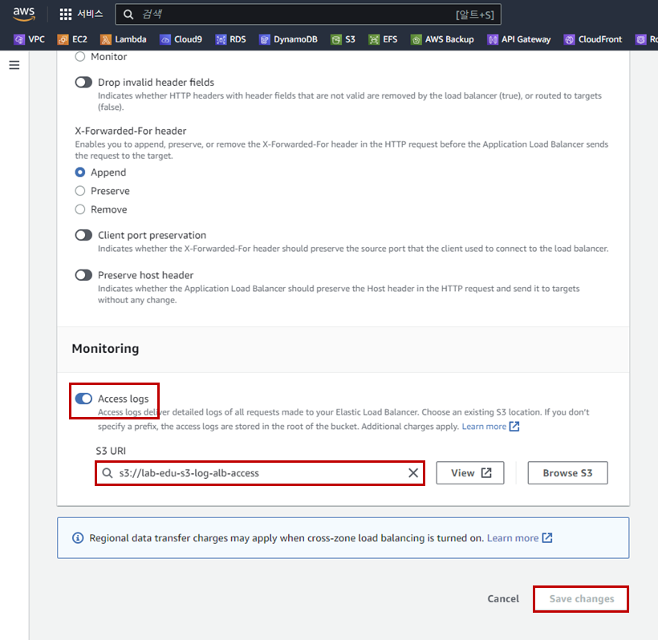

### 4. Athena 테이블 생성

- VS Code 편집기 이동 → 'support_files/athena_query/alb_table_create.sql' 파일 열기 → 내용 수정 → 내용 복사

    - {ALB_LOG_BUCKET_NAME}: *lab-edu-s3-log-alb-access-{ACCOUNT_ID}*

    - {ACCOUNT_ID}: Account ID

    - {REGION}: ap-northeast-2

        ```sql
        CREATE EXTERNAL TABLE IF NOT EXISTS alb_access_logs (
                    type string,
                    time string,
                    ...
                    classification_reason string,
                    conn_trace_id string
                    )
                    ROW FORMAT SERDE 'org.apache.hadoop.hive.serde2.RegexSerDe'
                    WITH SERDEPROPERTIES (
                    'serialization.format' = '1',
                    'input.regex' = 
                '([^ ]*) ([^ ]*) ([^ ]*) ([^ ]*):([0-9]*) ([^ ]*)[:-]([0-9]*) ([-.0-9]*) ([-.0-9]*) ([-.0-9]*) (|[-0-9]*) (-|[-0-9]*) ([-0-9]*) ([-0-9]*) \"([^ ]*) (.*) (- |[^ ]*)\" \"([^\"]*)\" ([A-Z0-9-_]+) ([A-Za-z0-9.-]*) ([^ ]*) \"([^\"]*)\" \"([^\"]*)\" \"([^\"]*)\" ([-.0-9]*) ([^ ]*) \"([^\"]*)\" \"([^\"]*)\" \"([^ ]*)\" \"([^\s]+?)\" \"([^\s]+)\" \"([^ ]*)\" \"([^ ]*)\" ?([^ ]*)?( .*)?')
                    LOCATION 's3://{ALB_LOG_BUCKET_NAME}/AWSLogs/{ACCOUNT_ID}/elasticloadbalancing/{REGION}/'
        ```

- **Athena 메인 콘솔 화면 → '쿼리 편집기' 리소스 탭 → "쿼리" 입력 창에 SQL Query 붙여 넣기 → '실행' 버튼 클릭**

### 5. Athena 이용 로깅 데이터 검색

- VS Code 편집기 이동 → 'support_files/athena_query/alb_query.sql' 파일 열기 → 내용 복사

    ```sql
    SELECT COUNT(request_verb) AS
    count,
    request_verb,
    client_ip
    FROM alb_access_logs
    GROUP BY request_verb, client_ip
    LIMIT 100
    ```

- **Athena 메인 콘솔 화면 → '쿼리 편집기' 탭 → "+" 버튼 클릭 → '쿼리 2' 입력 창에 쿼리 내용 붙여 넣기 → '실행' 버튼 클릭**

    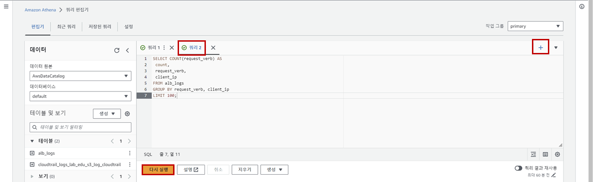
<br><br>


# VPC Flow 로그 생성 및 Athena 이용 로깅 데이터 검색

### 1. VPC Flow Log 전용 S3 버킷 생성

- **S3 메인 콘솔 화면 → '버킷 만들기' 버튼 클릭**

- S3 버킷 생성 정보 입력

    - 이름: lab-edu-s3-log-vpc-flow-*{ACCOUNT_ID}*

    - '버킷 생성' 버튼 클릭

### 2. VPC Flow Log 생성

- **S3 메인 콘솔 화면 → 'lab-edu-s3-log-vpc-flow-*{ACCOUNT_ID}*' 선택 → '속성' 탭 → 'Amazon 리소스 이름(ARN)' 정보 복사**

- **VPC 메인 콘솔 화면 → 'VPC' 리소스 탭 → 'lab-edu-vpc-ap-01' 선택 → '플로우 로그' 상세 화면 탭 → '플로우 로그 생성' 버튼 클릭**

    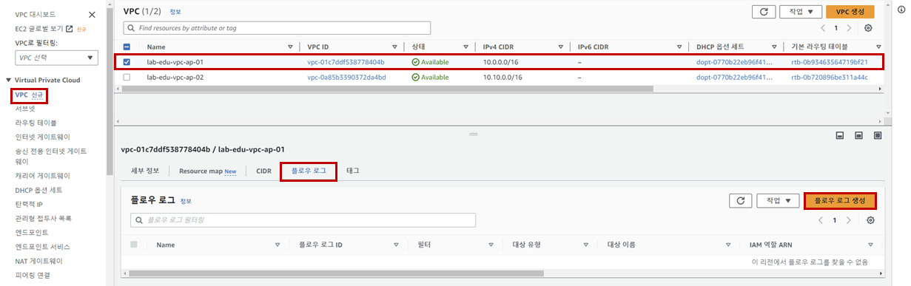

- Flow Log 생성 정보 입력

    - 이름: lab-edu-flowlog-ap-p1

    - 최대 집계 간격: 1분

    - 대상 정보는 'Amazon S3 버킷으로 전송' 선택

    - S3 버킷 ARN: arn:aws:s3:::{VPC_FLOW_LOG_BUCKET_NAME}

    - '플로우 로그 생성' 버튼 클릭

        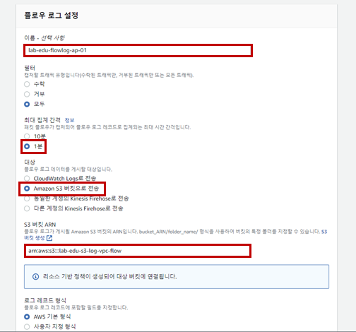

### 3. Athena 테이블 생성

- VS Code 편집기 이동 → 'support_files/athena_query/vpc_flow_log_create.sql' 파일 열기 → 내용 수정 → 내용 복사

    - {ALB_LOG_BUCKET_NAME}: *lab-edu-s3-log-vpc-flow-{ACCOUNT_ID}*

    - {ACCOUNT_ID}: Account ID

    - {REGION}: ap-northeast-2

        ```sql
        CREATE EXTERNAL TABLE IF NOT EXISTS `vpc_flow_logs` (
        version int,
        account_id string,
        interface_id string,
        ...
        flow_direction string,
        traffic_path int
        )
        PARTITIONED BY (`date` date)
        ROW FORMAT DELIMITED
        FIELDS TERMINATED BY ' '
        LOCATION 's3://{ALB_LOG_BUCKET_NAME}/AWSLogs/{ACCOUNT-ID}/vpcflowlogs/{REGION}/'
        TBLPROPERTIES ("skip.header.line.count"="1");
        ```

- **Athena 메인 콘솔 화면 → '쿼리 편집기' 리소스 탭 → "쿼리" 입력 창에 SQL Query 붙여 넣기 → '실행' 버튼 클릭**

- VS Code 편집기 이동 → 'support_files/athena_query/vpc_flow_log_partition_table_create.sql' 파일 열기 → 내용 수정 → 내용 복사

    - {ALB_LOG_BUCKET_NAME}: *lab-edu-s3-log-vpc-flow-{ACCOUNT_ID}*

    - {ACCOUNT_ID}: Account ID

    - {REGION}: ap-northeast-2

        ```sql
        ALTER TABLE vpc_flow_logs
        ADD PARTITION (`date`='YYYY-MM-dd')
        LOCATION 's3://{ALB_LOG_BUCKET_NAME}/AWSLogs/{ACCOUNT-ID}/vpcflowlogs/{REGION}/YYYY/MM/dd';
        ```

- **Athena 메인 콘솔 화면 → '쿼리 편집기' 리소스 탭 → "쿼리" 입력 창에 SQL Query 붙여 넣기 → '실행' 버튼 클릭**

### 4. Athena 이용 로깅 데이터 검색

- VS Code 편집기 이동 → 'support_files/athena_query/vpc_flow_log_query.sql' 파일 열기 → 내용 복사

    - DATE('2020-05-04'): 오늘 일자로 변경

        ```sql
        SELECT * 
        FROM vpc_flow_logs 
        WHERE date = DATE('2020-05-04') 
        LIMIT 100;
        ```

- **Athena 메인 콘솔 화면 → '쿼리 편집기' 탭 → "+" 버튼 클릭 → '쿼리 3' 입력 창에 쿼리 내용 붙여 넣기 → '실행' 버튼 클릭**
