# AWS WAF 생성 및 접근제어 테스트

### 1. WAF 생성 및 IP 기반 접근제어 테스트

- **WAF 메인 콘솔 화면 → "Create Web ACL" 버튼 클릭**

    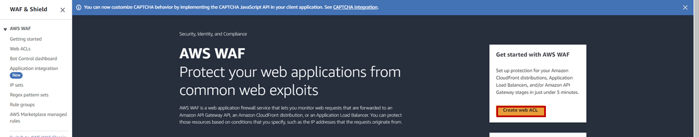

- WAF 생성 정보 입력

    - 이름 : lab-edu-waf

    - Region : Asia Pcific (Seoul)

    - 'Add AWS resources' 버튼 클릭

        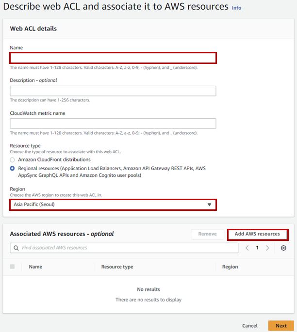

    - 'Application Load Balancer' 선택

    - 'lab-edu-alb-web' 체크박스 활성화

    - 'Add' 버튼 클릭

        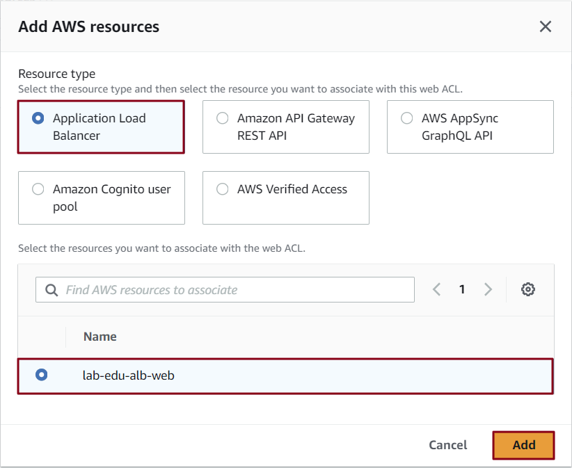
    
- 'Next' 버튼 클릭 → 'Next' 버튼 클릭 → 'Next' 버튼 클릭 → 'Create web ACL' 버튼 클릭

### 2. 차단 정책 생성

- 'https://whatismyipaddress.com/' 방문 → 'IPv4' 정보 복사

    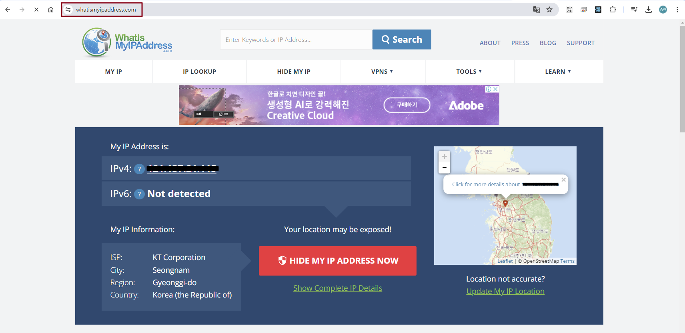

- **WAF 메인 콘솔 화면 → "IP sets" 탭 → *'Create IP set' 선택***

    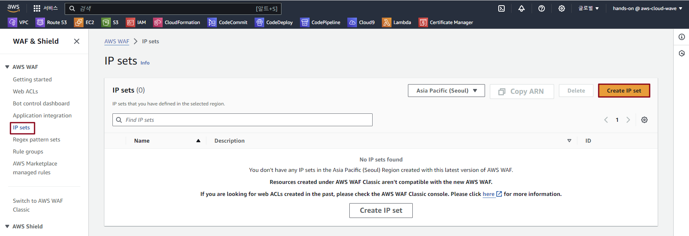

- IP set 생성 정보 입력

    - IP set name: *lab-edu-ipset-myip*

    - IP addresses: *IP_ADDRESS/32*

    - 'Create IP set' 버튼 클릭

        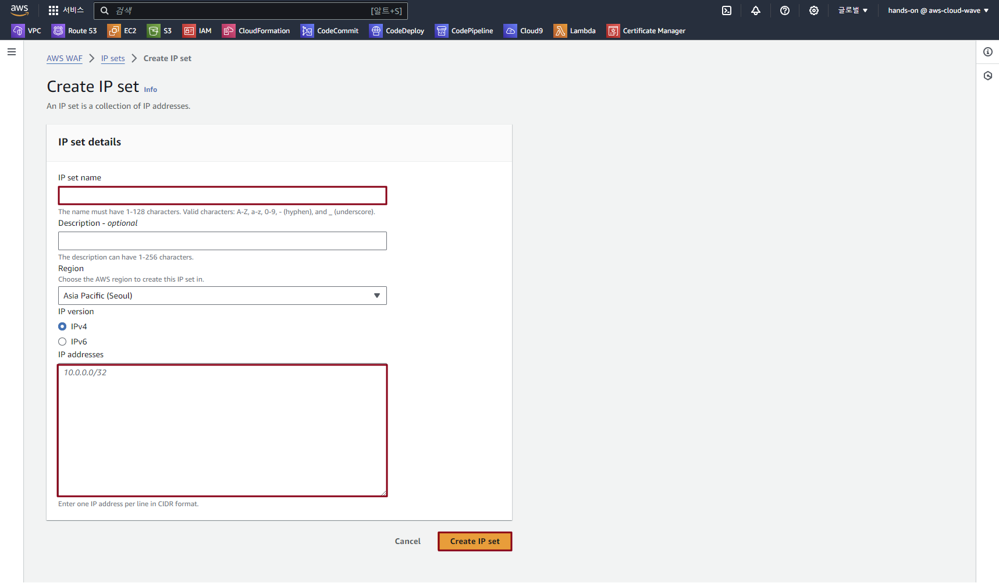

- **WAF 메인 콘솔 화면 → "Web ACLs" 탭 → *'lab-edu-waf' 선택***

- Rules 탭 → 'Add Rules' 버튼 클릭 → 'Add my own rules and rule groups' 선택

- Rule 생성 정보 입력

    - 'IP set' 선택

    - Name: lab-edu-rule-deny-myip

    - IP set: lab-edu-ipset-myip

    - 'Block' 선택

    - 'Add Rule' 버튼 클릭 → 'Save' 버튼 클릭

        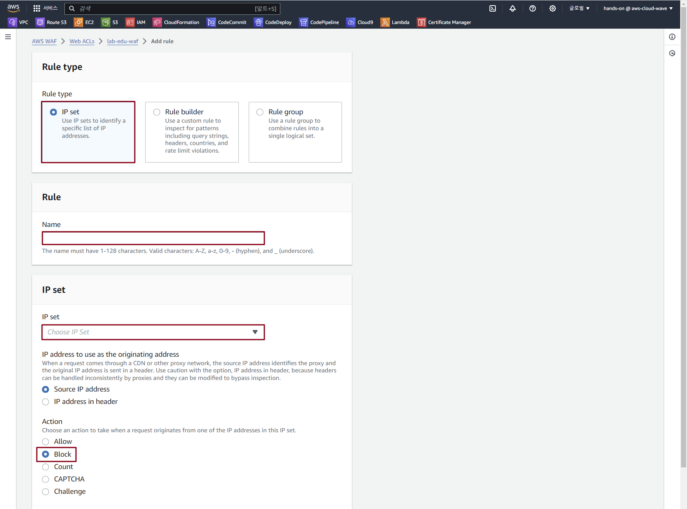

### 3. 웹 서비스 접속 테스트

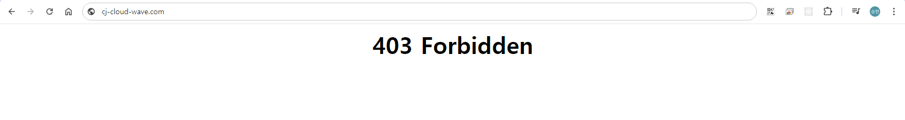
<br><br>


# Block HTML Page 구성

### 1. Access Deny Web Page 구성 (HTML)

- VS Code 편집기 → 'support_files/access_denied.html' 파일 열기 → 내용 복사

    ```html
    <!DOCTYPE html>
    <html>
    <head>
    <title>Access Denied</title>
    <style>
        body {
            background-color: #f4f4f4;
            text-align: center;
            padding: 50px;
            font-family: "Helvetica", sans-serif;
        }

        .warning {
            color: #ff0000;
            background-color: #fff;
            display: inline-block;
            padding: 20px;
            border: 1px solid #ff0000;
            box-shadow: 0 0 10px rgba(0,0,0,0.1);
        }

        h1 {
            color: #333;
        }

        p {
            color: #666;
        }
    </style>
    </head>
    <body>

    <div class="warning">
        <h1>Access Denied</h1>
        <p>Your access to this resource has been blocked by our web application firewall due to suspicious activity. If you believe this is an error, please contact the website administrator.</p>
        <p><b>Contact Information:</b></p>
        <p>Email: admin@example.com</p>
        <p>Phone: +1 123 456 7890</p>
    </div>

    </body>
    </html>
    ```

### 2. Response 형식 설정

- **WAF 메인 콘솔 화면 → "Web ACLs" 탭 → *'lab-edu-waf' 선택***

- 'Custom response bodies'  탭 → 'Create custom response body' 버튼 클릭

    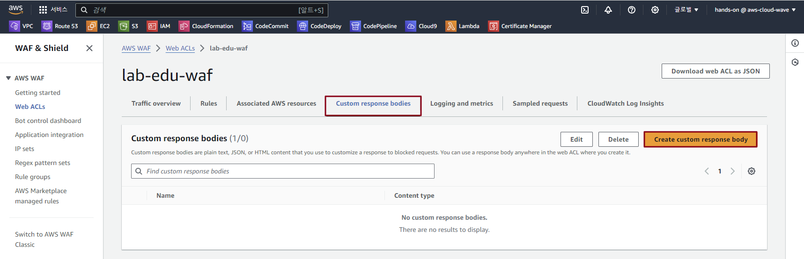

- Response 생성 정보 입력

    - Name : Access-Denied

    - Content type : HTML

    - Body : *access_denied.html 파일 입력*

    - 내용 저장
    
        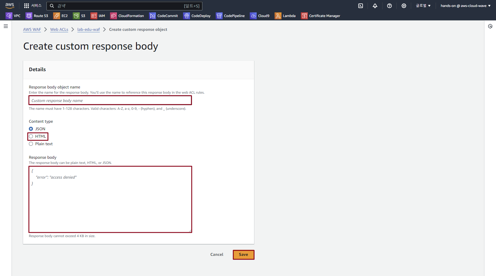

- Rules 탭 → 'lab-edu-rule-deny-myip' 선택 → 'Edit' 버튼 클릭

- Rule 수정 정보 입력

    - 'Custom response - *optional*' 확장

    - 'Enable' 체크 박스 활성화

    - Response code: 403    

    - response body: Access-Denied

    - 'Save rule" 버튼 클릭 → 'Save' 버튼 클릭

        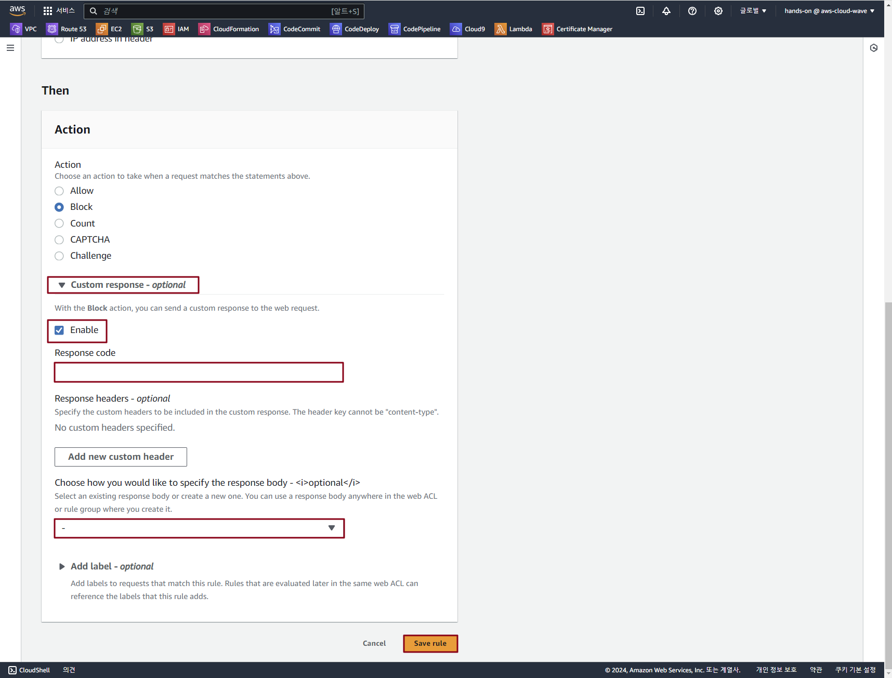

### 3. 웹 서비스 접속 테스트

- 차단된 단말기에서 웹 브라우져로 접속

    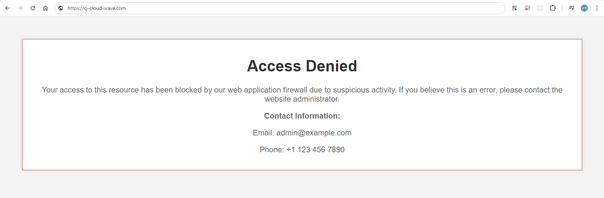

- 모바일 브라우져 이용 접속 테스트 (Wi-Fi 해제)

    
<br><br>


# Block HTML Page 구성

### 1. 해외 IP 차단 설정

- **WAF 메인 콘솔 화면 → "Web ACLs" 탭 → *'lab-edu-waf' 선택***

- Rules 탭 → 'lab-edu-rule-deny-myip' 선택 → 'Delete' 버튼 클릭

- Rules 탭 → 'Add Rules' 버튼 클릭 → 'Add my own rules and rule groups' 선택

- Rule 생성 정보 입력

    - 'Rule builder' 선택

    - Name: lab-edu-rule-allow-korea

    - Type: Regular rule

    - Inspect: Originated from a country in

    - Country codes: Korea, Republic of - KR

    - Action: Allow

    - 'Add rule' 버튼 클릭 → 'Save' 버튼 클릭

        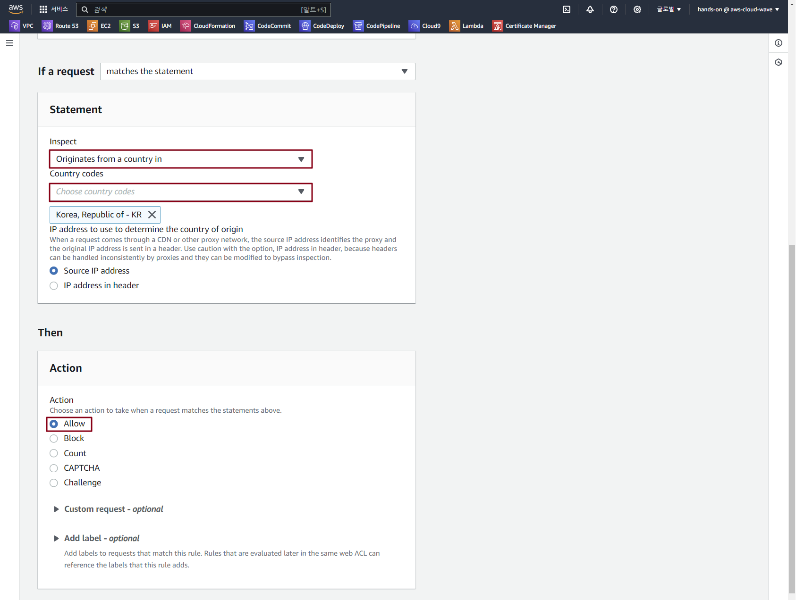

### 2. Default Action 수정

- Rules 탭 → 'Default web ACL action for requests that don't match any rules' 영역 'Edit' 버튼 클릭

    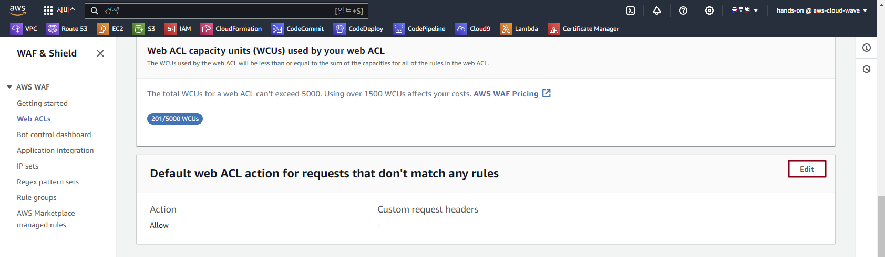

- Default web ACL action 수정 정보 입력

    - Default action: Block

    - 'Custom response - *optional*' 확장

    - 'Enable' 체크 박스 활성화

    - Response code: 403    

    - response body: Access-Denied

    - 'Save' 버튼 클릭

### 3. 웹 서비스 접속 테스트

- 단말기에서 웹 브라우져로 접속

    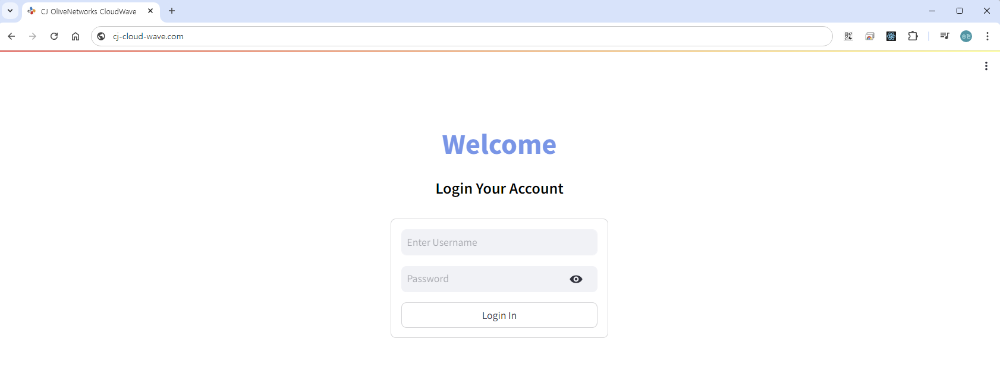

- solarwinds 테스트 사이트 접속 (https://tools.pingdom.com/)

    - URL 입력: *{st01~30}.cj-cloud-wave.com*

    - Test From: North America - USA

    - 'Start TEST' 버튼 클릭

        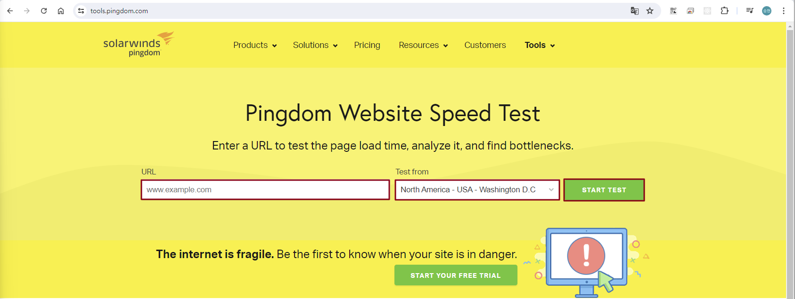

    - 테스트 결과 확인 (403 Error)

        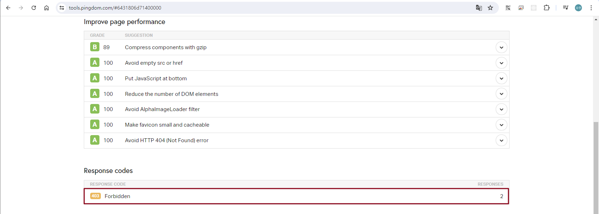
<br><br>


# WAF Logging 설정

### 1. WAF Logging 용 버킷 S3 생성

- **S3 콘솔 메인 화면 → "버킷 만들기" 버튼 클릭**

- S3 버킷 생성 정보 입력

    - 버킷 이름: *aw-waf-logs-bucket-{ACCOUNT_ID}*

    - '버킷 생성' 버튼 클릭

### 2. WAF Logging 설정

- **WAF 메인 콘솔 화면 → "Web ACLs" 탭 → *'lab-edu-waf' 선택***

- Logging and metrics 탭 → 'Logging' 항목의 'Enable' 버튼 클릭

    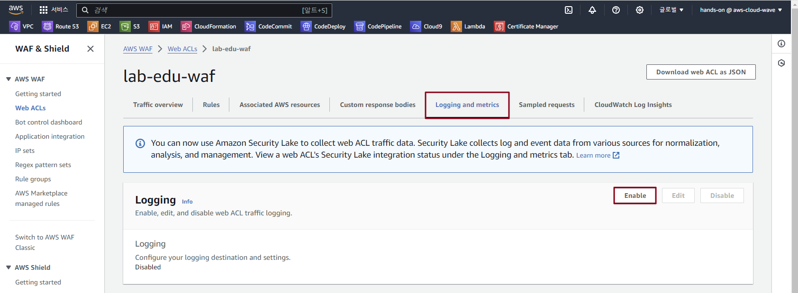

- Logging 설정 정보 입력

    - Logging destination: S3 bucket

    - Amazon S3 bucket: aws-waf-logs-bucket

    - Redacted fields: HTTP method, Query string, URI path

    - 'Save' 버튼 클릭

        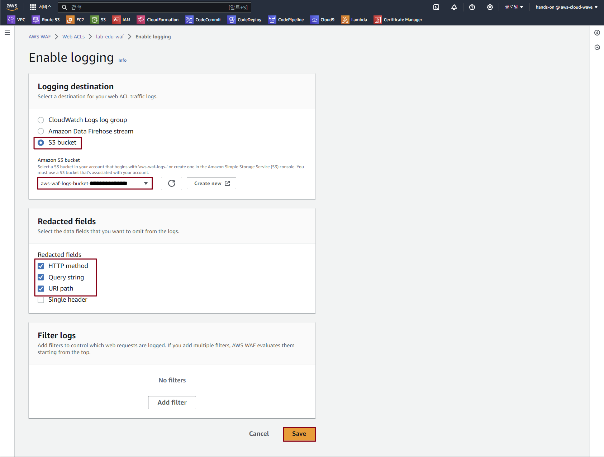