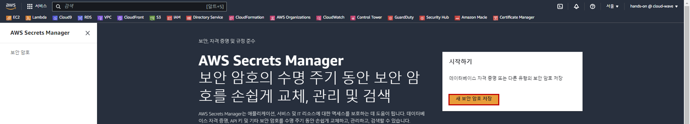
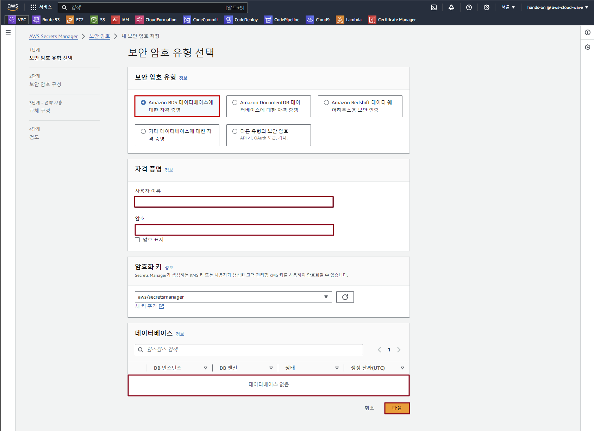
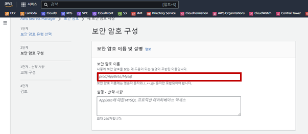
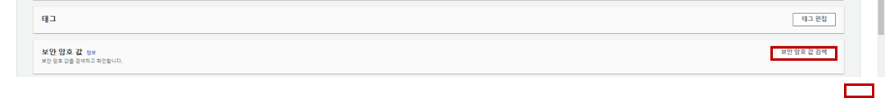
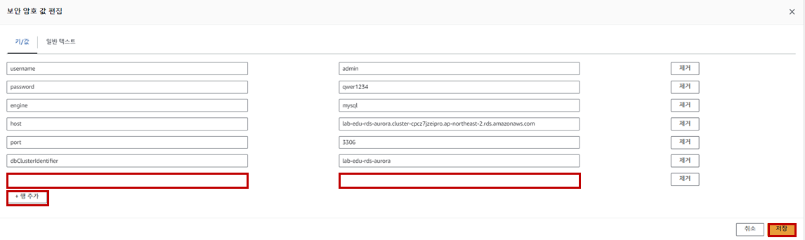

# Secret Manager 생성 및 DB 연동 테스트

### 1. Secret Manager 생성

- **Secret Manater 메인 콘솔 화면 → "새 보안 암호 저장" 버튼 클릭**

    

- Secret Manater 생성 정보 입력

    - 보안 암호 유형: *Amazon RDS 데이터베이스에 대한 자격 증명*

    - 사용자 이름: user

    - 암호: qwer1234

    - 데이터베이스: *lab-edu-rds-aurora*

    - '다음' 버튼 클릭

        

    - 보안 암호 이름: /secret/aurora

        

    - '다음' 버튼 클릭

    - '다음' 버튼 클릭

    - '저장' 버튼 클릭

### 2. Secret Manager 암호 정보 저장

- **Secret Manater 메인 콘솔 화면 → "보안 암호" 탭 → '/secret/aurora' 선택**

- '보안 암호 검색' 버튼 클릭 → '편집' 버튼 클릭

    

- 보안 암호 값 변경 정보 입력

    - '행 추가' 버튼 클릭

    - 키: database

    - 값: trip_advisor

    - '저장' 버튼 클릭

        

### 3. DB 접근 정보 수정

- VS Code 코드 편집기 → 'back_end/db_connection_secrest_manager.py' 파일 오픈 → 설정 값 수정

    ```python
    def get_db_connection():
        # Replace with your AWS region
        aws_region = "REGION"
        # aws_region = "ap-northeast-2"

        # Replace with your secret name in AWS Secret Manager
        secret_name = "SECRETS_NAME"
        # secret_name = "/secret/aurora"

        try:
            secret_values = get_secret_value(secret_name, aws_region)
            return connect_to_database(secret_values)
        except Exception as e:
            print(f"Error: {e}")
    ```

- VS Code 코드 편집기 → 'back_end/login_connection.py' 파일 오픈 → 설정 값 수정

    ```python
    from flask import jsonify, Blueprint, request
    # from db_connection import get_db_connection                   # 주석처리
    from db_connection_secrest_manager import get_db_connection     # 주석해제
    ```

### 4. 서비스 코드 배포 

- VS Code Termainal → 소스코드 Commit → Push

    ```cmd
    git add .
    git commit -m "update login function"
    git push origin main
    ```

### 5. 웹 서비스 접속 테스트

- 웹 서비스 접속 (*www.{st01~30}.cj-cloud-wave.com*) → 로그인 → 정상 접속 여부 확인